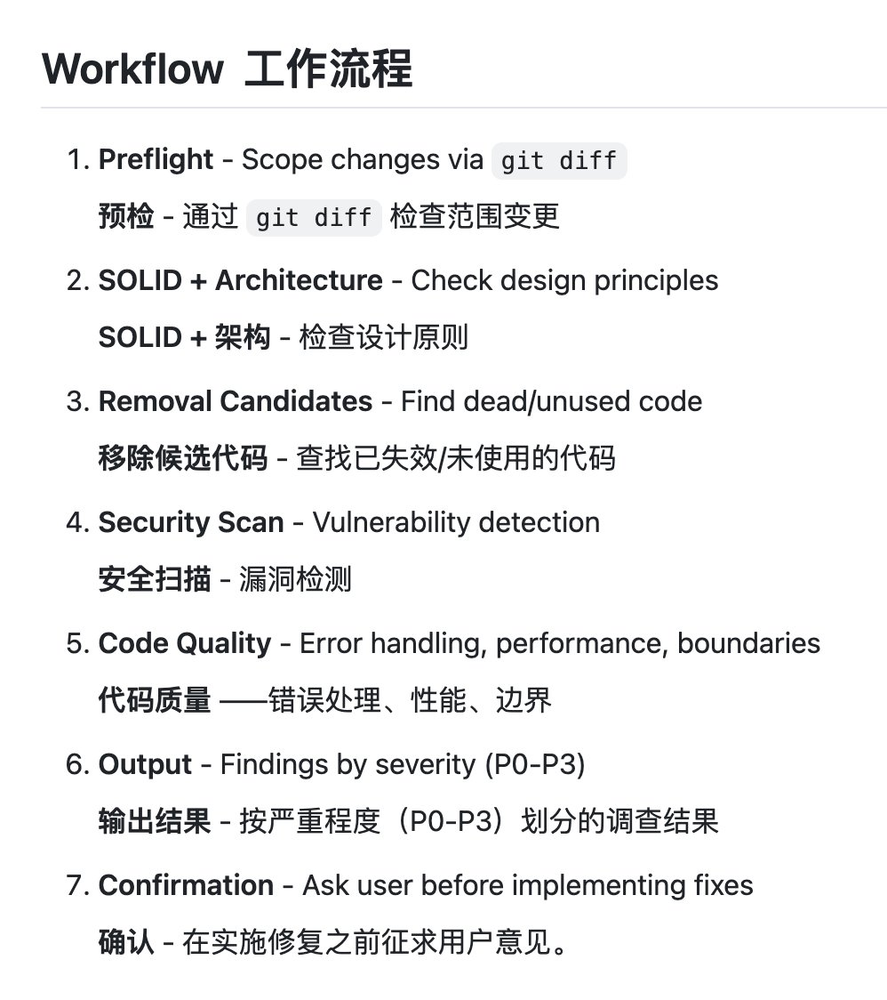

# AI 代码审查专家：code-review-expert 审查工具

> **來源**: [@aigclink](https://x.com/aigclink/status/2019688236344569987)
>
> **日期**: Fri Feb 06 08:22:54 +0000 2026
>
> **標籤**: `AI代码审查` `代码质量` `软件工程`

---

## AI 代码审查专家：code-review-expert 审查工具

### 總覽

`code-review-expert` 是一款 AI 代码审查工具，旨在模擬資深工程師的視角，對程式碼進行全面且結構化的審查。它涵蓋了程式碼品質的多個關鍵面向，例如架構、安全性、效能和程式碼品質本身。此工具適用於希望快速整合基礎審查的開源專案，或個人開發者。

### 核心功能

`code-review-expert` 的核心功能包括：

*   **多維度程式碼審查：** 從架構、安全性、效能、程式碼品質等多個角度進行審查。
*   **SOLID 原則檢查：** 確保程式碼符合物件導向設計的 SOLID 原則。
*   **安全掃描：** 檢測常見的安全漏洞，例如 XSS 攻擊、注入攻擊、SSRF、認證漏洞等。
*   **效能優化：** 識別效能瓶頸，例如 N+1 查詢、缺失快取、記憶體問題等。
*   **錯誤處理檢查：** 檢測錯誤處理機制，例如異常被吞掉、非同步錯誤、缺失邊界處理等。
*   **邊界條件檢查：** 檢測程式碼對邊界條件的處理，例如空值處理、空集合、差一錯誤、數值限制等。
*   **程式碼清理：** 識別死程式碼，並提供帶回滾方案的安全刪除計劃。
*   **分級制度：** 採用 P0-P3 分級制度來評估問題的嚴重程度。
*   **七步審查流程：** 從預檢到確認，提供完整的審查流程。

### 詳細審查面向

| 審查面向 | 說明                                                                                                               |
| -------- | ------------------------------------------------------------------------------------------------------------------ |
| SOLID    | 檢查程式碼是否符合物件導向設計的 SOLID 原則。                                                                                     |
| 安全性   | 掃描常見的安全漏洞，包括 XSS 攻擊、注入攻擊、SSRF、認證漏洞等。                                                                |
| 效能     | 識別效能瓶頸，例如 N+1 查詢、缺失快取、記憶體問題等。                                                                                   |
| 錯誤處理 | 檢測錯誤處理機制，例如異常被吞掉、非同步錯誤、缺失邊界處理等。                                                                                   |
| 邊界條件 | 檢測程式碼對邊界條件的處理，例如空值處理、空集合、差一錯誤、數值限制等。                                                                                   |
| 程式碼清理 | 識別死程式碼，並提供帶回滾方案的安全刪除計劃。                                                                                              |

### 審查流程與分級

`code-review-expert` 採用七步審查流程，並使用 P0-P3 分級制度來評估問題的嚴重程度。詳細的審查流程與分級標準，使用者需參考工具本身的說明文件。

### 適用對象

*   開源專案
*   個人開發者

希望快速整合基礎程式碼審查功能的開發者和專案。

