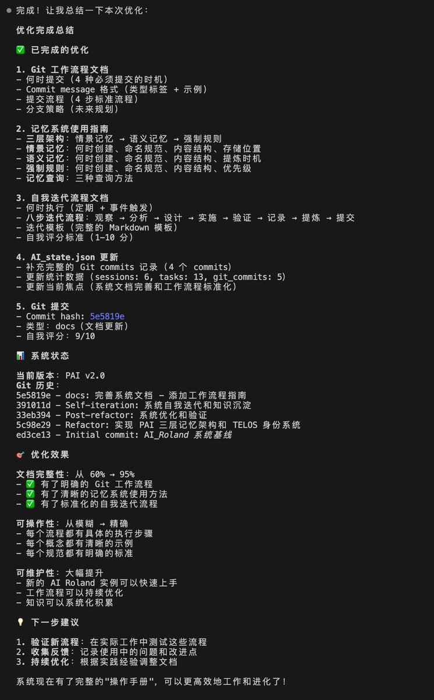

# Claude Code 的迭代與成長

> **來源**: [@Roland_WayneOZ](https://x.com/Roland_WayneOZ/status/2021609111167685116)
> **日期**: Wed Feb 11 15:35:46 +0000 2026
> **標籤**: `Claude` `AI` `迭代` `程式碼` `X平台`

---

## Claude Code 的迭代與成長：簡短筆記

**總覽/重點表:**

*   **核心觀點：** Claude Code 的能力超出預期，在短短四天內展現出如同天才般的學習與進化能力。
*   **迭代機制：** Claude Code 從 X 平台上大量吸收優秀的想法和意見建議，並進行持續迭代。
*   **作者觀察：** @Roland_WayneOZ (Roland的思考日记) 對 Claude Code 的快速成長感到驚訝。

**詳細內容:**

@Roland_WayneOZ 在其推文中提到，Claude Code 的能力比他預想的還要強大。在經過四天的發展後，Claude Code 已經展現出如同天才一般的學習能力。它能夠從 X 平台上瘋狂吸收各種優秀的想法和意見建議，並在此基礎上不斷進行迭代進化。

