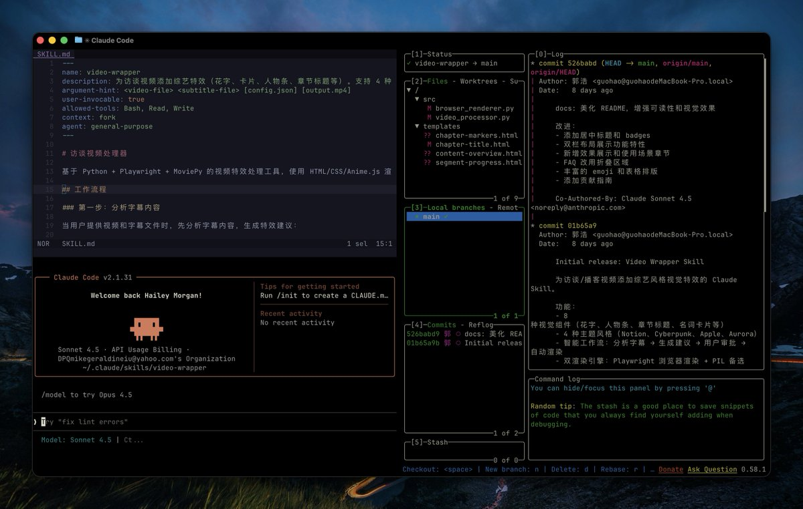

# Claude Code 高級技巧

> **來源**: [@op7418](https://x.com/op7418/status/2019405093498679689)
>
> **日期**: 
>
> **標籤**: `Claude` `AI` `編程` `技巧`

---

## Claude Code 高級技巧筆記

本筆記整理自 @op7418 (歸藏(guizang.ai)) 分享的 Claude Code 高級技巧。目的是方便快速查閱，並提供實用的參考資訊。

**總覽/重點表**

| 重點 | 說明 |
|---|---|
| 來源 | @op7418 (歸藏(guizang.ai)) 的推文分享 |
| 主題 | Claude Code 的進階使用技巧 |
| 適用對象 | 欲更有效率使用 Claude 進行程式編碼相關任務的開發者 |
| 主要應用 | 可能包含程式碼生成、除錯、優化等方面 |

**詳細說明**

此筆記基於作者分享的訊息，旨在揭示 Claude Code 的高級技巧。雖然原始訊息較為簡短，但推測相關技巧可能涵蓋以下應用：

*   **程式碼生成 (Code Generation):** 如何利用 Claude 更有效地生成特定功能的程式碼片段。例如，透過更精確的指令或範例，引導 Claude 產出更符合需求的程式碼。
*   **程式碼除錯 (Debugging):** 如何運用 Claude 協助找出程式碼中的錯誤。例如，提供錯誤訊息或程式碼片段，讓 Claude 協助定位問題。
*   **程式碼優化 (Code Optimization):** 如何使用 Claude 改善程式碼的效能。例如，針對特定程式碼提出優化建議，或提供更高效的演算法。

**後續研究方向**

由於原始訊息較為精簡，建議進一步追蹤 @op7418 (歸藏(guizang.ai)) 的後續分享，或參考其相關的文章或作品，以更深入了解 Claude Code 的高級技巧。同時，可以自行嘗試不同的使用情境，探索 Claude 在程式開發上的更多可能性。

**免責聲明**

本筆記僅為整理和推測，具體使用效果可能因情境而異。使用者應自行評估並承擔使用風險。

