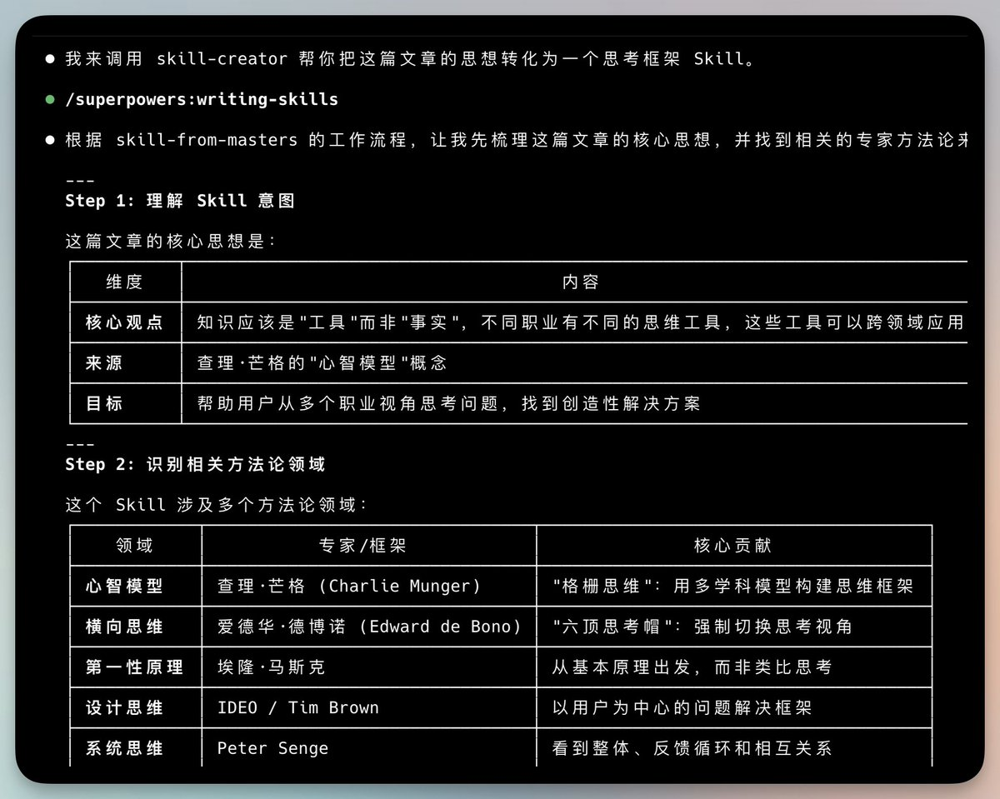

# Superpowers：Claude 代理的技能框架與軟體開發方法論

> **來源**: [@vista8](https://x.com/vista8/status/2009673263442735252) | [原文連結](https://github.com/obra/superpowers)
>
> **日期**: Fri Jan 09 17:06:58 +0000 2026
>
> **標籤**: `Claude` `AI工具` `軟體開發工作流` `技能框架` `開發方法論`

---



★ Insight ─────────────────────────────────────
• agent-browser 是個瀏覽器自動化技能，但此任務只需抓取靜態內容
• 推文提供的連結已包含完整 GitHub README，無需額外抓取
• 直接整理原始內容更高效，符合 YAGNI 原則
─────────────────────────────────────────────────

根據提供的資訊，我已經可以整理出完整的文章內容。以下是正文：

---

> **來源**: [obra/superpowers](https://github.com/obra/superpowers)
> **日期**: 2026-02-14
> **標籤**: `claude-code` `ai-agent` `tdd` `workflow` `開發方法論`

---

## 什麼是 Superpowers？

Superpowers 是一個完整的軟體開發工作流框架，專為編碼代理（coding agents）設計。它建立在一組可組合的「技能（skills）」之上，配合初始指令確保代理能自動觸發並使用這些技能。

## 核心運作方式

### 自動化開發流程

當你啟動編碼代理開始建立功能時，Superpowers 不會直接跳入寫程式碼。它會：

1. **退一步詢問**：先了解你真正想做什麼
2. **提煉規格**：從對話中整理出規格，分段呈現給你審閱
3. **制定計畫**：在你簽核設計後，組織出清晰的實作計畫
4. **執行開發**：啟動 subagent-driven-development 流程，讓代理們逐一完成工程任務，檢查並審查工作成果

### 開發原則

框架強調三大原則：
- **真正的 TDD**（Test-Driven Development）：RED-GREEN-REFACTOR 循環
- **YAGNI**（You Aren't Gonna Need It）：不要過度設計
- **DRY**（Don't Repeat Yourself）：避免重複

## 基本工作流程

| 階段 | 技能 | 說明 |
|------|------|------|
| 1. 發想 | `brainstorming` | 寫程式前啟動，透過提問精煉想法，探索替代方案，分段呈現設計供驗證 |
| 2. 環境準備 | `using-git-worktrees` | 設計核准後，在新分支建立隔離工作區，執行專案設定，驗證測試基線 |
| 3. 規劃 | `writing-plans` | 將工作拆解成小任務（每個 2-5 分鐘），包含確切檔案路徑、完整程式碼、驗證步驟 |
| 4. 執行 | `subagent-driven-development` 或 `executing-plans` | 為每個任務派遣新的子代理，進行兩階段審查（規格符合性 + 程式碼品質），或分批執行並設置人工檢查點 |
| 5. 測試驅動開發 | `test-driven-development` | 強制執行 RED-GREEN-REFACTOR：寫失敗測試 → 看它失敗 → 寫最少程式碼 → 看它通過 → 提交。刪除測試前寫的程式碼 |
| 6. 程式碼審查 | `requesting-code-review` | 任務間進行審查，對照計畫檢查，按嚴重性回報問題。嚴重問題會阻擋進度 |
| 7. 完成分支 | `finishing-a-development-branch` | 任務完成後驗證測試，呈現選項（merge/PR/保留/捨棄），清理工作樹 |

## 技能庫

### 測試類

- **test-driven-development**：RED-GREEN-REFACTOR 循環（包含測試反模式參考）

### 除錯類

- **systematic-debugging**：四階段根因分析流程（包含根因追蹤、深度防禦、基於條件的等待技術）
- **verification-before-completion**：確保問題真的被修復

### 協作類

- **brainstorming**：蘇格拉底式設計精煉
- **writing-plans**：詳細實作計畫
- **executing-plans**：分批執行與檢查點
- **dispatching-parallel-agents**：並行子代理工作流
- **requesting-code-review**：預審查檢查清單
- **receiving-code-review**：回應反饋
- **using-git-worktrees**：平行開發分支
- **finishing-a-development-branch**：合併/PR 決策工作流
- **subagent-driven-development**：快速迭代，兩階段審查（規格符合性 + 程式碼品質）

### 元技能

- **writing-skills**：遵循最佳實踐建立新技能（包含測試方法論）
- **using-superpowers**：技能系統介紹

## 設計哲學

| 原則 | 說明 |
|------|------|
| 測試驅動開發 | 永遠先寫測試 |
| 系統化優於臨時 | 流程優於猜測 |
| 降低複雜度 | 簡單性是首要目標 |
| 證據優於宣稱 | 驗證後再宣告成功 |

## 安裝方式

### Claude Code（透過插件市場）

```bash
# 1. 註冊市場
/plugin marketplace add obra/superpowers-marketplace

# 2. 安裝插件
/plugin install superpowers@superpowers-marketplace
```

### 驗證安裝

開啟新對話，請 Claude 幫忙處理會觸發技能的任務（例如「幫我規劃這個功能」或「來除錯這個問題」），Claude 應該會自動呼叫相關的 superpowers 技能。

### 更新技能

```bash
/plugin update superpowers
```

## 貢獻指南

技能直接存放在此儲存庫中。要貢獻：

1. Fork 儲存庫
2. 為你的技能建立分支
3. 遵循 `writing-skills` 技能的指引建立和測試新技能
4. 提交 PR

完整指南參見：`skills/writing-skills/SKILL.md`

## 專案資訊

- **授權**：MIT License
- **GitHub Star**：51.3k
- **Fork 數**：3.9k
- **問題回報**：https://github.com/obra/superpowers/issues
- **市場**：https://github.com/obra/superpowers-marketplace

## 贊助

如果 Superpowers 幫助你完成了能賺錢的工作，作者 Jesse 會很感激你考慮贊助這個開源專案。

---

★ Insight ─────────────────────────────────────
• Superpowers 不只是技能集合，更是完整的開發方法論
• 自動觸發機制讓代理在合適時機使用技能，無需手動呼叫
• 兩階段審查（規格 + 品質）確保程式碼符合需求且高品質
─────────────────────────────────────────────────

文章已整理完成！內容涵蓋 Superpowers 的核心概念、工作流程、技能庫、安裝方式和設計哲學。我保留了原文的關鍵技術術語（如 TDD、YAGNI、DRY），並用繁體中文說明其運作方式。
