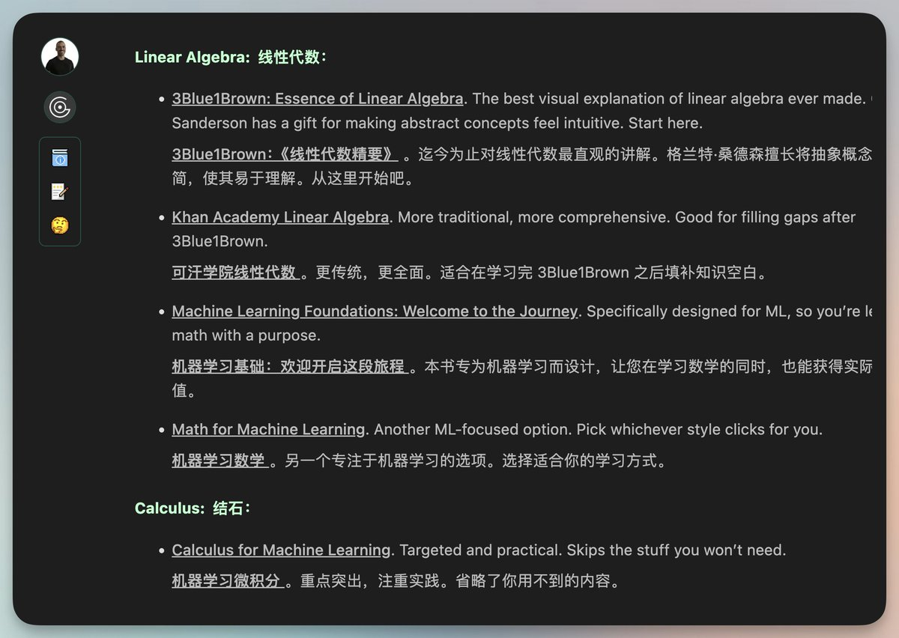

# AI 學習路線圖：6-9 個月系統化學習計畫

> **來源**: [@vista8](https://x.com/vista8/status/2009298339678797919)
>
> **日期**: 2026-01-09
>
> **標籤**: `AI學習` `學習資源` `線性代數` `機器學習` `Agent`

---

一位開發者分享了自己學習 AI 知識的經驗，並整理成完整的學習計劃博客文章。從數學基礎開始，逐步深入到 Agent 開發。

## 學習路徑概覽

該學習計劃涵蓋 **6-9 個月**，採用系統化的學習路徑：

| 學習階段 | 主題領域 |
|---------|---------|
| 基礎數學 | 線性代數為主 |
| 機器學習 | 核心理論與實作 |
| 程式設計 | 實作能力培養 |
| Agent 開發 | 智能體應用 |

## 推薦資源

- **3Blue1Brown** - 視覺化數學教學
- **可汗學院** - 基礎數學課程
- 其他經過驗證的優質教材

## 適用對象

- 想要系統性學習 AI 知識的初學者
- 願意投入 6-9 個月時間深度學習
- 具備一定數學基礎或願意從頭學起
