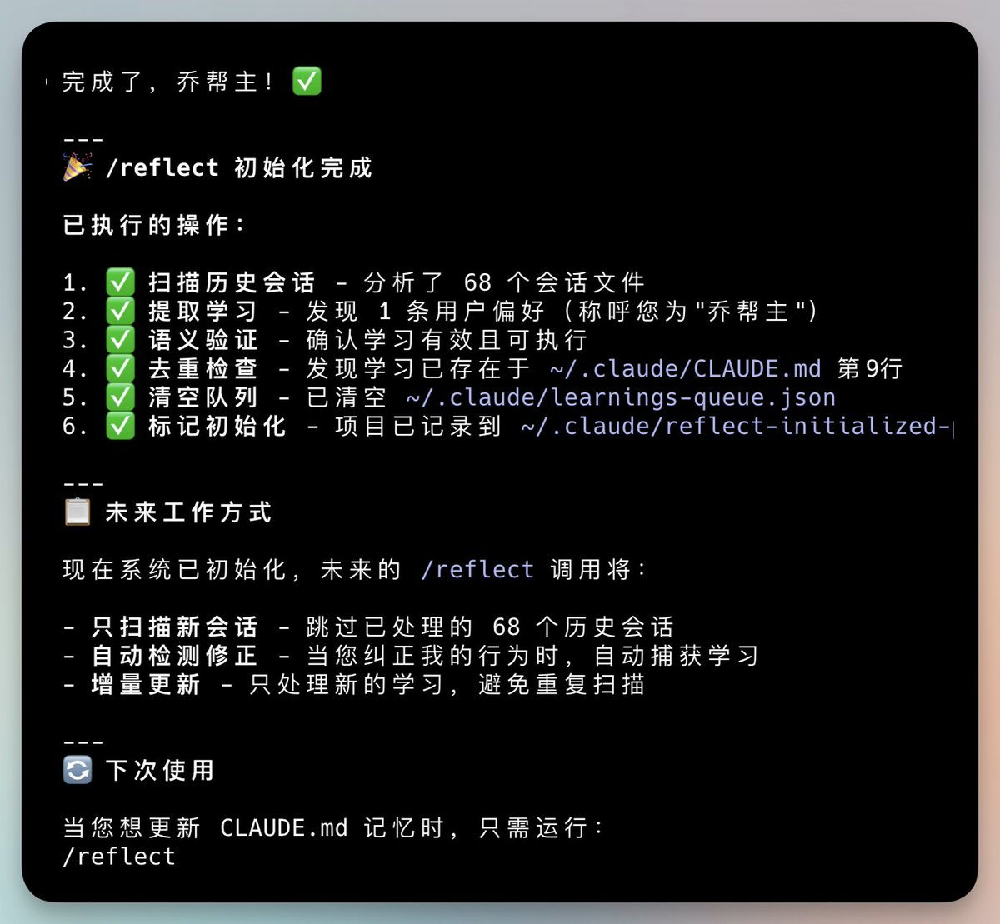

# Claude 自我學習進化技巧

> **來源**: [@vista8](https://x.com/vista8/status/2014401267553235123)
> **日期**: 
> **標籤**: `Claude` `Prompt工程` `AI技巧` `自我學習`

---

## Claude 自我學習進化技巧

### 總覽

本文介紹一個讓 Claude 自我學習進化的技巧，核心概念是透過提示 Claude 將修正 bug 的經驗寫入全局記憶，避免重複犯錯。同時，也探討了如何有效管理和組織這些經驗，以優化 Claude 的性能和效率。

### 核心技巧：經驗提煉與全局記憶

讓 Claude 變得更聰明的關鍵在於，**每次 Claude 修正了重要的 bug 或問題，都提示它將經驗提煉並寫入全局記憶。** 具體提示語類似於：「每當你修復了重要 bug 或問題，把經驗提煉写入全局記憶。」

由於 Claude.md 文件每次都會被加載，通過反思總結經驗，理論上可以避免下一次犯同樣的錯誤。

### 全局記憶的有效管理

作者指出，直接將所有經驗都寫入單一的 Claude.md 文件可能會導致一些問題：

*   **文件過長：** Anthropic 官方建議全局 Claude.md 文件不要超過 200 行。
*   **Token 浪費：** 加載過長的文件會消耗更多的 token。
*   **影響記憶：** 過長的文件可能會降低 Claude 的記憶效率。

**解決方案：使用子文件索引**

為了避免上述問題，建議將經驗整理成子文件，並在 Claude.md 文件中建立索引，告知 Claude 何時查看特定的經驗。 這種做法的好處是：

*   **保持 Claude.md 文件簡潔：** 符合 Anthropic 的建議。
*   **降低 Token 消耗：** 僅在需要時加載相關的子文件。
*   **提升記憶效率：** 更容易找到需要的資訊。

### Linus 風格提示詞的潛在問題

很多人常用的 Linus 風格 Claude 提示詞，如果內容過長，本身可能是一種錯誤的做法。比較好的方式是將其轉化為 Skills。

### 專業的反思記憶工具

作者建議可以尋找專門用於反思記憶的 Claude 插件，以更專業地進行反思和學習。

