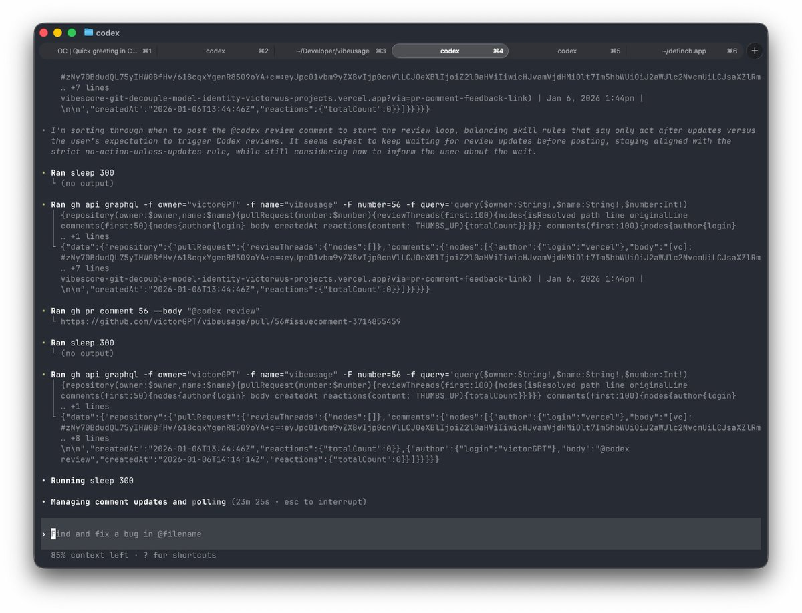

# CodeX PR 審核迴圈自動化 Skill

> **來源**: [@victor_wu](https://x.com/victor_wu/status/2008554986264031604) | [原文連結](https://github.com/victorGPT/my_coding_agent_share/tree/main/codex-pr-review-loop)
>
> **日期**: 
>
> **標籤**: `GitHub自動化` `代碼審核` `Claude Code`

---

好的，讓我根據已獲取的資訊來整理文章內容：

---

## 功能概述

這是一個針對 GitHub 綁定的 CodeX 帳號設計的自動化 PR 審核迴圈 Skill，能完整串接從修改程式碼到通過審核的整個流程。

## 核心流程

自動化迴圈包含以下步驟：

1. **修改程式碼** - 根據審核意見修復問題
2. **提交變更** - 自動 commit 變更
3. **等待審核** - 輪詢 GitHub review 狀態
4. **處理反饋** - 如有新意見，重複修改
5. **完成合併** - 審核通過後自動 merge

## 主要特點

### 1. 全自動運行

- 內建 **5 分鐘輪詢機制**，持續監控審核狀態
- 可根據需求調整為 10 分鐘，或在 5 分鐘後再輪詢 5 分鐘
- 無需手動介入，自動處理整個迴圈

### 2. 深度優化 CodeX 審核流程

針對 CodeX 在 GitHub 上的審核細節做了優化，包括：

| 審核階段 | 處理方式 |
|---------|---------|
| **Review 狀態檢測** | 自動識別何時進入 review 狀態 |
| **反饋接收** | 精確判斷何時給出審核意見 |
| **通過條件** | 識別審核通過訊號（如 "Didn't find any major issues" 或 👍 反應） |

## 技術實作細節

### 審核狀態監控

- 使用 `gh pr view` 識別 PR
- 透過 GitHub API 查詢 review threads 和 comments
- 每 5 分鐘檢查一次是否有新的更新

### 自動修復流程

1. 解析審核反饋內容
2. 針對標記的問題進行修正
3. 執行測試確保修改正確
4. Commit 並 push 到分支
5. 在 PR 留言 `@codex review` 請求重新審核

### 合併條件

只有在以下情況才會執行 merge：

- 審核反饋中包含 "Didn't find any major issues"
- 或收到 👍 (thumbs-up) 反應
- 所有測試通過

## 安全防護機制

- **禁止無意義操作** - 沒有新更新時不會採取行動
- **禁止未經許可合併** - 沒有明確通過訊號不會 merge
- **測試優先** - Push 前必須執行測試
- **遵守儲存庫規則** - 需要確認時會請求授權

## 使用建議

### 適用場景

- 頻繁提交 PR 需要多輪審核的專案
- 使用 CodeX 自動審核功能的團隊
- 需要減少手動操作的開發流程

### 自訂設定

- 可調整輪詢間隔（預設 5 分鐘）
- 可修改審核通過的識別條件
- 可自訂測試執行方式

## 注意事項

⚠️ **重要提醒**

- 此 Skill 設計為**開箱即用**，但建議先在測試環境驗證
- 確保 GitHub 帳號已正確綁定 CodeX
- 首次使用時建議監控自動化流程，確保符合團隊規範
- 自動 merge 功能需謹慎使用，確保專案有適當的保護機制

---

★ Insight ─────────────────────────────────────

這個 Skill 展示了幾個值得學習的設計模式：

1. **輪詢機制設計** - 5 分鐘間隔是在反應速度和 API 請求成本間的良好平衡
2. **狀態機思維** - 將審核流程拆解為明確的狀態轉換，每個狀態都有對應的處理邏輯
3. **防護機制** - 在自動化流程中加入多重檢查，避免誤操作導致的風險

─────────────────────────────────────────────────
