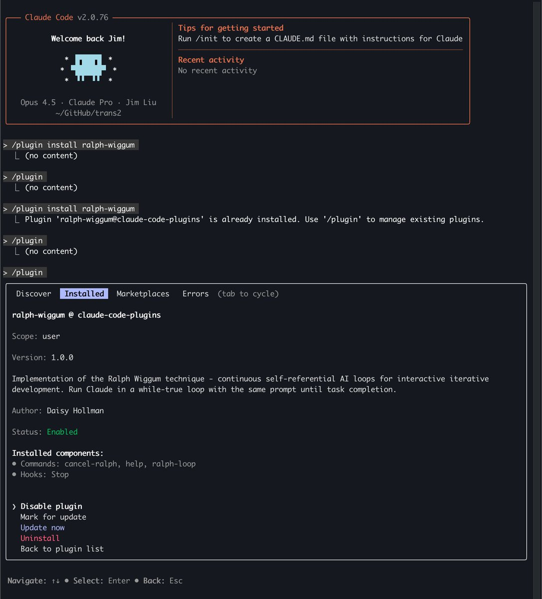

# Ralph Wiggum 插件：讓 Claude 自我迭代的自動化循環

> **來源**: [@dotey](https://x.com/dotey/status/2007197068394164613) | [原文連結](https://github.com/anthropics/claude-plugins-official/tree/main/plugins/ralph-wiggum)
>
> **日期**: Fri Jan 02 21:07:27 +0000 2026
>
> **標籤**: `Claude Code` `自動化工作流` `TDD開發`

---



## 什麼是 Ralph Wiggum 插件

Ralph Wiggum 是 Claude Code 的官方插件，透過 **Stop hook 機制**讓 Claude 能夠自我對話和迭代。簡單來說，就是讓 Claude 自己跟自己對話形成循環——你下班回家，它替你加班，醒來代碼就寫好了。

## 核心運作原理

### 傳統用法 vs Ralph 用法

| 模式 | 流程 |
|------|------|
| **傳統用法** | 你給任務 → Claude 完成 → 退出 → 你再手動啟動下一輪 |
| **Ralph 用法** | 任務啟動 → 自動循環迭代 → 達成條件後停止 |

### 運作機制

```bash
/ralph-loop "你的任務描述" --completion-promise "DONE" --max-iterations 50
```

Claude 會執行以下循環：

1. 執行任務
2. 嘗試退出時被 Stop hook 攔截
3. 自動重新讀取同一個 prompt
4. 檢視自己之前寫的代碼/測試結果
5. 持續改進，直到輸出 "DONE" 或達到迭代上限

**關鍵洞察**：每次迭代 prompt 不變，但文件和 git 歷史在變——Claude 透過讀取自己的「作品」實現自我進化。

## 最適合的場景

### ✅ 推薦使用

| 場景 | 說明 |
|------|------|
| **TDD 開發** | 寫測試 → 跑失敗 → 改代碼 → 重複直到全綠 |
| **Greenfield 項目** | 定義好需求，過夜執行 |
| **有自動驗證的任務** | 測試、Lint、類型檢查能自動判斷對錯 |

### ❌ 不建議使用

- 需要人類判斷的設計決策
- 沒有明確成功標準的任務

## Prompt 撰寫要點

### 必備元素

1. **明確的完成條件**
2. **完成信號詞**

### 示例

```markdown
構建一個 Todo REST API

完成標準：
- CRUD 全部可用
- 輸入校驗完備
- 測試覆蓋率 > 80%

完成後輸出：<promise>COMPLETE</promise>
```

## 安全機制

**始終設置 `--max-iterations`** 防止無限循環：

```bash
/ralph-loop "任務" --max-iterations 30 --completion-promise "DONE"
```

這是避免 token 消耗失控的關鍵設定。

## 真實戰績

| 案例 | 成果 |
|------|------|
| **Y Combinator Hackathon** | 一夜生成 6 個 repository |
| **某商業項目** | $50k 合同，API 成本僅 $297 |

## 快速上手

1. 安裝插件：[Ralph Wiggum 插件地址](https://github.com/anthropics/ralph-wiggum)
2. 定義明確的任務和完成條件
3. 設定合理的迭代上限
4. 啟動循環，等待完成

## 核心概念總結

| 概念 | 說明 |
|------|------|
| **Stop hook** | 攔截 Claude 退出，觸發下一輪迭代 |
| **Self-iteration** | Claude 讀取自己的輸出持續改進 |
| **Completion promise** | 定義完成的信號詞（如 "DONE"） |
| **Max iterations** | 防止無限循環的安全閥 |
