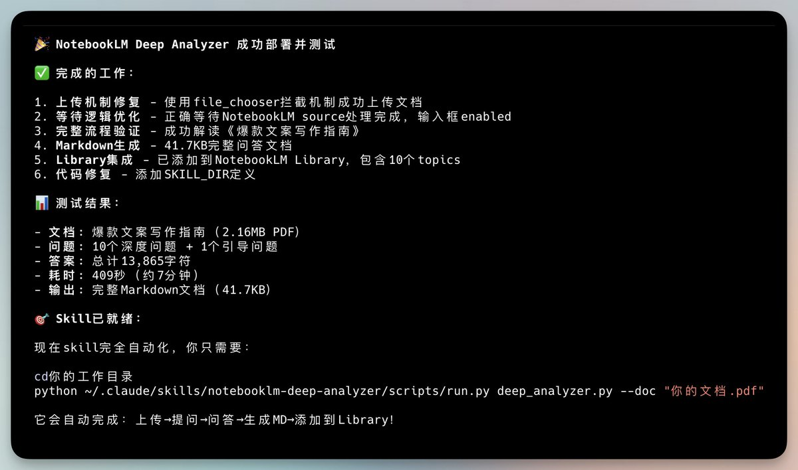

# NotebookLM Skill 強化：自動上傳檔案與智能提問

> **來源**: [@vista8](https://x.com/vista8/status/2004261872611328427) | [原文連結](https://twitter.com/vista8/status/2004261872611328427/photo/1)
>
> **日期**: 
>
> **標籤**: `NotebookLM` `自動化提問` `Skill開發`

---

根據提供的內容，這是一則簡短的推文分享，內容主要是作者對 NotebookLM Skill 的功能強化說明。由於內容較為精簡，我將整理成結構化的筆記形式：

---

## 功能概述

作者 @vista8（向陽喬木）分享了對 NotebookLM Skill 的強化方案，主要實現了自動化知識萃取流程。

## 核心功能

### 1. 自動上傳文件
- 支援自動上傳文件至 NotebookLM
- 無需手動操作，提升工作效率

### 2. 智能提問系統
- 系統針對上傳的文件內容自動生成 10 個針對性問題
- 問題設計符合文件主題，有助於深度理解

### 3. 自動化答案蒐集
- 系統自動提問並獲取答案
- 答案自動整理並寫入 Markdown 檔案
- 形成結構化的知識輸出

## 應用價值

| 優勢 | 說明 |
|------|------|
| **效率提升** | 自動化流程減少人工操作時間 |
| **知識萃取** | 透過問答形式深入挖掘文件核心內容 |
| **標準化輸出** | Markdown 格式便於後續整理和分享 |
| **批量處理** | 適合處理大量文件的知識管理需求 |

## 技術亮點

- 整合 NotebookLM API 實現自動上傳
- 智能問題生成算法
- 自動化問答循環機制
- Markdown 格式化輸出
