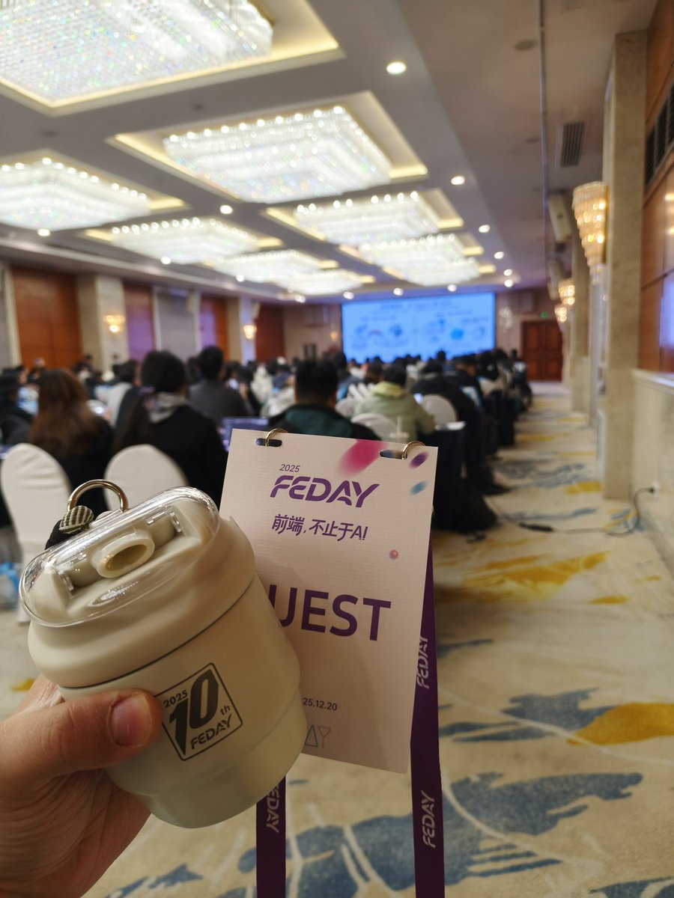

# Agent 前端落地案例

> **來源**: [@dotey](https://x.com/dotey/status/2002214342486347900) | [原文連結](https://docs.google.com/presentation/d/1-H9VGNyCY-2jKw3e3aO722yQyHbMFtDxc3yEXMmKZDQ/edit?usp=sharing)
>
> **日期**: Sat Dec 20 03:07:53 +0000 2025
>
> **標籤**: `Agent應用` `前端開發` `Prompt工程`

---




好的，我已經整理好文章內容。以下是正文：

---

> **來源**: [宝玉 (@dotey)](https://twitter.com/dotey/status/xxx)
> **日期**: 2025-02-14
> **標籤**: `AI Agent` `前端開發` `設計系統` `Claude Code` `產品思維`

---

## 快速總覽

| 主題 | 內容 |
|------|------|
| 核心主題 | Agent 在前端開發的落地實戰：從構建到重構的反思 |
| 技術挑戰 | 私有設計系統、代碼預覽、Prompt 工程、自我修復 |
| 關鍵轉折 | 從「如何構建 Agent」到「設計系統的真正目的是什麼」 |
| 最終方案 | 將 Agent 能力轉化為 Skill，融入開發者工作流 |
| 核心洞察 | 以 AI 為中心重新設計流程，而非讓 AI 模仿人類流程 |

## 背景：2025 Agent 元年

2025 年被視為 AI Agent 元年，技術發展密集：

- **2025/2/3**: Deep Research 發布
- **2025/3/6**: Manus 發布  
- **2025/5/22**: Claude Code 發布

思考題：你所在的公司或團隊，有沒有在做或計劃做 Agent？

## 什麼是 AI Agent？

**定義**：AI Agent（智能體）是為了實現某個目標，循環調用工具的大語言模型。

**核心機制（Loop）**：
- **輸入（Input）**：來自用戶或另一個 LLM
- **工具循環（Tools in a loop）**：模型調用工具 → 獲取結果 → 繼續推理
- **明確終點**：為了達成目標，而非無限循環
- **基礎記憶**：通過對話歷史保存上下文

```
flowchart TB
    IN[輸入] --> LLM[LLM]
    LLM --> OUT[輸出]
    LLM <--> TOOLS[Tools]
```

## 挑戰目標：搞定私有設計系統

### 背景與痛點

- 企業擁有內部設計系統（Design System）和完整的私有前端框架
- **痛點**：這些私有代碼從未被 AI 訓練過，通用模型無法直接生成
- **目標**：Agent 能根據截圖或 Figma 設計稿，自動生成符合內部設計規範的前端代碼
- **期望效果**：類似 Lovable，但使用自己的 Design System

### 技術挑戰概覽

| 挑戰類別 | 具體問題 |
|----------|----------|
| **系統搭建** | 接入大模型、構建 UI 系統 |
| **前端難題** | 生成的代碼必須能即時在瀏覽器中預覽 |
| **Agent 難題** | 提示工程、自我修復、上下文限制 |

## 技術實踐

### 1. 架構選擇：站在巨人的肩膀上

**核心策略**：先跑通再優化，Agent 最難的不是模型，而是讓流程跑通。

**技術選型**：基於 Claude Agent SDK 進行二次開發

**選型理由**：
- Claude Code 驗證了可行性
- 開箱即用，內置工具滿足多數場景
- 擴展性強：支持自定義工具、接入 MCP（Model Context Protocol）
- 兼容性：可接入國產模型

### 2. 預覽方案的試錯：從 Sandpack 到本地文件系統

**失敗的嘗試**：使用 Sandpack（瀏覽器端沙盒）

**問題**：
- 複雜組件在沙盒運行困難
- Agent 兼容性差
- 無法充分發揮 Agent 讀寫文件的能力

**成功的轉向**：給 Agent 一個本地文件系統

**架構**：
- 每個會話一個獨立環境（虛擬機或目錄）
- Agent 可以自由讀取、修改、編譯代碼

> **核心洞察**：給 Agent 一個本地文件系統能最大化發揮 Agent 能力

### 3. 知識注入：文檔即是最好的 Prompt

**核心理念**：Agent 就像新員工，最好的學習方法就是高質量的文檔。

**實施方案**：
- **Markdown 化**：將設計系統說明、組件列表、API 整理成 Markdown
- **代碼即文檔**：高質量的參考代碼也是很好的教材
- **按需檢索**：引導 Agent 按需檢索文檔，通常不需要複雜的 RAG（檢索增強生成）

### 4. 閉環驗證：讓 Agent 學會自我檢查

**工作流**：Gather Context → Take Action → Verify Work

**驗證工具**：
- 讓 Agent 能夠 lint（靜態檢查）和編譯代碼
- 讓 Agent 能夠自己截圖，進行視覺比對
- 利用 Chrome Dev Tool MCP 作為強力驗證工具

**技巧**：將驗證工具放入 Skill 或 SubAgent，避免污染主 Agent 的上下文。

## 失敗復盤：理想與現實

### 落地情況

**現狀**：以失敗告終。初時大家覺得新鮮，但很快就沒什麼人用了。

**對比**：

| 理想（Ideal） | 現實（Reality） |
|---------------|-----------------|
| 一鍵生成完美頁面 | 只有少數人在嘗試 |
| 極大提升效率 | 難以融入日常工作 |

### 深度復盤：為什麼大家不用？

| 問題類別 | 具體原因 |
|----------|----------|
| **習慣阻力** | 設計師和 PM 更習慣在 Figma 中工作，而不是對著對話框 |
| **效果瓶頸** | 只能實現 8 成的效果，剩下的 20% 修改成本極高 |
| **流程割裂** | 與開發環境脫節，無法利用現有代碼；需要手動複製生成的代碼回項目 |

## 核心洞察：以終為始，我們問錯了問題

### ❌ 錯誤的問題

**我們最初問的是**：「如何構建一個設計系統 Agent？」

**後果**：這種提問方式讓 Agent 變成了目的本身。我們為了技術而忽略了本質。

### ✅ 正確的問題

**我們應該問**：「我們設計設計系統的最終目的是什麼？」

**答案**：設計系統只是手段，而非目的。它的核心價值只有兩點：

1. 在整個企業內實現設計規範的統一
2. 實現開發效率的提升

## 思維轉換：重新以 AI 為中心

### 核心觀點

Agent 落地並非讓 AI 去模仿現有的人類流程，而是重新以 AI 為中心去設計新的流程。

### 新設計系統原則

| 原則 | 說明 |
|------|------|
| **AI 友好** | 選擇 AI 容易理解和操作的技術棧 |
| **輕量化** | 只保留 Design Tokens，基於 AI 友好的開源系統（如 Shadcn/UI）進行擴展 |

## 流程重構：從 Agent 到 Skill

### 融入流程

不要做一個獨立的 Agent 平台，而是將能力融入現有的 AI 開發環境。

### Skill 概念

將設計系統變成一種 **Skill（技能）**，可以被通用的 Agent（如 Claude、Cursor）調用。

### 架構變化

| 模式 | 架構 |
|------|------|
| **舊模式** | 獨立 Agent ← → 開發者 |
| **新模式** | 通用 Agent + Design System Skill ← → 項目代碼 |

## Skill 的具體形態

### 定義

讓 AI 知道如何應用 Design System。

### 組成部分

1. **文檔檢索**：Markdown 文檔 + Grep 工具，供 AI 查閱組件用法
2. **自動化腳本**：用於初始化項目、自動安裝和應用設計系統的腳本工具

### 參考架構

```
Filesystem
    ↓
Agent + Skill (Docs + Scripts)
```

**開源參考**：Anthropics 的 web-artifacts-builder

## 總結與行動號召

### 認知升級

我們經歷了一次從模仿人類工作流到為 AI 重塑工作流的認知升級。

### 行動的力量

> **AI 時代，失敗沒有什麼，好過什麼都沒做。去構建（Build）！**

無論成敗，行動本身就是價值。
