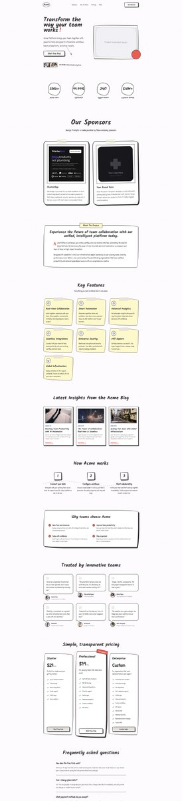
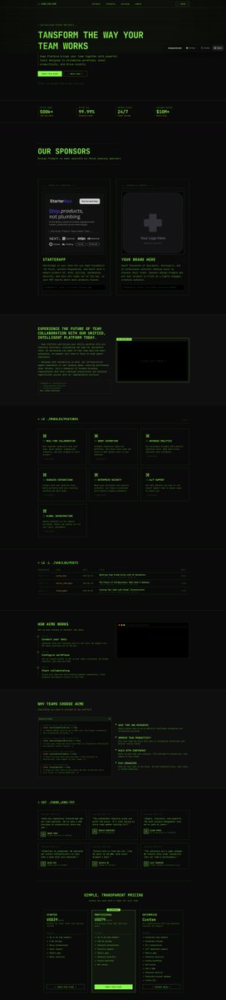
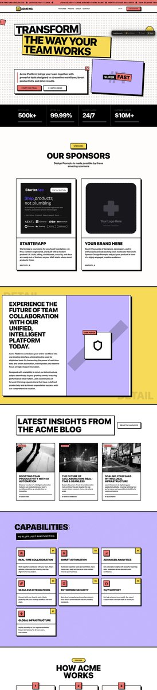

# Design Prompts：30+ 網頁設計風格 Agent Prompt 集合

> **來源**: [@miantiao](https://x.com/miantiao/status/2000166814379106687) | [原文連結](https://twitter.com/miantiao_me/status/2000166814379106687/photo/1)
>
> **日期**: Sun Dec 14 11:31:44 +0000 2025
>
> **標籤**: `Claude Code` `網頁設計` `Prompt 工程`

---

# Design Prompts：30+ 網頁設計風格 Agent Prompt 集合

> **來源**: [@miantiao (面条)](https://t.co/xEAW2KO1YL)
> **日期**: 2026-02-15
> **標籤**: `design-prompts` `claude-code` `ai-design` `web-design` `subagent`

---

## 概述

Design Prompts 是一個提供網頁設計風格 Agent Prompt 的資源網站，收錄 30 種以上常見網頁設計風格的專業 Prompt，可直接整合到 Claude Code 的 Subagent 功能中使用。

## 核心功能

透過將這些設計風格 Prompt 加入 Claude Code 的 Subagent，可以實現：

- **快速生成美觀介面**：AI 網頁設計師根據指定風格快速產出設計
- **保持設計統一性**：整個網站遵循一致的設計語言
- **大幅提升效率**：減少手動調整設計的時間成本

## 使用方式

1. 前往 Design Prompts 網站選擇需要的設計風格
2. 複製對應的 Agent Prompt
3. 整合到 Claude Code 的 Subagent 設定中
4. 讓 AI 設計師根據選定風格為專案生成介面

## 適用場景

- 需要快速建立具專業外觀的網站
- 希望保持多頁面設計風格一致
- 想探索不同設計風格的可能性
- 加速 MVP 或原型開發流程
