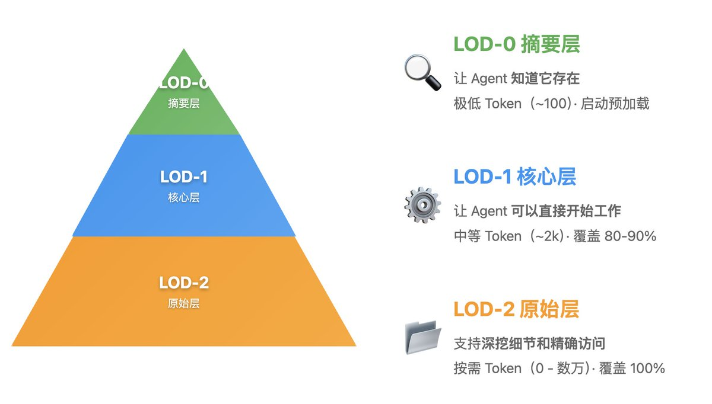

# Claude Skills 的信息分層設計與按需加載機制

> **來源**: [@feltanimalworld](https://x.com/feltanimalworld/status/1989338470456631674) | [原文連結](https://agentskills.io/home)
>
> **日期**: Fri Nov 14 14:23:46 +0000 2025
>
> **標籤**: `Claude Skills` `Agent 能力擴展` `信息架構`

---



> **來源**: [@feltanimalworld (Susan STEM)](https://twitter.com/feltanimalworld)  
> **日期**: 2026-02-17  
> **標籤**: `Claude Skills` `信息架構` `AI Agent` `按需加載`

---

## 核心概念

Claude Skills 是一種「通過文件系統擴展 Agent 能力」的機制。它實現了三個關鍵設計：

1. **每個 Skill = 一個文件夾**
2. **元信息在 YAML frontmatter 裡**
3. **按需加載完整內容與引用文件**

Claude Skills 的核心效率來源於：**漸進式的信息披露 + 按需加載**。

用更直觀的語言描述就是：遠看大顆粒，按需走近，走近打開顆粒度再繼續細化。

LOD（Level of Detail，細節層級）決定「顯示多細」，而按需加載決定「什麼時候加載什麼」。

這個才是按需調度的關鍵，因為最終目標不僅是按需調度，還包括：
- 鏈式調度
- 分層調度
- 可能的分叉
- 當系統熵增高到一定程度時，自動引入 Human in the Loop decision making

## 信息三層架構——從塞爾達到 Claude Skills

### LOD-0：摘要層（最抽象）

**目的**：讓 Agent「知道它存在」

**對應塞爾達**：遠方神廟的輪廓、怪物營地的一縷煙

**內容**：極少量元信息——名稱 + 一句話描述 + 若干標籤

**在 Claude Skills 中的實現**：

```yaml
---
name: PDF
description: Manipulate PDF documents, fill forms
---
```

**加載時機**：Agent 啟動時一次性讀取全部 Skills 的 frontmatter

**Token 成本**：極低。比如 20 個 Skill，總共不過幾百 tokens

### LOD-1：核心層（開箱即用）

**目的**：讓 Agent「可以直接開始工作」

**對應塞爾達**：神廟完整的外部結構、營地的基本布局和敵人類型

**內容**：足以完成 80–90% 場景的「核心信息」：
- 完整 SKILL.md
- 函數簽名、參數說明、常用示例
- 數據表的統計摘要與樣本等

**在 Claude Skills 中的實現**：當 Agent 認為 PDF 相關時，才加載完整 SKILL.md 正文（可能 1–3k tokens）

### LOD-2：原始層 / 按需層（完整細節）

**目的**：解決剩下 10–20% 的複雜情況

**對應塞爾達**：神廟內部的機關、敵人的具體屬性、材料的物理參數

**內容**：全量原始信息：
- 全部代碼
- 全部數據
- 更細的規格、表單模板等

**在 Claude Skills 中的實現**：
- SKILL.md 引用的擴展文件，如 scripts/、examples/ 等
- 只有在具體執行某個複雜操作時才被讀取

## 信息架構對照表

| 層級 | 目的 | 塞爾達類比 | Claude Skills 實現 | Token 成本 | 加載時機 |
|------|------|-----------|-------------------|-----------|---------|
| LOD-0 | 知道存在 | 遠方輪廓 | YAML frontmatter | 極低（幾百 tokens） | Agent 啟動時 |
| LOD-1 | 開始工作 | 神廟外觀 | 完整 SKILL.md | 中等（1-3k tokens） | 判斷相關時 |
| LOD-2 | 解決複雜情況 | 神廟內部 | 引用的擴展文件 | 按需（可能很高） | 執行複雜操作時 |


## Agent Skills 的優勢

### 對 Skill 作者
構建一次能力，即可部署到多個 Agent 產品

### 對兼容的 Agent
支持 Skills 讓終端用戶能夠開箱即用地賦予 Agent 新能力

### 對團隊和企業
將組織知識捕獲為可移植、版本控制的套件

## Agent Skills 能實現什麼

- **領域專業知識**：將專業知識打包成可重用的指令，從法律審查流程到數據分析管道
- **新能力**：賦予 Agent 新能力（例如創建演示文稿、構建 MCP 服務器、分析數據集）
- **可重複的工作流程**：將多步驟任務轉化為一致且可審計的工作流程
- **互操作性**：在不同的 Skills 兼容 Agent 產品之間重用相同的 Skill

## 補充說明

Agent Skills 格式最初由 Anthropic 開發，作為開放標準發布，現已被越來越多的 Agent 產品採用。該標準對更廣泛的生態系統開放貢獻。
