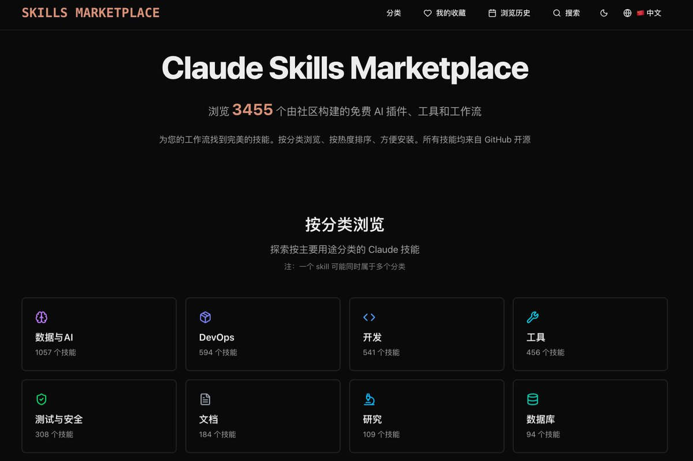

# Claude Skills Marketplace — 3455 個開源技能市集

> **來源**: [@gkxspace](https://x.com/gkxspace/status/1987885651086233747) | [原文連結](https://skillsmp.com/)
>
> **日期**: Mon Nov 10 14:10:47 +0000 2025
>
> **標籤**: `Claude Skills` `工作流自動化` `開發工具`

---

> **來源**: [@gkxspace (余温)](https://x.com/gkxspace)
> **日期**: 2026-02-17
> **標籤**: `Claude` `Skills` `開源` `AI工具`

---

## Claude Skills Marketplace

**Claude Skills Marketplace** 是一個 Claude Skills 開源技能市集，目前收錄了 **3455 個** Claude Skills。這些技能涵蓋開發、研究、內容創作等多種用途。

### 主要特色

- **分類瀏覽**：按照不同類別整理技能，方便尋找特定領域的工具
- **熱度排序**：可依照熱門程度排序，快速找到最受歡迎的技能
- **便捷安裝**：提供簡便的安裝方式
- **開源來源**：所有 Skills 均來自 GitHub 開源專案

### 市集網址

https://claudeskills.xyz

### 相關討論

有使用者分享使用 Kimi 成功執行 Claude Skills，並表示在多數場景下可以替代 n8n 等 AI 工作流工具。

