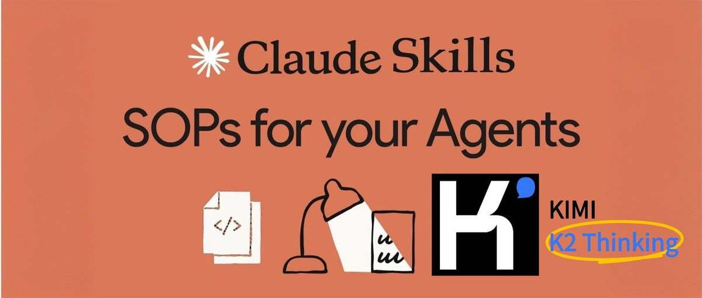
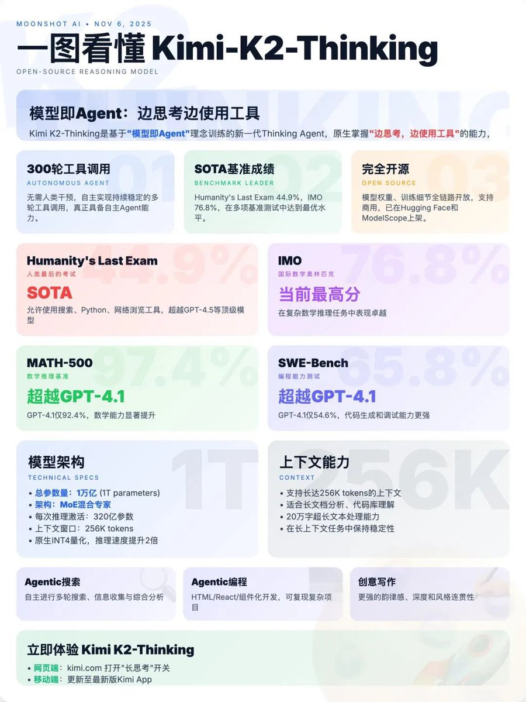

# 用 Kimi 跑通 Claude Skills，直接替代 n8n 工作流

> **來源**: [@bggg_ai](https://x.com/bggg_ai/status/1986996153741967534) | [原文連結](https://twitter.com/bggg_ai/status/1986996153741967534/photo/1)
>
> **日期**: Sat Nov 08 03:16:14 +0000 2025
>
> **標籤**: `Claude Skills` `Kimi AI` `工作流自動化`

---




> **來源**: [@bggg_ai (餅乾哥哥AGI（2.0）)](https://twitter.com/bggg_ai)
> **日期**: 2026-02-17
> **標籤**: `kimi` `claude-skills` `workflow` `ai-tools` `n8n`

---

## 核心概念

n8n 已死！我用 Kimi 跑通了 Claude Skills，直接替代工作流。

昨天的圖，是我用 Kimi 在 Claude Code 一句話生成的：

```
搜索 kimi 今天發布的 kimi-k2-thinking 的信息，以及網友對它的測評效果，然後調用 `infopic-skill` 做一個信息圖
```

效率比工作流高 10 倍。

## 如何使用

如何用 Kimi 新建、安裝、使用 Claude Skills，詳見來源推文串。
