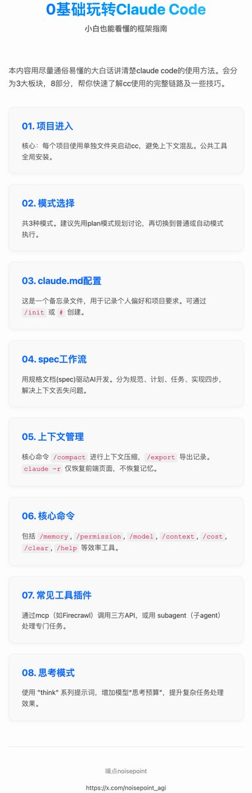

# Claude Code 零基礎完全指南：框架流程與高頻操作

> **來源**: [@noisepoint_agi](https://x.com/noisepoint_agi/status/1986683674188828695)
>
> **日期**: Fri Nov 07 06:34:33 +0000 2025
>
> **標籤**: `Claude Code` `工作流` `開發效率`

---

> **來源**: [@noisepoint_agi (噪点noisepoint)](https://x.com/noisepoint_agi)  
> **日期**: 2026-02-17  
> **標籤**: `Claude Code` `AI開發工具` `工作流` `新手指南`

---

## 概述

本文用通俗易懂的方式講解 Claude Code（CC）的完整使用方法，適合零基礎或剛接觸的使用者快速了解 CC 的完整鏈路及技巧。

文章分為 **3 大板塊，8 個部分**：

- **需求前期工作**：項目進入 → 模式選擇 → `CLAUDE.md` 配置
- **工作流管理**：Spec 工作流開發
- **高頻操作及功能**：上下文管理 → 核心命令 → 常見工具插件 → 思考模式

其中從「項目進入」到「Spec 工作流」為基礎的完整開發流程，這些環節就可以把需求進行實現，直接看到效果。後面幾部分是提升開發效率和結果的核心要素。

---

## 需求前期工作

### 項目進入

這是新手最容易踩的坑。

很多人在安裝完 CC 後直接在主目錄或安裝 CC 的目錄裡啟動，然後不管做什麼需求都在同一個目錄空間裡運行。儘管 CC 可以正常跑，但這裡面有一個巨大風險：**CC 是基於項目資料夾的工具，它在生成 `CLAUDE.md` 時會參考整個 codebase 程式碼庫**。這意味著如果你啟動 CC 的目錄空間裡有不同項目，它就會全部參考，導致上下文混亂和邏輯衝突的機率大大增加。

簡單來說，你在做一個新需求時，它既會參考你空間裡的 A 項目，也會參考 B 項目，這就很容易出錯。

**強烈建議**：每個完整項目都有自己的單獨資料夾，然後在終端裡進入到這些嵌套的具體項目資料夾去啟動 CC，這樣參考的 codebase 就只是這個項目資料夾裡的內容。

對於一些公共的 CC 設置和不區分項目的工具，盡量全域安裝。建議盡量自己安裝，不讓 AI 去裝，因為 AI 有時雖然裝上了能用，但可能會做成項目級，新項目空間裡就失效了。

**操作步驟**：
1. 建好項目資料夾
2. 在終端 `cd` 進入到具體的項目資料夾
3. 再啟動 Claude Code

完成這關鍵的第一步，就進到了主界面。

---

### 模式選擇

在 CC 中有 3 種模式，通過 `Shift+Tab` 可以切換：

1. **普通模式**：進入主界面就是普通模式，沒什麼好說的
2. **Plan 模式**：這個模式只會去討論溝通，不會執行寫程式碼。在項目前期需要規劃功能的時候可以用這個模式，它會自動給出計畫方案，然後會和你確認是否執行
3. **自動接受編輯模式**：這個模式會根據和 AI 討論的方案，自動進行任務執行（比如寫程式碼）

**建議**：一開始用普通或 Plan 模式，**Plan 模式最佳**。可以盡情和 CC 討論你的需求，讓它不斷調整方案、給文件建議，都確定好了後退出 Plan 模式，切換到普通或自動接受模式進行相關執行。

---

### `CLAUDE.md` 創建

進入項目、選擇完模式後，在開始溝通具體需求前還有個環節可以操作，那就是 `CLAUDE.md`。

這是一個特殊檔案，類似官方提供的你和 CC 之間的備忘錄。Claude 在開始對話時會自動將其內容拉入上下文，所以它既可以記錄一些你個人的習慣（如特殊偏好、常用命令、程式碼風格等），也可以針對項目記錄一些具體項目要求（如項目背景、注意事項、測試說明等）。總之，一切你想要 Claude 知悉的事項都可以寫進去。

**`CLAUDE.md` 分為兩種**：

- **使用者級**：不關聯項目，只要是在你這個使用者名登錄下任何項目都會遵守這個 `CLAUDE.md` 文件規則
- **項目級**：只對該項目生效，切換項目後就不會再遵守

**生成方式**：

1. **直接運行 `/init` 命令**：會自動參考你的項目空間 codebase 生成文件
2. **通過輸入 `#`**：後面可直接添加 memory 記憶，然後讓你選擇是添加到使用者級還是項目級，這個 memory 也就是 `CLAUDE.md` 的內容

如果不想自動生成，也可以手動添加一個項目級 `CLAUDE.md`，怎麼寫直接和 AI 討論就行。核心包括：項目介紹、開發偏好、技術棧。

**`CLAUDE.md` 記憶內容查看**：

通過運行 `/memory` 可以查看 `CLAUDE.md` 裡的記錄內容，項目級和使用者級都可查看。

---

## 工作流管理

把上面前期環節都走完後，就可以來到真正的需求溝通和執行環節了。

這個環節最核心的就是一句話：**文件，文件，還是文件**。只要把需求細節都講清楚，讓它照著文件做，選個好模型，做出來的產品與預期不會偏離太多。

### Spec 工作流

Spec 即規範規格，用規格文件來驅動 AI 開發，可以理解為這個規格是 AI 要遵守的唯一契約，必須按照 Spec 文件做事執行。

**Spec 分 4 部分**：

#### 1. 規範（Specification）

這個文件不用涉及技術相關內容，主要是關於項目的描述、功能需求、目標人群等。把這些大的需求相關資訊告訴 AI，讓 AI 生成一個規範文件。這是一個將模糊想法轉化為結構化需求的過程。

#### 2. 計畫（Plan）

把上面剛生成的規範文件以及你的一些技術偏好、項目相關約束（如框架、語言、測試計畫等）發給 AI，讓它生成一個完整的技術文件。

#### 3. 任務（Task）

把上面的兩個文件再發給 AI，讓它參考這 2 個文件把你的功能需求按確認後的技術偏好拆分成一個個具體的、可執行的子任務，每個任務都可以獨立實現和測試。

#### 4. 實現（Implementation）

讓它先把上面的 3 個文件匯總成一個大的 `spec.md` 發給你確認。如果覺得有問題就修改，確認無誤後發給 AI，讓它進行程式碼編寫開幹。

**與 `CLAUDE.md` 的區別**：

相比 `CLAUDE.md` 來說，Spec 文件會更側重於具體功能的詳細實現計畫，`CLAUDE.md` 會相對更大一點。當然對於簡單小需求，只寫一個即可。

**Spec 工作流解決的核心問題**：

現在模型上下文都很有限，如果上下文用滿後再開一個視窗不能把這些上下文內容 100% 記錄，就會造成上下文丟失，開發效果會大打折扣。而文件記錄正好解決了這一問題，可以讓 AI 能看到完整的上下文背景資訊。

---

### 個人工作流習慣

1. 先自己寫個大致文件需求
2. 然後發給 AI 和它基於這個文件討論溝通，讓它給我建議
3. 然後讓它把討論過程中我確認的資訊再完整複述給我，我來確認，確保雙方理解無誤
4. 確認無誤後讓它更新到我之前的文件中，這些文件會包含上面提到的 Spec 完整環節（比如技術文件、任務拆分等），生成最終文件
5. 將最終文件發給它，讓它開始執行，你最後測試需求效果

當然這只是個人習慣，沒什麼固定格式，只要自己用的順手、能夠把需求細節描述清楚、上下文給到位，其他任意工作流樣式都可以，此處介紹 Spec 只是舉例罷了。

---

以上基本就覆蓋了 Claude Code 實現需求的核心鏈路和環節，能夠讓一個需求變成一個產品的全過程。

---

## 高頻操作及功能

下面會再介紹在這個開發鏈路過程中會經常用到的一些高頻功能和技巧，以及注意事項。

### 上下文管理

上下文可以說是任何 AI 工具的核心，沒有足夠完整的上下文，結果一定會與預期偏差較大。

在 Claude Code 中有幾個高頻命令可以進行上下文管理：

#### `/compact`（壓縮）

直接在 CC 裡輸入 `/compact` 可以進行上下文壓縮，AI 會自動去掉無關資訊，保留核心資訊的關鍵摘要。也可以按你的需求進行壓縮，比如只保留壓縮你想要的某一部分內容。

當然系統也會在上下文用盡時自動壓縮，**建議是最好主動壓縮**，看到頁面空間剩下 20% 時就要留意是不是要壓縮或新開視窗了。

#### `/export`（導出）

可以將完整聊天記錄進行導出，放到文件裡再發給 AI 參考。

#### `claude -r`（恢復會話）

當退出會話後，可以在終端用 `claude -r` 恢復會話，但**一定要注意，這個恢復只是前端頁面**，是方便使用者看聊天記錄的，**並不會恢復模型的上下文記憶**。

---

### 常用命令

- `/memory`：`CLAUDE.md` 記憶管理
- `/permission`：功能及工具權限確認
- `/compact`：上下文壓縮
- `/export`：導出當下會話，方便給 AI 參考
- `/config`：進入配置欄，進行 CC 相關配置，如主題等
- `/status`：查看當前你的 Claude Code 狀態
- `/model`：進行模型切換
- `/context`：tokens 消耗情況查看
- `/cost`：費用情況查看
- `/exit`：退出 Claude Code
- `/clear`：清空上下文，新開啟會話
- `/help`：所有命令查看

以上是一些比較常見的命令，能幫助提升一些使用效率。

---

### 常見工具及插件

在 Claude Code 裡面，還支援自定義添加很多工具來增加 Claude Code 能力，比如 MCP、插件、Subagent 等。

#### MCP

簡單理解為就是 API 的一種，本身也是一種協定，可以來調用第三方工具擴展能力。

常見的 MCP 像：

- **Context7**：獲取官方最新文件，如 API 對接、庫文件等
- **Firecrawl**：網頁內容抓取
- **Playwright MCP**：瀏覽器自動化工具

在 CC 中 `/mcp` 即可查看已安裝的 MCP 列表，使用時直接說明用某某 MCP 去執行任務即可，比如「用 Firecrawl 來查詢總結這篇文章內容」。

#### Subagent

本質就是一個 Agent，可以理解 Claude Code 支援你添加不同的子 Agent 來專門負責完成對應的任務。這些子 Agent 即 Subagent 可以設置不同的能力，比如專門做需求分析、寫程式碼、做測試等。

每個 Agent 都有自己獨立的上下文。需要注意的是，Subagent 執行完畢的結果是返回給主 Agent 即 Claude Code，而不是你。Claude Code 會把這些 Subagent 執行的結果統一處理後再返回給你。

使用 `/agent` 可以進行 Agent 管理，包括新建、編輯、管理等。

**有 2 種使用方法**：

1. Claude Code 會根據你的任務自行判斷是否調用 Subagent，調用哪個 Subagent
2. 顯式調用，直接在對話裡和 AI 說清楚即可

---

### 思考模式

在 Claude Code 中可以通過 `think` 提示詞來激活思考模式，有幾個層級：

**"think" < "think hard" < "think harder" < "ultrathink"**

思考程度依次增強。

**原理**：通過調節「思考預算」（即模型在內部推理階段可用的資源/token 數）讓模型在遇到複雜任務時「多花點時間思考」再出結果，效果會更好，當然費用也會更多。

**注意**：這個擴展思考模式不是切換模型，只是讓同一個模型在內部保留更多推理步驟或 token 數來思考更久。

---

## 總結

以上基本就是使用 Claude Code 的核心知識點，涵蓋了 **3 大板塊，8 部分**：

- **前期工作**：項目進入 → 模式選擇 → `CLAUDE.md` 配置
- **工作流管理**：Spec 工作流開發
- **高頻操作及功能**：上下文管理 → 核心命令 → 常見工具插件 → 思考模式

當然，Claude Code 不止用來寫程式碼，很多場景只要是有可能 AI 解決的，都可以在 Claude Code 嘗試解決。**多用才是上手最快的方法**。
