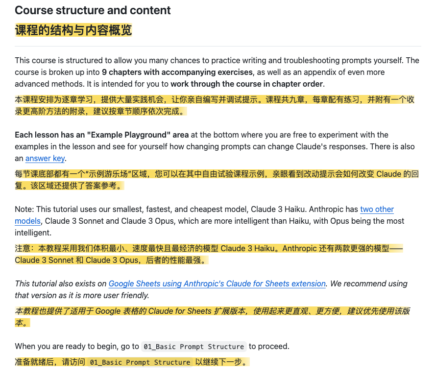

# Anthropic 官方提示工程互動教學課程

> **來源**: [@hongming731](https://x.com/hongming731/status/1977585846363869563) | [原文連結](https://github.com/anthropics/prompt-eng-interactive-tutorial)
>
> **日期**: Mon Oct 13 04:03:02 +0000 2025
>
> **標籤**: `提示工程` `Claude` `學習資源`

---

> **來源**: [@hongming731 (ginobefun)](https://twitter.com/hongming731)  
> **日期**: 2026-02-17  
> **標籤**: `AI` `Claude` `提示工程` `教學課程` `Anthropic`

---

## 課程簡介

Anthropic 官方推出的零門檻互動式提示工程教學課程，幫助你解鎖 Claude 的真正潛力。

課程網址：https://github.com/anthropics/prompt-eng-interactive-tutorial

## 課程目標

完成本課程後，你將能夠：

- 掌握良好提示詞的基本結構
- 識別常見的失敗模式，學習「80/20」技巧來解決問題
- 了解 Claude 的優勢與劣勢
- 從零開始為常見使用場景建構強大的提示詞

## 課程結構

本課程分為 **9 個章節**加上一個進階方法附錄，每個章節都包含配套練習。建議按照章節順序學習。

每個課程都有「範例遊樂場」區域，讓你自由實驗範例並親自觀察改變提示詞如何影響 Claude 的回應。課程也提供答案解析。

**注意**：本教學使用 Anthropic 最小、最快、最便宜的模型 Claude 3 Haiku。Anthropic 還有兩個更智能的模型：Claude 3 Sonnet 和 Claude 3 Opus，其中 Opus 是最智能的。

本教學也有 Google Sheets 版本，使用 Anthropic 的 Claude for Sheets 擴充功能，該版本更加使用者友善。

## 課程目錄

### 初級

- **Chapter 1**: 基本提示結構
- **Chapter 2**: 清晰直接的表達
- **Chapter 3**: 角色分配

### 中級

- **Chapter 4**: 將資料與指令分離
- **Chapter 5**: 格式化輸出與代替 Claude 發言
- **Chapter 6**: 預知（逐步思考）
- **Chapter 7**: 使用範例

### 進階

- **Chapter 8**: 避免幻覺
- **Chapter 9**: 建構複雜提示詞（產業使用案例）
  - 從零開始的複雜提示詞 - 聊天機器人
  - 法律服務的複雜提示詞
  - 練習：金融服務的複雜提示詞
  - 練習：程式碼撰寫的複雜提示詞

### 附錄：超越標準提示

- 提示詞鏈接（Chaining Prompts）
- 工具使用（Tool Use）
- 搜尋與檢索（Search & Retrieval）

## 相關資源

- GitHub 儲存庫：anthropics/prompt-eng-interactive-tutorial
- Stars: 30.1k
- Forks: 3k
- 程式語言：Jupyter Notebook (98.1%), Python (1.9%)

---

★ Insight ─────────────────────────────────────
1. **官方互動式教學**：Anthropic 親自下場製作的教學課程，內容權威且實用，包含大量實戰練習
2. **循序漸進的結構**：從基礎到進階，涵蓋提示工程的所有核心技巧，特別是「80/20」法則專注於最實用的技術
3. **實務導向**：第 9 章直接針對法律、金融、程式碼等真實產業場景，讓你學完就能應用
─────────────────────────────────────────────────
