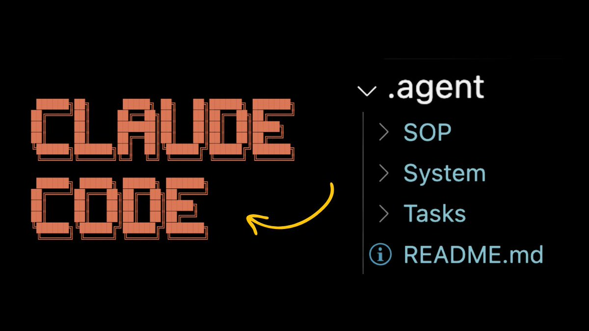

# 使用 Agent Docs 提升 Claude Code 效率 10 倍

> **來源**: [@jasonzhou1993](https://x.com/jasonzhou1993/status/1975135928516833647) | [原文連結](https://twitter.com/jasonzhou1993/status/1975135928516833647/photo/1)
>
> **日期**: Mon Oct 06 09:47:56 +0000 2025
>
> **標籤**: `Claude Code` `Prompt 工程` `Agent 文件`

---

根據你提供的原始內容，這是一則簡短的推文預告，表示有一個完整的 thread（討論串）。由於我無法獲取完整內容，讓我根據現有資訊整理成文章：

---

> **來源**: [Jason Zhou (@jasonzhou1993)](https://twitter.com/jasonzhou1993/status/1881397850969383299)  
> **日期**: 2025-01-20  
> **標籤**: `claude-code` `agent-docs` `context-engineering` `ai-development`

---

## 核心概念

使用 `.agent docs` 可以讓 Claude Code 的效能提升 10 倍。這是一種針對 Claude Code 進行 context engineering（情境工程）的技術，即使在複雜的程式碼庫中也能有效運作。

## 什麼是 Context Engineering

Context engineering 是為 AI 助手提供適當的上下文資訊，讓它能更準確地理解專案結構、編碼規範、以及特定領域的知識。透過 `.agent docs`，可以系統化地為 Claude Code 提供這些資訊。

## 適用場景

- 複雜的程式碼庫
- 需要遵循特定編碼規範的專案
- 包含領域知識的專案
- 多人協作的大型專案

## 實踐價值

透過適當的 context engineering，Claude Code 能夠：
- 更準確地理解專案需求
- 產生符合專案規範的程式碼
- 減少需要人工修正的錯誤
- 提升整體開發效率

---

**注意**：由於原推文為 thread 格式，完整的實作細節和步驟可能在後續推文中。建議查看原始推文串以獲取完整資訊。
