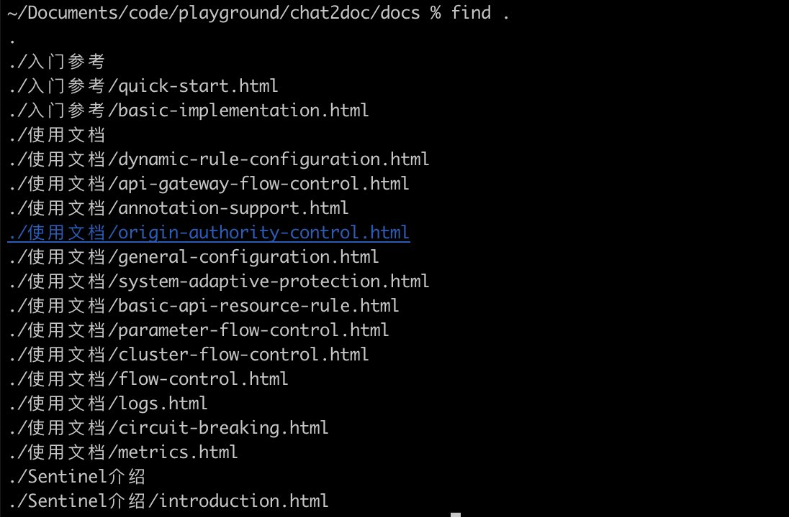
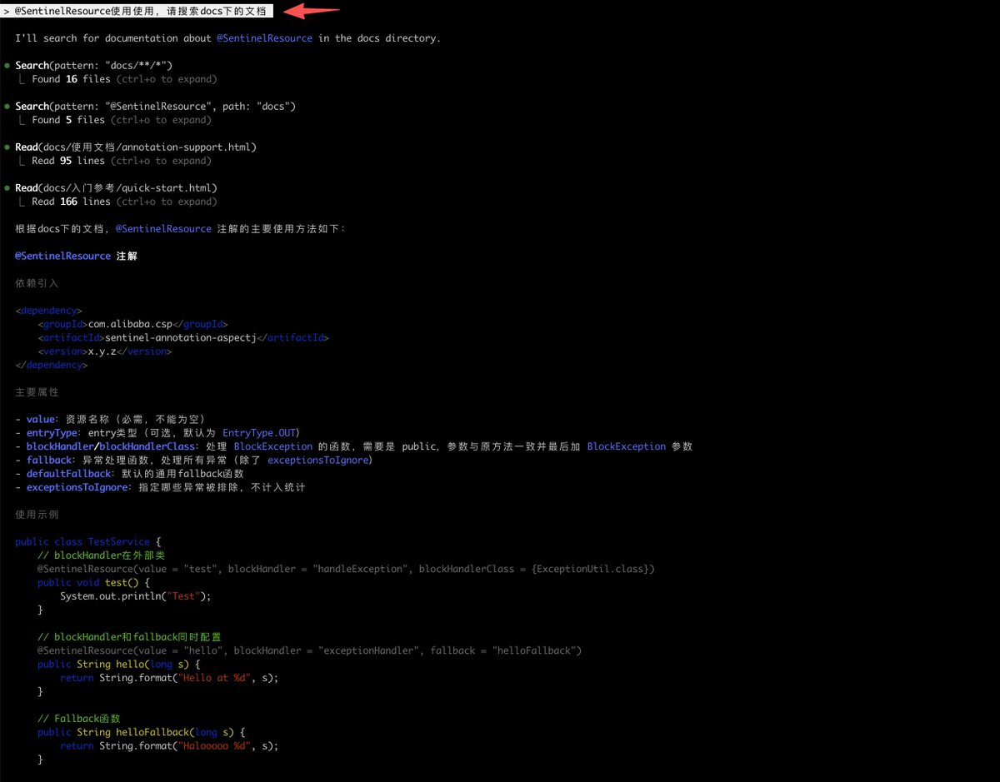

# 使用 Claude Code 搭建 RAG 文件智能體

> **來源**: [@LinearUncle](https://x.com/LinearUncle/status/1975104961311646181)
>
> **日期**: Mon Oct 06 07:44:53 +0000 2025
>
> **標籤**: `Claude Code` `RAG` `Agent SDK`

---

> **來源**: [@LinearUncle](https://twitter.com/LinearUncle)
> **日期**: 2026-02-18
> **標籤**: `claude-code` `rag` `mcp` `agent-sdk`

---

## 實驗概述

受到寶哥帖子的啟發，花 10 分鐘實驗了 chat2website 當作 RAG 使用的流程。

## 實作步驟

### 1. 下載網站文檔到本地

使用 Claude Code + chrome-devtools-mcp 下載網站的部分文檔到本地目錄。

**注意事項**：請遵紀守法，切勿把別人站搞掛了，後果自負。

### 2. 新開 Claude Code 針對文檔詢問

新開一個 Claude Code session，針對下載的文檔進行問答。

### 3. 後續優化計劃

準備打磨提示詞，看看 Claude Code 能否根據本地這堆文檔快速實現相關功能。

**建議**：最好是轉成 md 格式文件，因為 html 中有很多無關內容。

## 相關參考：Claude Agent SDK

### 開發 Agent 的選擇

如果你想開發一個 Agent，無論是打算做 CLI、Web 還是 Windows，都可以考慮使用 Claude Agent SDK。它和 Claude Code 共享底層程式碼，Claude Code 就是基於它之上加了個 CLI 的 UI，也就是說你完全可以基於它寫一個 Claude Code 出來。

### 實際案例：Design System UI Agent

昨天幫朋友花了幾個小時實現了個簡單的 Agent，功能是輸入提示詞，就可以基於某個沒訓練的 Design System 寫一套 UI 出來。

#### 實作原理

這個 Agent 原理很簡單：

1. 把這套設計系統的所有 Markdown 文檔（幾百個）放到一個它可以存取的目錄
2. 在 System Prompt 裡面引導它去檢索這個文檔目錄
3. 當使用者輸入提示詞或 Screenshot 要做一個 UI，Agent 就根據提示詞規劃可能要用到的元件
4. 用 SDK 自帶的 GREP 工具去檢索文檔庫找到這些元件的 API
5. 基於收集到的資訊用這個 Design System 元件生成頁面

### SDK 特點

#### 優勢

- **API 簡單但強大**：不只可以用內建工具（Task、Grep、WebFetch 等），還可以新增自己的工具，也可以用 MCP
- **可取得原始資料**：可以把整個互動的結果透過 API 取得原始的請求和返回訊息，這樣可以自己實現一套比 CLI 更好用的互動 UI

#### 局限

1. 只能用 Claude 模型相容的 API，如果你想用 GPT-5 之類模型，估計效果不會太好
2. 只支援 Python 和 TypeScript
3. Tokens 消耗飛快

### 建議

如果你只是做前期的 POC，強烈建議試試。
