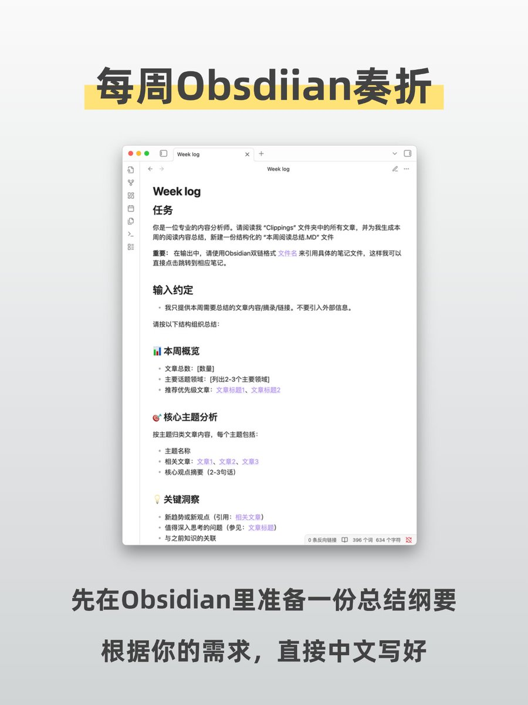
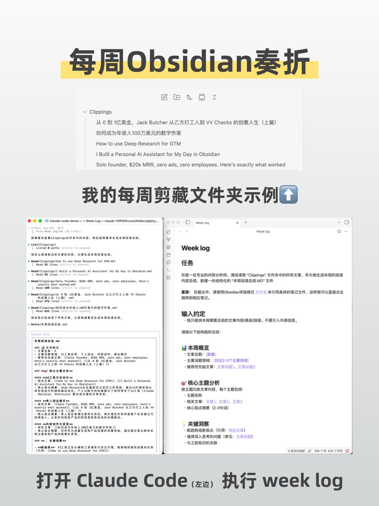
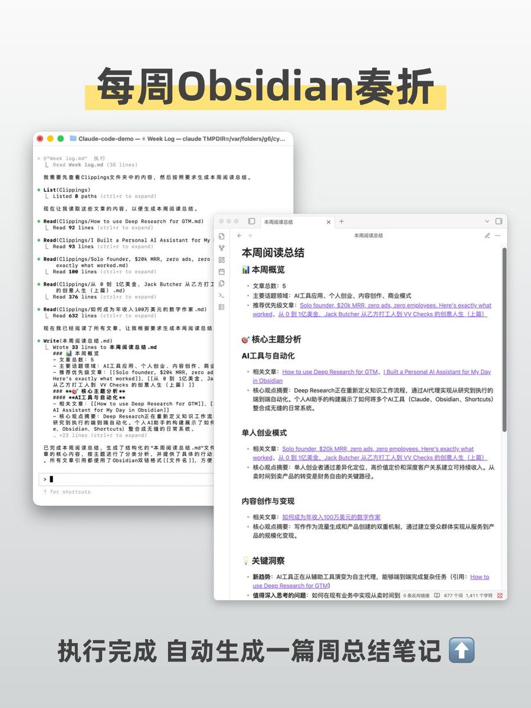

# 用 Claude Code 自動化週報閱讀總結工作流

> **來源**: [@Lessnoise365](https://x.com/Lessnoise365/status/1960247657374589414)
>
> **日期**: 
>
> **標籤**: `Claude Code` `知識管理` `工作流自動化`

---

## 自動化週報閱讀總結工作流

> **來源**: [@Lessnoise365 (被減數)](https://x.com/Lessnoise365)
> **標籤**: `claude-code` `obsidian` `workflow-automation` `知識管理`

---

## 閱讀習慣與痛點

我有個習慣，平時看到好文章就隨手扔到 Obsidian Clipping 文件夾裡，也不分類，反正到週末再說。

週末整理這些文章是我最頭疼的事，經常拖著拖著就忘了。

## Claude Code 自動化解決方案

現在完全不一樣了。只需要在 Claude Code 裡說一句「生成本週閱讀總結」，CC 就會把這一週剪藏的所有文章全部讀一遍，然後生成一份結構化的總結報告。

我只需像皇帝批閱奏折一樣快速瀏覽，就能知道哪些文章值得深讀，哪些可以略過。

## 技術組合

目前使用的是 **Claude Code + KIMI** 的窮人組合。

提示詞還能優化得更細節。
