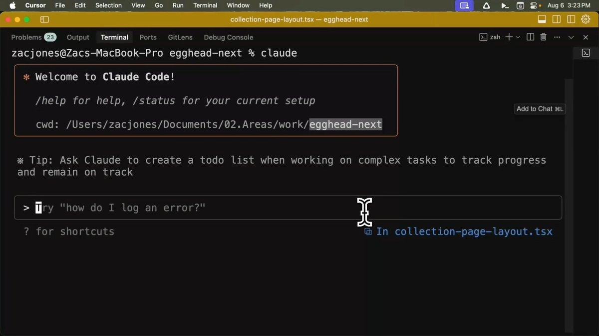

# 在 Claude Code 中整合 Gemini CLI 子智能體進行大型程式庫分析

> **來源**: [@aigclink](https://x.com/aigclink/status/1959901325917118575)
>
> **日期**: Mon Aug 25 08:51:03 +0000 2025
>
> **標籤**: `Claude Code` `Gemini CLI` `子智能體`

---

> **來源**: [@aigclink (AIGCLINK)](https://x.com/aigclink)
> **日期**: 2026-02-18
> **標籤**: `claude-code` `gemini-cli` `程式碼分析` `子智能體` `ai-tools`

---

## 核心概念

在 Claude Code 中整合 Gemini CLI 子智能體，將大型程式庫分析任務委派給 Gemini 的百萬 token 視窗，既能節省 Claude 額度，又能獲得高品質結果。

## 方法優勢

利用不同模型的優勢來完成特定任務：

- **大型程式碼掃描**：使用 Gemini 處理，不消耗 Claude token
- **IDE 內整合**：一鍵完成，結果直接可讀
- **子智能體角色**：本身不執行分析，只負責管理 Gemini CLI 的輸入和輸出

## 實作步驟

整個教程演示了以下流程：

1. **在 Claude Code 中新建子智能體**
2. **配置子智能體**：將其設定為 Gemini CLI 包裝器
3. **執行分析**：用一句自然語言指令讓 Gemini 掃描整個程式庫
4. **回傳結果**：將 Gemini 的結果返回 Claude，節省時間和 token

## 教程內容

教程包含完整的實作細節：

- 整套流程說明
- 範例指令
- 注意事項

按照教程內容即可完成複現。
