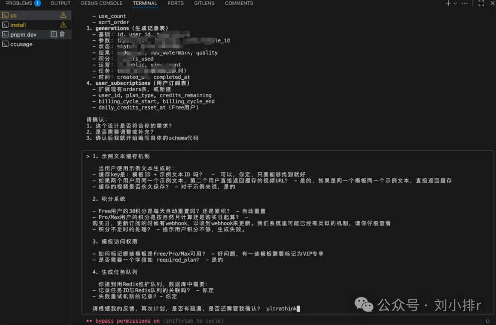

# Claude Code 入門：3 條鐵律告別代碼屎山

> **來源**: [@bourneliu66](https://x.com/bourneliu66/status/1959616518771351608) | [原文連結](https://mp.weixin.qq.com/mp/wappoc_appmsgcaptcha?poc_token=HKkKlWmj3M5ipTGKJr48_-JH1nNIx_wMYOuze-0L&target_url=https%3A%2F%2Fmp.weixin.qq.com%2Fs%2FjQRB9B9Nt0-_5QPgq4_6TA)
>
> **日期**: Sun Aug 24 13:59:20 +0000 2025
>
> **標籤**: `Claude Code` `需求溝通` `代碼質量`

---

> **來源**: [@bourneliu66 (刘小排)](https://twitter.com/bourneliu66)
> **日期**: 2026-02-18
> **標籤**: `Claude Code` `需求管理` `開發流程`

---

## Claude Code 入門：3 條鐵律告別代碼屎山

### 第一條：用飛書文檔寫需求

做到「任何人看都沒有歧義」。圖文並茂，再複製給 Claude Code。

### 第二條：先討論方案，再寫代碼

新需求首次溝通時，告訴它「不要急著寫代碼！先討論方案」。

### 第三條：界面設計先用 ASCII 畫圖

涉及界面時，讓 Claude Code 用 ASCII 畫出多個方案，討論完再寫代碼。
