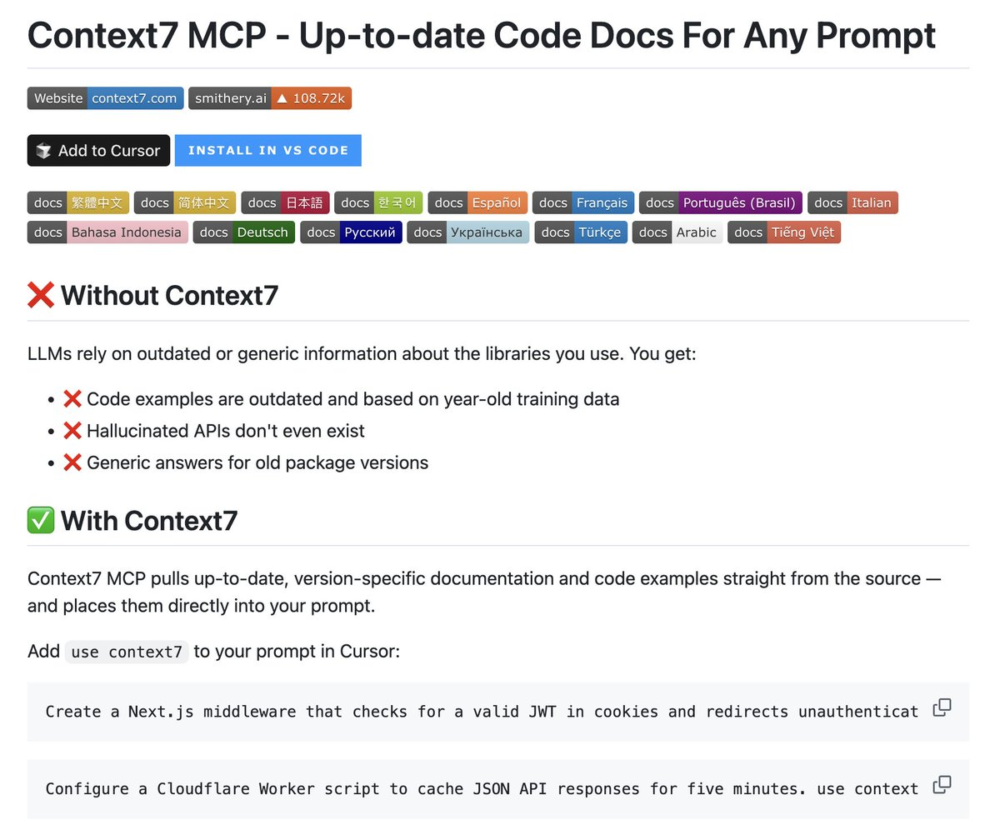

# Context7 MCP：AI 開發必裝的最新文件查詢工具

> **來源**: [@fetalkpodcast](https://x.com/fetalkpodcast/status/1957963302891581459) | [原文連結](https://twitter.com/fetalkpodcast/status/1957963302891581459/photo/1)
>
> **日期**: Wed Aug 20 00:30:03 +0000 2025
>
> **標籤**: `MCP` `文件參考` `AI工具`

---

> **來源**: [@fetalkpodcast (前端輕鬆聊)](https://twitter.com/fetalkpodcast)  
> **日期**: 2026-02-18  
> **標籤**: `ai-tools` `mcp` `context7` `文件查詢`

---

## 什麼是 Context7 MCP

Context7 MCP 是一個專為 AI 開發設計的 MCP (Model Context Protocol) 工具，讓你和你的 AI 助手能夠快速查詢最新的程式庫文件。

## 為什麼需要安裝

如果你剛開始使用 AI 進行開發，Context7 MCP 是第一個應該安裝的 MCP 工具。它提供了橫跨常用程式庫的最新文件查詢功能，讓 AI 能夠基於最新的文件資訊來協助你開發。

## 相關資源

- 工具連結：https://t.co/s1Y6F6lJNZ
