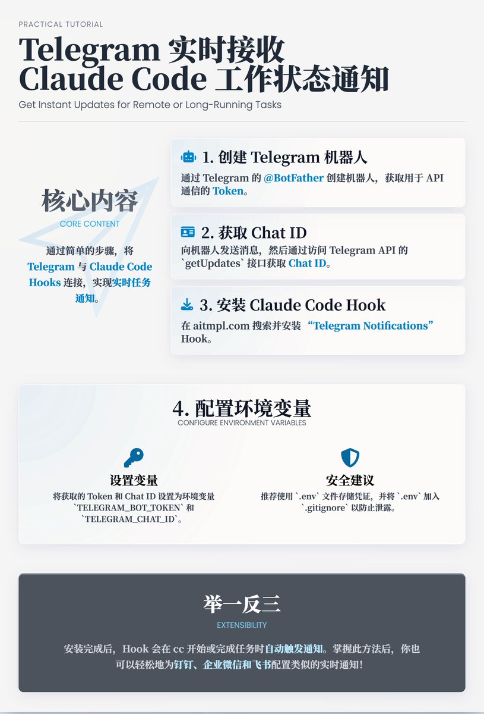
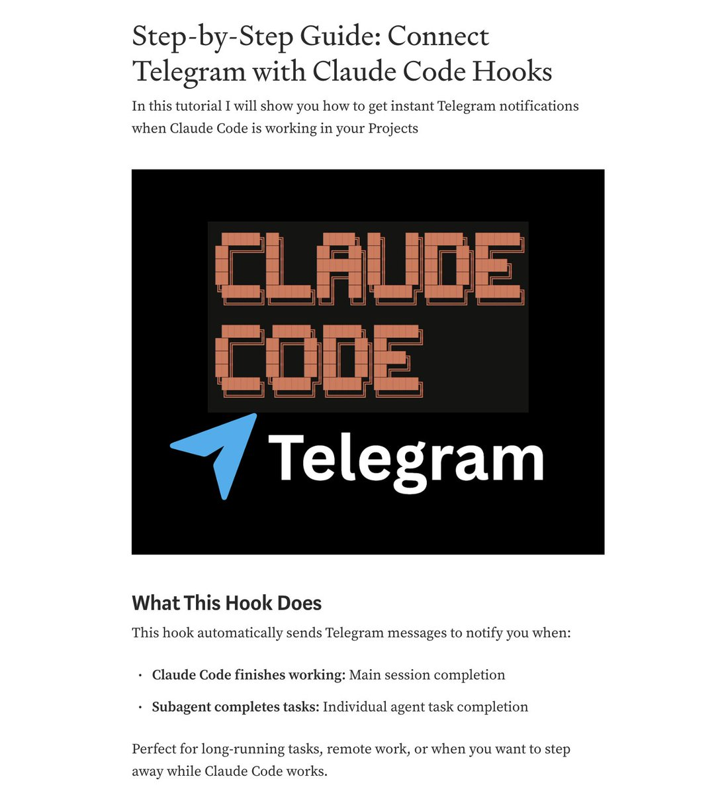

# Claude Code 整合 Telegram 實時通知教程

> **來源**: [@shao__meng](https://x.com/shao__meng/status/1957611521892315166)
>
> **日期**: 
>
> **標籤**: `Claude Code` `Telegram 機器人` `自動化通知`

---




## 核心內容

教程的目的是指導用戶透過簡單的步驟,將 Telegram 與 Claude Code 連接起來,實現以下功能:

- **即時通知**:當 Claude Code 完成主要任務(如主會話結束)或子代理完成具體任務時,自動透過 Telegram 發送通知
- **適用場景**:適合需要監控長時間運行任務、遠程工作或希望在任務執行期間離開的用戶

## 主要步驟解析

### 1. 創建 Telegram 機器人

**操作**:透過 Telegram 的 @BotFather 創建機器人,獲取機器人 Token,具體步驟:

1. 在 Telegram 中搜尋 @BotFather 並發起對話
2. 使用 `/newbot` 命令創建機器人,設置名稱和用戶名(用戶名需以 "bot" 結尾)
3. 複製 BotFather 返回的 Token

**目的**:Token 是機器人與 Telegram API 通信的憑證,用於後續配置。

### 2. 獲取 Chat ID

**操作**:向新建的機器人發送任意訊息(如 "Hello"),然後透過訪問 Telegram API 的 getUpdates 接口獲取 Chat ID。

- 使用 URL:`https://api.telegram.org/bot<YOUR_BOT_TOKEN>/getUpdates`
- 從返回的 JSON 中提取 Chat ID

**目的**:Chat ID 用於指定通知發送的目標用戶或群組。

### 3. 安裝 Claude Code Hook

**操作**:在 aitmpl.com 上搜尋與 Telegram 集成的 Hook,安裝 "Telegram Notifications" Hook。

- 運行命令:`npx claude-code-templates@latest --hook=automation/telegram-notifications --yes`

**目的**:安裝 Hook 以連接 Claude Code 和 Telegram,實現通知功能。

### 4. 配置環境變數

**操作**:將 Token 和 Chat ID 設置為環境變數,確保安全性。

**臨時設置**(僅當前會話有效):

```bash
export TELEGRAM_BOT_TOKEN="123456789:ABCdefGHIjklMNOpqrsTUVwxyz"
export TELEGRAM_CHAT_ID="987654321"
```

**永久設置**(推薦,適用於 macOS/Linux):

- 將變數寫入 shell 配置文件(如 `~/.zshrc`),並透過 `source ~/.zshrc` 刷新
- 驗證變數:`echo $TELEGRAM_BOT_TOKEN` 和 `echo $TELEGRAM_CHAT_ID`

**目的**:透過環境變數存儲敏感資訊,避免在代碼中硬編碼,提高安全性。

### 5. 使用與觸發

**自動運行**:安裝完成後,Hook 會自動在以下情況下觸發通知:

- Claude Code 開始新會話
- Claude Code 完成工具使用或任務

**驗證**:收到通知即表示配置成功,可繼續探索其他 Hook。

## 安全建議

文章特別強調了保護 Token 和 Chat ID 的重要性:

**避免**:在腳本中硬編碼 Token

**推薦**:使用 `.env` 文件存儲憑證,並將 `.env` 加入 `.gitignore` 以防止洩露

## 擴展功能

- **其他通知 Hook**:可結合 Slack、Discord 或桌面通知 Hook,擴展通知渠道
- **國內替代方案**:釘釘、企業微信、飛書也可以按照這個方式配置,差別主要在機器人和 chat ID 配置

## 引用原文

> Claude Code can now send you Telegram notifications when it finishes working on your projects.
> 
> I wrote a step-by-step tutorial after many people asked for this integration.
> 
> It's actually pretty straightforward using the hooks available in Claude Code Templates.
> 
> The setup takes about 5 minutes:
> - Create a Telegram bot
> - Get your chat ID
> - Install the hook with one command
> - Set environment variables
> 
> Perfect for long-running tasks or when you want to step away while Claude Code works.
> 
> You'll get instant notifications on your phone when sessions complete.
> 
> — @dani_avila7
