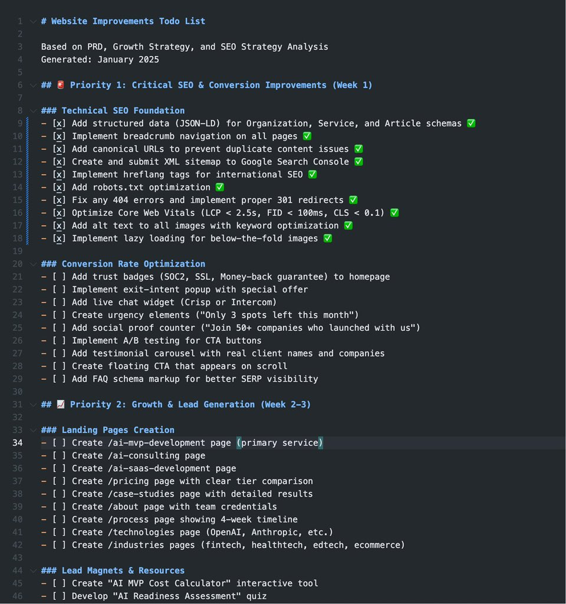

# Claude Code 專案工作流程技巧與自動化文件生成

> **來源**: [@etanphu](https://x.com/etanphu/status/1957592657221619919) | [原文連結](https://twitter.com/etanphu/status/1957592657221619919/photo/1)
>
> **日期**: Mon Aug 18 23:57:14 +0000 2025
>
> **標籤**: `Claude Code` `工作流程自動化` `文件生成`

---

> **來源**: [@etanphu (Ethan AI實驗室)](https://twitter.com/etanphu)
> **日期**: 2026-02-18
> **標籤**: `claude-code` `工作流程` `文件生成` `專案管理`

---

## Claude Code 專案工作流程技巧

在既有專案中使用 Claude Code 的自動化工作流程：

### 文件生成階段

1. **生成 PRD 文檔**
   - 根據專案的既有程式碼，自動生成產品需求文檔（PRD）並保存

2. **生成 SEO 策略文檔**
   - 根據專案的既有程式碼，生成 SEO 策略文檔並保存

### 任務規劃階段

3. **生成改進清單**
   - 根據 PRD 文檔和 SEO 策略文檔，生成可以改進的 todo list 並保存

### 執行階段

4. **分區塊執行任務**
   - 讀取 todo list 文檔的特定區塊（xxx 區塊）
   - 完成該區塊的任務
   - 更新 todo list 的完成狀態

### 最佳實踐

記得使用 **ultrathink 模式**進行深度思考和分析
