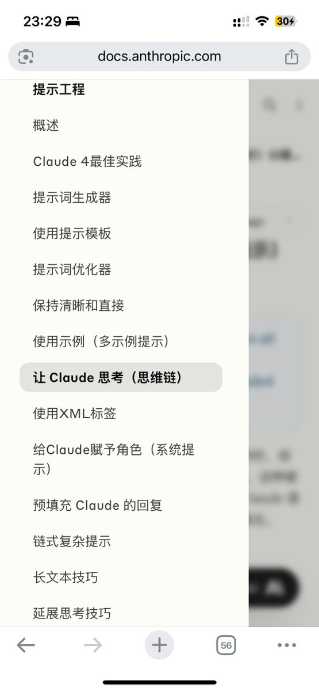

# Anthropic 提示工程系列：14 篇文章掌握 AI 提示技巧

> **來源**: [@wquguru](https://x.com/wquguru/status/1957578183487942989) | [原文連結](https://twitter.com/wquguru/status/1957578183487942989/photo/1)
>
> **日期**: Mon Aug 18 22:59:43 +0000 2025
>
> **標籤**: `提示工程` `Anthropic` `AI 工程`

---

> **來源**: [@wquguru (WquGuru🦀)](https://twitter.com/wquguru)
> **日期**: 2025
> **標籤**: `Anthropic` `提示工程` `AI` `Prompt Engineering`

---

2025 年下半年應該學點什麼呢，首推全網最具實用價值的提示工程文檔——Anthropic 的提示工程系列，短短 14 篇文章，每篇讀下來只需要 3 分鐘就可以擁有巨大的槓桿收益。

## 核心特點

- **篇幅精簡**：僅 14 篇文章
- **高效閱讀**：每篇約 3 分鐘
- **實用價值**：全網最具實用價值的提示工程文檔
- **槓桿收益**：投入時間少，收益巨大

## 參考資源

完整文檔：https://t.co/B51byRBA8a
