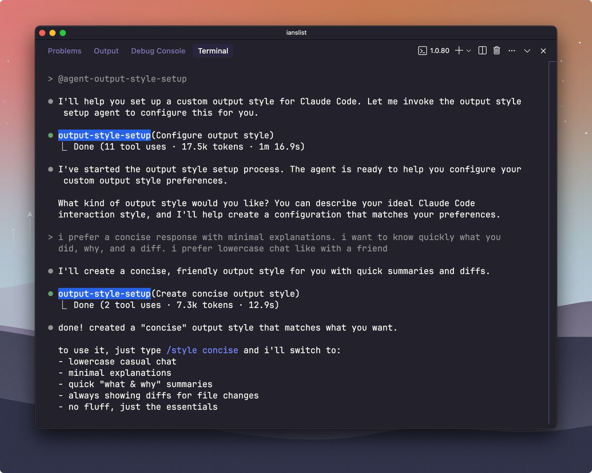

# Claude Code 1.0.80 輸出風格控制技巧

> **來源**: [@iannuttall](https://x.com/iannuttall/status/1955750903623114757) | [原文連結](https://twitter.com/iannuttall/status/1955750903623114757/photo/1)
>
> **日期**: Wed Aug 13 21:58:46 +0000 2025
>
> **標籤**: `Claude Code` `輸出風格` `開發工具`

---

> **來源**: [@iannuttall (Ian Nuttall)](https://twitter.com/iannuttall)
> **日期**: 2026-02-18
> **標籤**: `Claude Code` `輸出風格` `開發工具`

---

## 核心功能

Claude Code 1.0.80 版本包含一個未公開的指令 `@agent-output-style-setup`，可以啟動輸出風格設定工具，讓使用者自訂 AI 的回應風格。

## 使用範例

作者選擇的風格設定：
- 簡潔的回應
- 最少的解釋說明
- 小寫字母
- 「和朋友聊天」的風格

## 使用方式

在 Claude Code 中輸入 `@agent-output-style-setup` 指令即可啟動輸出風格控制工具。
