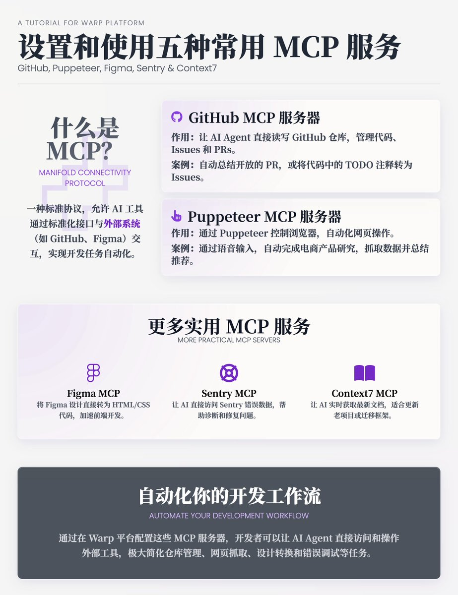

# Warp 平台 MCP 服務設定指南：GitHub、Puppeteer、Figma、Sentry 和 Context7

> **來源**: [@shao__meng](https://x.com/shao__meng/status/1953986749426020506)
>
> **日期**: Sat Aug 09 01:08:39 +0000 2025
>
> **標籤**: `MCP協議` `AI開發工具` `自動化工作流`

---

> **來源**: [@shao__meng (meng shao)](https://twitter.com/shao__meng)
> **日期**: 2026-02-18
> **標籤**: `Warp` `MCP` `GitHub` `Puppeteer` `Figma` `Sentry` `Context7` `AI開發工具`

---

## 概述

MCP 是一種標準協議，允許 AI 工具通過標準化的介面與外部系統（如 GitHub、Figma 等）互動。Warp 是一個支援 MCP 的開發平台，透過配置 MCP 伺服器，開發者可以讓 AI Agent 直接存取和操作外部工具的資料，自動化完成各種開發任務。本教學詳細介紹了五種 MCP 伺服器的設定方法、JSON 配置，以及實際工作場景中的使用案例。

## 1. GitHub MCP 服務器：自動化 GitHub 儲存庫操作

### 作用
讓 Warp 的 AI Agent 直接讀寫 GitHub 儲存庫，適合管理程式碼、Issues 和 PRs。

### 設定步驟

1. **建立 GitHub 個人存取 token（PAT）**：
   - 登入 GitHub，進入「設定 > 開發者設定 > 個人存取權杖」
   - 產生新 token，勾選「repo」權限（全選）和「read:user」權限，建議只授予必要權限以降低風險
   - 複製 token 並妥善保存

2. **在 Warp 中配置**：
   - 開啟 Warp 的命令面板（Command Palette），進入 MCP 面板，點擊「新增」
   - 貼上 GitHub MCP 的 JSON 配置（影片描述中有連結），填入你的 PAT，儲存
   - 儲存後，你會看到 GitHub MCP 提供的所有可用介面

### 實際案例

- **總結開放的 PR**：在 Warp 中輸入提示，讓 AI Agent 列出所有開放的拉取請求，提取討論內容和未解決的問題。AI 會透過 GitHub MCP 呼叫 `list_pull_requests`、`get_pull_request_comments` 等介面，產生帶連結的總結，方便直接跳轉查看。

- **將程式碼中的 TODO 轉為 Issues**：使用儲存的提示，讓 AI 掃描程式碼中的 TODO 註解，自動呼叫 `create_issue` 為每個 TODO 建立 GitHub 問題，包含原文和程式碼連結。這種自動化能節省 20-30 分鐘的手動操作。

### 價值
極大簡化了儲存庫管理，適合需要頻繁處理 PR 或問題的開發者。

## 2. Puppeteer MCP 服務器：瀏覽器自動化

### 作用
透過 Puppeteer 控制瀏覽器，自動化網頁操作，如搜尋、抓取資料等。

### 設定步驟

- 在 Warp 的 MCP 面板中，點擊「新增」，貼上 Puppeteer MCP 的 JSON 配置（連結在影片描述中），儲存
- 配置後，你會看到類似 `navigate`、`fill`、`screenshot` 和 `evaluate` 的介面

### 實際案例：電商產品研究

影片展示了一個語音輸入的案例。使用者透過 Warp 的語音功能（基於 Whisper 轉錄）說：「去 Amazon 搜尋女士白色 T 恤，抓取標題、價格和連結，開啟每個產品頁總結評論，並推薦最佳 T 恤。」

- Puppeteer MCP 會自動導航到 Amazon，填充搜尋欄，抓取商品資料（透過截圖和 JavaScript 選擇器），然後進入每個產品頁提取評論
- 最後，AI 基於價格和評論品質，推薦了一款 8 美元、4.5 星的舒適 T 恤

### 適用場景
產品研究、競爭分析、重複性網頁抓取，省去手動操作的麻煩。

### 價值
適合需要從網頁提取資料或執行自動化任務的場景，比如市場調研或測試。

## 3. Figma MCP 服務器：設計轉程式碼

### 作用
將 Figma 設計直接轉為 HTML/CSS 程式碼，快速產生頁面框架。

### 設定步驟

1. **取得 Figma 個人存取 token**：
   - 在 Figma 帳戶中，點擊頭像 > 設定 > 安全，產生新 token，授予完整讀取權限

2. **在 Warp 中配置**：
   - 在 MCP 面板中新增 Figma MCP 的 JSON 配置，填入 token，儲存

3. **使用方法**：
   - 在 Figma 中選擇要轉換的設計（比如一個頁面組），右鍵複製連結
   - 在 Warp 中使用儲存的提示（如「Figma Mockup」），要求 AI 按設計產生程式碼，保留間距、字型、顏色等

### 實際案例

影片用 Warp 的重新設計主頁作為例子。AI 呼叫 `get_figma_data` 和 `download_figma_images`，產生 HTML 和 CSS 檔案，包含頁首、功能卡片等。結果與原設計高度相似，雖然缺少一些細節（如漸層和頁尾），但作為起點非常高效。

### 適用人群
產品經理、設計師或開發者，可以快速跳過樣板程式碼，直接進入迭代階段。

### 價值
節省從設計到程式碼的重複工作，加速前端開發。

## 4. Sentry MCP 服務器：錯誤除錯

### 作用
讓 AI 直接存取 Sentry 的錯誤資料，幫助診斷和修復程式碼問題。

### 設定步驟

在 Warp 的 MCP 面板中貼上 Sentry MCP 的 JSON 配置，儲存。

### 實際案例

影片使用 Sentry 的官方 demo 專案（Empower Plant，一個帶有 React 前端和後端的電商網站，內含故意設計的 bug）。

- 使用者在 Sentry 儀表板中找到一個錯誤（比如類型錯誤），複製連結，提示 Warp：「診斷這個 Sentry 錯誤，找到程式碼中的問題並提供修復。」
- Sentry MCP 呼叫 `get_issue_details` 取得堆疊追蹤，AI 掃描程式碼，定位問題（如對陣列錯誤呼叫 `toUpperCase`），並產生修復補丁

### 價值
透過直接存取錯誤資料，AI 提供精準診斷和修復建議，避免手動查找堆疊追蹤的麻煩。

## 5. Context7 MCP 服務器：獲取最新文件

### 作用
讓 AI 即時取得網路上的最新文件，適合更新舊專案或遷移框架。

### 設定步驟

在 Warp 的 MCP 面板中新增 Context7 MCP 的 JSON 配置，儲存。

### 實際案例

影片展示了一個舊的 Astro 專案（基於 Astro 框架的網站）。使用者提示 AI：「更新這個 Astro 專案，遵循最新最佳實踐。」

- Context7 MCP 呼叫 `get_library_docs` 取得 Astro 5 的最新文件，AI 自動更新 Tailwind 匯入語法、最佳化 TypeScript 配置、改進建置設定和新增可存取性規則
- 結果：專案程式碼自動更新，符合最新標準，省去手動查閱變更日誌的時間

### 價值
特別適合維護舊專案或遷移到新框架版本，確保程式碼符合最新規範。

## 參考來源

引用自 @warpdotdev：
> Just launched a video tutorial on how to set up 5 MCP servers in Warp:
> 
> ✅ Github MCP  
> ✅ Figma MCP  
> ✅ Puppeteer MCP  
> ✅ Sentry MCP  
> ✅ Context7 MCP  
> 
> Links below👇
