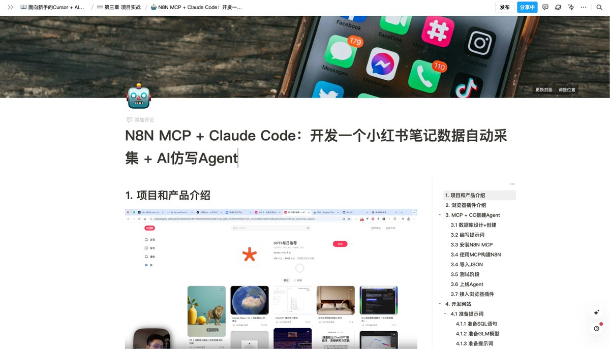

# N8N MCP + Claude Code：小紅書筆記數據自動採集與 AI 仿寫 Agent

> **來源**: [@yihui_indie](https://x.com/yihui_indie/status/1953762048334344551) | [原文連結](https://flowus.cn/yihui/share/0043e8ec-c23f-4762-be6e-b4642750c5a4?code=F22VHQ)
>
> **日期**: Fri Aug 08 10:15:46 +0000 2025
>
> **標籤**: `Claude Code` `N8N 工作流` `AI Agent`

---

> **來源**: [Yihui (@yihui_indie)](https://twitter.com/yihui_indie)
> **日期**: 2026-02-18
> **標籤**: `n8n` `MCP` `Claude-Code` `小紅書` `AI仿寫` `瀏覽器插件` `GLM-4.5`

---

## 課程簡介

本週發布的課程《N8N MCP + Claude Code：開發一個小紅書筆記數據自動採集 + AI 仿寫 Agent》已上線到知識庫。

## 核心知識點

1. **小紅書數據採集插件**
   - 開發一個能夠自動採集小紅書 web 端作者數據 + 筆記的瀏覽器插件

2. **Claude Code + n8n-mcp 工作流開發**
   - 學習使用 Claude Code 結合 n8n-mcp
   - 快速開發 N8N 工作流

3. **AI 仿寫網站開發**
   - 開發一個網站，實現 N8N 服務後端調用
   - 接入智譜清言 GLM-4.5 模型
   - 實現筆記仿寫功能

## 相關資源

課程地址：https://t.co/81rXGpEIrr (FlowUs 息流平台)
