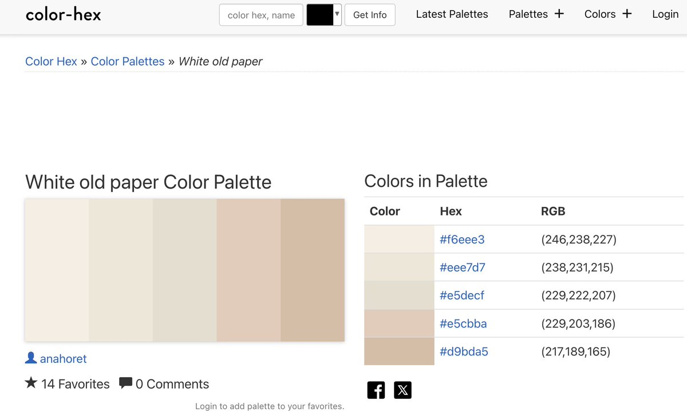

# AI 寫前端帶點審美的最佳實踐

> **來源**: [@Stv_Lynn](https://x.com/Stv_Lynn/status/1951851084831678954)
>
> **日期**: Sun Aug 03 03:42:16 +0000 2025
>
> **標籤**: `前端設計` `AI 開發` `提示工程`

---

> **來源**: [@Stv_Lynn (Steven Lynn)](https://x.com/Stv_Lynn)
> **日期**: 2026-02-18
> **標籤**: `AI開發` `前端設計` `審美優化` `提示詞技巧`

---

## 核心方法

讓 AI 寫前端帶點審美的最佳實踐流程：

1. **先放飛讓它寫 MVP**
   - 避免一開始就過度要求審美（求著它大多數情況下不管用）
   - 有時開口罵管用是因為會激活 critical think
   - 先讓它完成一版能運行的基礎版本

2. **提供配色上下文**
   - 搜索你想要的顏色色卡，把配色的 HEX 色碼作為上下文
   - 如果模型支持圖片作為上下文，也可以直接截圖提供

3. **指定字體**
   - 明確指定想使用的字體

4. **提升空間感**
   - 讓 AI 加一些背景（例如網格背景）
   - 加入漸變層
   - 提高網頁的空間感

## 終極方案

直接在 Figma 裡畫一版設計稿，使用 Figma MCP 轉換，比跟 LLM 人機協同更好使。

## 補充觀察

AI 很愛用漸變色（來自 @wong2__ 的觀察）。
