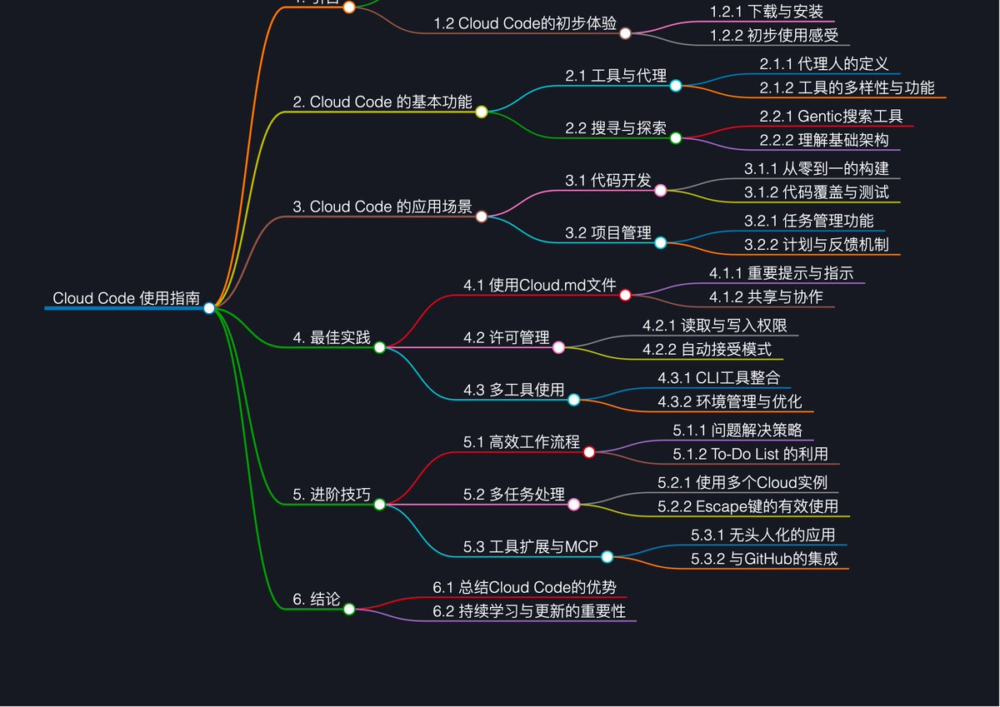

# Claude Code 命令與工作流完全指南

> **來源**: [@wquguru](https://x.com/wquguru/status/1951320386051964997) | [原文連結](https://docs.ctok.ai/claude-code-commands-guide.html)
>
> **日期**: Fri Aug 01 16:33:28 +0000 2025
>
> **標籤**: `Claude Code` `開發工作流` `最佳實踐`

---

> **來源**: [@wquguru (WquGuru🦀)](https://twitter.com/wquguru)
> **日期**: 2026-02-18
> **標籤**: `Claude Code` `工作流` `教學資源` `AI 開發`

---

Anthropic 發布了 19 個 Code with Claude 影片，總長達 8 小時，其實濃縮成一張圖就足夠了，剩下的交給你自己，基於專案刻意練習。

## 推薦文檔

以下是幾個優質的 Claude Code 學習資源：

- **10 分鐘掌握所有 Claude 命令**：https://t.co/FJfoILf7WM
- **Claude Code 最佳實踐和使用技巧**：https://t.co/CkOrcVX5yw
- **開源我的 Claude Code Vibe Coding 終極工作流**：https://t.co/RJKDNHziPL

## 使用建議

如果你想用 Claude Code，又擔心封號問題，推薦一家使用過一段時間的 Claude Code 拼車服務，相比市面上的共享服務穩定性強了非常多：https://t.co/J5O3yXTkG4
