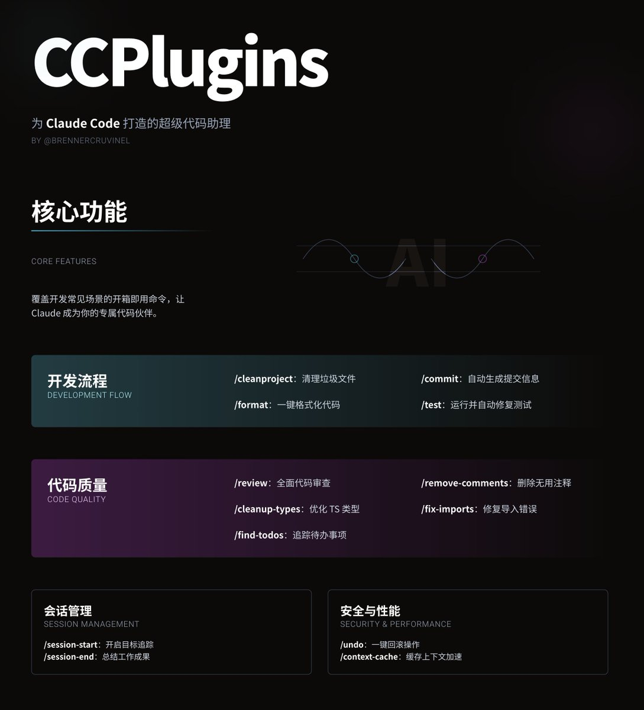
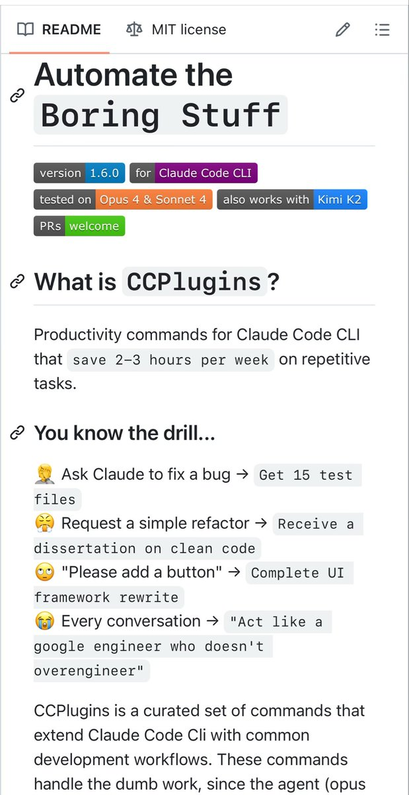

# CCPlugins：Claude Code 自動化開發工具集

> **來源**: [@shao__meng](https://x.com/shao__meng/status/1949809844732710931)
>
> **日期**: Mon Jul 28 12:31:07 +0000 2025
>
> **標籤**: `Claude Code` `開發工具` `自動化`

---

## 核心功能

這個專案提供了一堆開箱即用的命令，覆蓋了開發中的常見場景：

### 1. 開發流程

- **/cleanproject**：清理專案中的「垃圾檔案」，比如臨時測試檔案、除錯日誌、備份檔案等
- **/commit**：自動分析程式碼改動，生成規範的 Git 提交訊息，省去你絞盡腦汁寫 commit message 的痛苦
- **/format**：自動偵測並執行專案程式碼格式化工具，保持程式碼整潔
- **/test**：執行測試並自動修復簡單的失敗案例，減少手動除錯的時間

### 2. 程式碼品質

- **/review**：讓 Claude 幫你做一次全面的程式碼審查，檢查 bug、安全問題和效能瓶頸
- **/remove-comments**：刪掉那些沒必要的程式碼註解，但保留有價值的文件註解
- **/cleanup-types**：專為 TypeScript 使用者設計，移除那些偷懶的 `any` 型別，並建議更合適的型別
- **/fix-imports**：修復因檔案移動或重新命名導致的導入錯誤，省去手動調整的麻煩
- **/find-todos**：快速找到程式碼中的 `TODO`、`FIXME` 和 `HACK` 註解，幫你追蹤未完成的工作

### 3. 會話管理

- **/session-start**：開始一個有目標追蹤的編碼會話，相當於給你的工作設定一個清晰的起點
- **/session-end**：總結你的工作成果，生成交接筆記，方便團隊協作或後續回顧

### 4. 安全與效能

- **/undo**：搞砸了？這個命令可以回滾上一次操作，自動恢復備份
- **/context-cache**：快取專案上下文，加速後續命令的執行

## 為什麼它好用？

### 1. 省時間

從寫提交訊息到清理專案，每項任務都能從幾分鐘縮短到幾十秒。比如，手動寫一個提交訊息可能要 5-10 分鐘，用 `/commit` 只要 30 秒！

### 2. 像人一樣協作

命令用的是第一人稱（「我會幫你…」），讓 Claude 感覺像個真正的夥伴，而不是冷冰冰的工具。這種設計讓互動更自然，也更符合開發者的習慣。

### 3. 靈活適配

這些命令不是死板的腳本，而是透過 Claude 的上下文分析，智慧適配你的專案。不管你用什麼語言或框架，它都能「讀懂」你的程式碼庫。

### 4. 簡單易用

安裝方便（支援 Mac/Linux 和 Windows），命令直觀，輸入像 `/format` 這樣簡單的指令就能搞定複雜任務。

## 進階玩法

- **自訂命令**：你可以在 `~/.claude/commands/` 裡新增自己的 markdown 檔案，定義專屬命令
- **支援參數**：命令可以帶參數，比如 `/mycommand some-file.js`，靈活應對特定需求
- **CI/CD 整合**：可以用在自動化流程中，比如 `claude /test && claude /commit`

## 時間節省估算

根據原推文引用，使用 CCPlugins 可以每週節省 2-3 小時在：
- 開發流程
- 程式碼品質
- 會話管理
- 安全和效能
