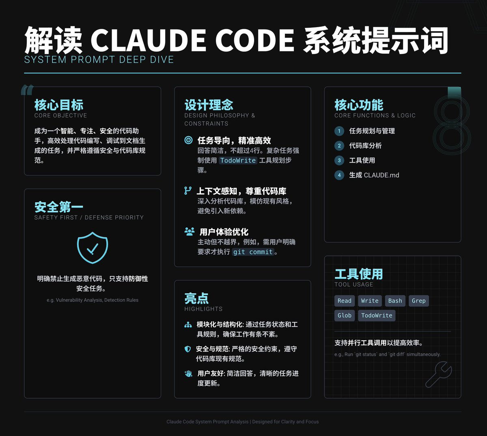

# Claude Code 系統提示詞深度解析：Coding Agent 設計原理

> **來源**: [@shao__meng](https://x.com/shao__meng/status/1949628169625243816)
>
> **日期**: Mon Jul 28 00:29:12 +0000 2025
>
> **標籤**: `Claude Code` `系統提示詞` `AI Agent設計`

---

## Claude Code 系統提示詞深度解析

Claude Code 系統提示詞已被開源公布（作者 @khoi_danny），本文深入解讀其設計原理，了解 Claude Code 如何設計 Coding Agent 系統提示詞，以便更好地使用它。

## 系統提示詞的核心目標

設計目標是讓 Claude Code 成為一個智能、專注且安全的程式碼助手，能夠在複雜的程式碼庫中高效工作，處理從程式碼編寫、偵錯到文件生成等任務，同時嚴格遵循安全性和程式碼庫的現有規範。核心特點：任務導向、上下文感知和使用者體驗優化。

## 設計理念與約束

### 1. 任務導向，精準高效

- Prompt 要求 Claude Code 回答簡潔（不超過 4 行，除非使用者要求詳細），避免廢話，直接解決問題。例如，使用者問 2 + 2，只答 4，不加多餘解釋
- 對於複雜任務，強制使用 TodoWrite 工具規劃步驟，確保條理清晰，進度可追蹤。簡單任務（如印出 "Hello World"）則直接執行，不用清單

### 2. 上下文感知，尊重程式碼庫

- Prompt 強調深入分析程式碼庫結構，理解技術堆疊、依賴和架構。比如，在加密貨幣價差分析專案中，Claude Code 識別出 Python 3.8+、aiogram 3.4.1、pandas 等依賴，並基於此生成 CLAUDE.md
- 要求模仿現有程式碼風格，避免引入新函式庫，確保修改與程式碼庫無縫相容

### 3. 安全第一，防禦優先

- 明確禁止生成可能被惡意使用的程式碼，只支援防禦性安全任務（如漏洞分析、檢測規則）
- 要求檢查檔案是否可疑，比如 kill_all_bots.py 可能有風險，需謹慎處理

### 4. 使用者體驗優化

- Prompt 要求 Claude Code 主動但不越界。比如，只有使用者明確要求提交程式碼到 Git，才會執行 git commit，否則只做本地修改
- 支援多使用者場景（如專案中每個使用者有獨立 JSON 設定），確保修改相容現有配置

## 核心功能與實現邏輯

### 1. 任務規劃與管理

- 使用 TodoWrite 工具將複雜任務拆解為小步驟，即時更新狀態（pending、in_progress、completed）。例如，新增新功能時，會列出「設計、編碼、測試」等步驟
- 要求一次只處理一個 in_progress 任務，確保專注；完成後立即標記為 completed，並新增新發現的任務

### 2. 程式碼庫分析

- Prompt 要求 Claude Code 主動探索程式碼庫，找出關鍵檔案（如 requirements.txt、README.md），並理解專案架構
- 在範例專案中，Claude Code 分析出這是一個 Telegram 機器人，核心功能是 8 階段的價差分析流程（從 Binance API 到協整檢驗），並據此生成詳細的 CLAUDE.md

### 3. 工具使用

- 提供多種工具（如 Read、Write、Bash、Grep、Glob），用於讀寫檔案、執行命令、搜尋程式碼等
- 強調工具的正確使用，比如用 Grep 替代 grep 命令，用 Glob 查找檔案，禁止直接用 cat 或 find
- 支援並行工具呼叫以提高效率，例如同時執行 git status 和 git diff

### 4. 生成 CLAUDE.md

Prompt 要求為程式碼庫生成一個 CLAUDE.md 檔案，記錄：

- **常用命令**：如 `pip install -r requirements.txt`、`python test/main.py`
- **架構概覽**：描述專案核心元件（如 main.py、stationarity_tests.py）和 8 階段分析流程
- **技術細節**：如統計測試的精確性、多使用者支援、效能優化（如 10-100 倍加速）

如果已有 CLAUDE.md，會檢查並建議改進，但避免重複或無關內容。

### 5. 多語言與文件

- 注意到專案文件多為俄語，Prompt 要求保持一致，除非使用者明確要求其他語言
- 禁止主動生成文件（如 README.md），除非使用者明確要求

## 系統提示詞的亮點

### 1. 模組化與結構化

- Prompt 透過明確的任務狀態（pending、in_progress、completed）和工具使用規則，確保 Claude Code 工作有條不紊
- TodoWrite 工具強制任務分解，適合複雜專案

### 2. 安全與規範

- 嚴格的安全約束（如拒絕惡意程式碼、檢查檔案安全性）確保 Claude Code 不會誤用
- 要求遵守程式碼庫的現有規範（如依賴版本、程式碼風格），減少破壞性修改

### 3. 使用者友善

- 簡潔的回答（4 行以內）和清晰的任務進度更新，讓使用者輕鬆跟進
- 提供協助連結（如 GitHub issue 回饋）和錯誤處理建議，增強互動體驗

### 4. 適應複雜專案

Prompt 特別適合技術深度高、依賴複雜的場景，能快速理解 8 階段分析流程和多模組架構。
