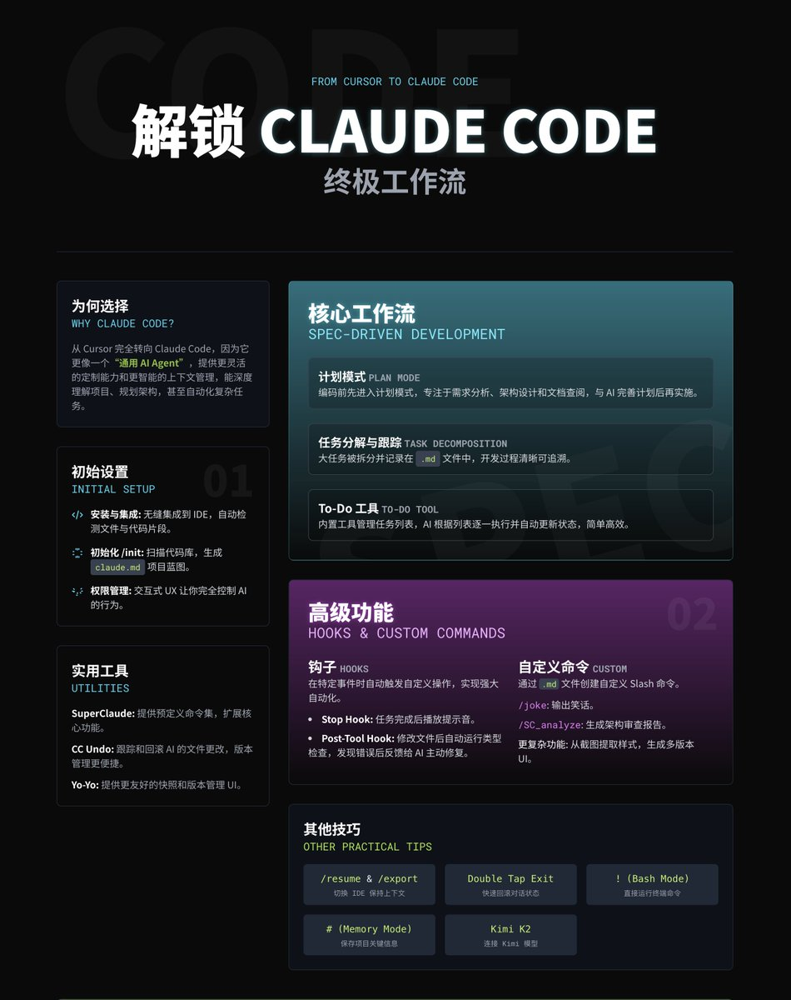

# Claude Code 規範驅動工作流完整指南

> **來源**: [@shao__meng](https://x.com/shao__meng/status/1949269773453516909)
>
> **日期**: Sun Jul 27 00:45:04 +0000 2025
>
> **標籤**: `Claude Code` `工作流優化` `自動化`

---

## 為什麼選擇 Claude Code？

作者之前一直使用 Cursor，但最近完全轉向了 Claude Code，原因是 Claude Code 提供了更靈活的定制能力和更智能的上下文管理。相比 Cursor，Claude Code 更像一個「通用 AI Agent」，不僅能寫代碼，還能深度理解項目需求、規劃架構，甚至自動化複雜任務。它的終端集成和強大的上下文處理能力讓它在處理大型項目時表現更出色。

## Claude Code 的初始設置

### 安裝與集成

使用 Claude Code 首先需要安裝其擴展，它能無縫集成到常見的 IDE。安裝後，Claude Code 會自動檢測你當前編輯的文件或選中的代碼片段，並允許通過終端直接操作。

### 初始化（/init 命令）

運行 `/init` 命令讓 Claude Code 掃描你的代碼庫，分析項目結構、依賴和技術棧，生成一個 `claude.md` 文件。這個文件會記錄項目的關鍵信息，作為 Claude Code 後續工作的基礎，相當於給 AI 一個「項目藍圖」。

### 權限管理

Claude Code 的交互式 UX 是一個亮點，它會詢問是否執行某些命令（如 `cd`）。你可以選擇自動批准（Always Auto Approve）或跳過權限檢查（`--dangerously-skip-permissions`），但作者建議保留交互式權限管理，以更好地控制 AI 的行為。

## 核心工作流：規範驅動開發

作者強調了一個類似亞馬遜 PRD 的開發方式，通過計劃模式（Plan Mode）和任務分解來確保 Claude Code 的工作有條理、高效：

### 計劃模式

在開始編碼前，始終進入計劃模式。在這個模式下，Claude Code 會專注於需求分析、架構設計和查閱最新技術文檔，而不會直接修改代碼。作者建議與 AI 反覆溝通，完善計劃後再進入實施階段。

### 任務分解與追蹤

Claude Code 會將大任務拆分成小任務，保存在 `doc/claude/task/taskname.md` 文件中。每次執行任務時，它會更新這個文件，記錄完成的步驟和細節。這種方式讓開發過程清晰可追溯，類似「文檔驅動」的開發流程。

### To-Do 工具

Claude Code 使用內置的 To-Do 工具來管理任務列表，每個任務包含內容、ID、優先級和狀態。作者發現這種簡單設計非常有效，AI 會根據任務列表逐一執行，並自動更新狀態。

## 高級功能：鉤子與自定義命令

### 鉤子（Hooks）

鉤子是 Claude Code 的一個強大功能，允許你在特定事件（如任務完成、文件修改）時自動觸發自定義操作。例如：

- **Stop Hook**：任務完成後播放系統提示音，提醒你 AI 已完成工作
- **Post-Tool Hook**：在 AI 修改或創建文件後，運行一個 Python 腳本進行類型檢查，類似 Cursor 的錯誤檢測功能。如果發現類型錯誤，腳本會將錯誤信息反饋給 Claude Code，讓它主動修復
- 作者分享了一個複雜示例：通過鉤子檢查 TS 文件（`.ts` 或 `.tsx`）的類型錯誤，並阻止 AI 繼續執行，直到問題解決。這種自動化機制大大減少了手動調試的時間

### 自定義命令

Claude Code 支持自定義 Slash 命令（類似 `/joke`），通過在 `commands` 文件夾中創建 Markdown 文件定義。作者舉例：

- 創建一個 `/joke` 命令，讓 Claude Code 輸出一個笑話
- 使用 `/SC_analyze` 命令進行深度代碼分析，生成架構審查報告
- 自定義命令還能實現更複雜的功能，比如從截圖中提取 UI 樣式、生成多版本 UI 設計，或並行運行多個 Git 工作樹

## 實用工具

### SuperClaude

一個開源項目，提供預定義的命令，如代碼分析、構建項目、調試等。安裝需要一些步驟（通過 `uv` 工具），但完成後可以在全局使用，極大擴展了 Claude Code 的功能。

### CC Undo

用於追蹤和回滾 Claude Code 對文件的更改。命令如 `/CC_undo_list`（列出更改）、`/CC_undo_preview`（預覽更改）和 `/CC_undo_undo`（回滾指定更改）讓版本管理更方便。

### Yo-Yo

提供更用戶友好的快照和版本管理界面，適合需要直觀操作的用戶。

## 其他實用技巧

### 恢復與導出（/resume 和 /export）

使用 `/resume` 跳回之前的對話歷史，`/export` 導出整個對話，方便在不同 IDE（如 Cursor 或 WebStorm）間切換，保持上下文一致。

### 雙擊退出（Double Tap Exit）

快速回滾到之前的對話狀態，適合糾正 AI 的錯誤。但需要配合外部版本管理工具（如 CC Undo），因為 Claude Code 本身不保存文件快照。

### Bash 模式（!）

輸入 `!` 進入 Bash 模式，直接運行終端命令（如 `npm install`），並將命令記錄到對話歷史，方便 AI 追蹤你的操作。

### Memory 模式（#）

使用 `#` 保存項目關鍵信息（如技術棧或組件）到 `claude.md`，可在項目或用戶級別存儲，供後續任務參考。

### 連接 Kimi K2 模型

通過配置 `.zshrc` 文件（或 Windows 的 Bash 文件），可以快速切換到 Kimi K2 運行 Claude Code，適合預算有限的用戶實驗。

## 給初學者的資源推薦

作者特別提到一個由 Google 首席分析官和數據科學家編寫的免費電子書「Learn to Code with ChatGPT」，適合編程初學者：

- 內容包括：如何選擇編程語言、調試和優化代碼的最佳實踐提示、以及如何用 Claude 和 ChatGPT 定制個性化學習路線
- 提供了一個自定義 GPT，集成了最新的編程包和學習資源，還有詳細的視頻教程，鏈接見評論
