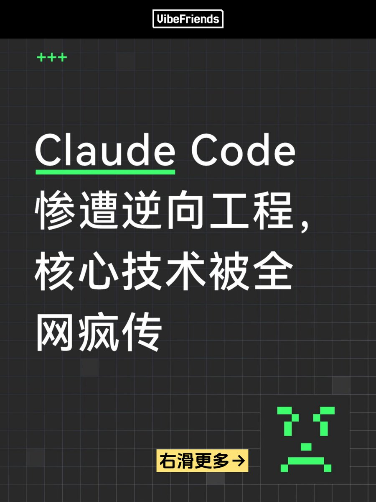
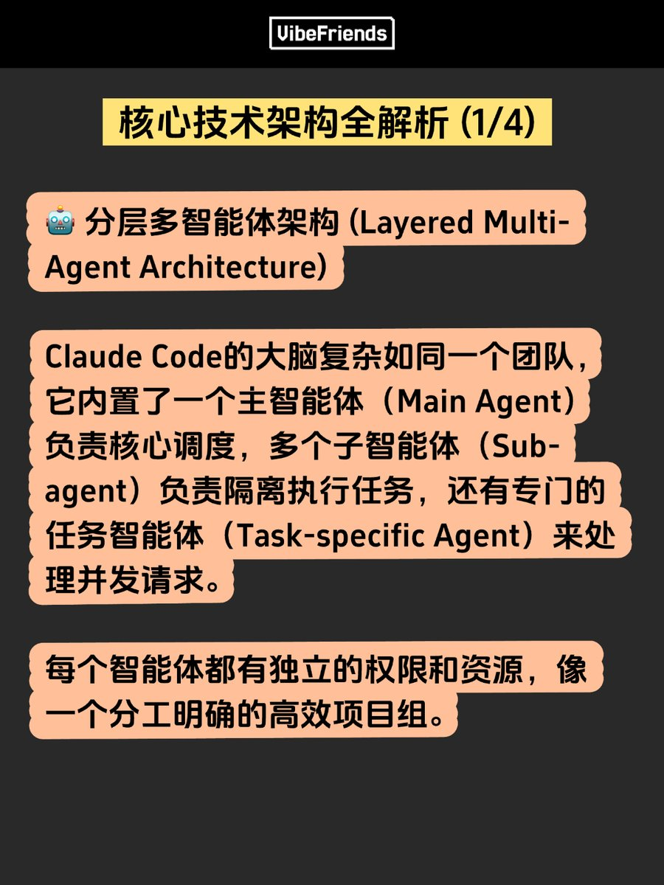
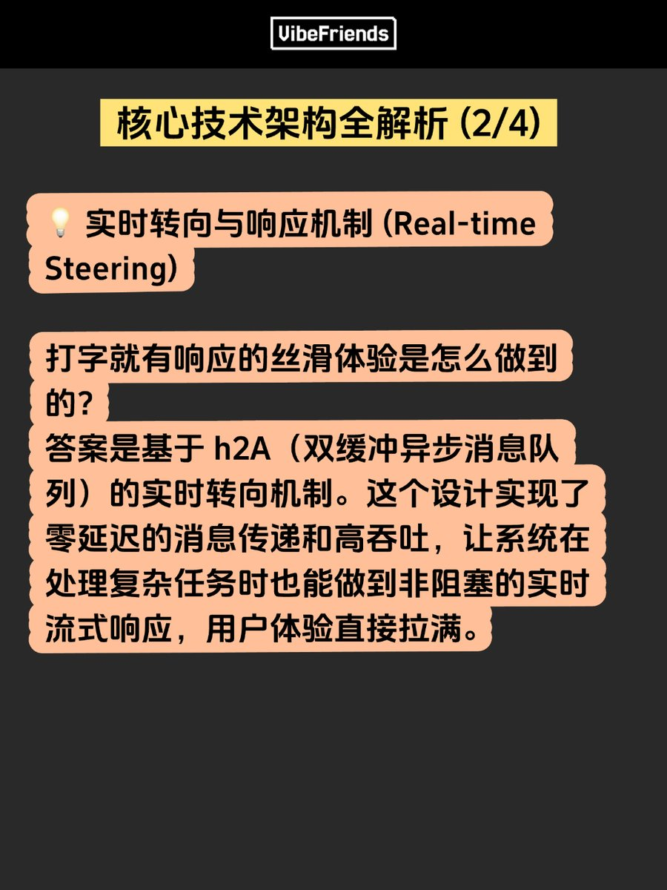
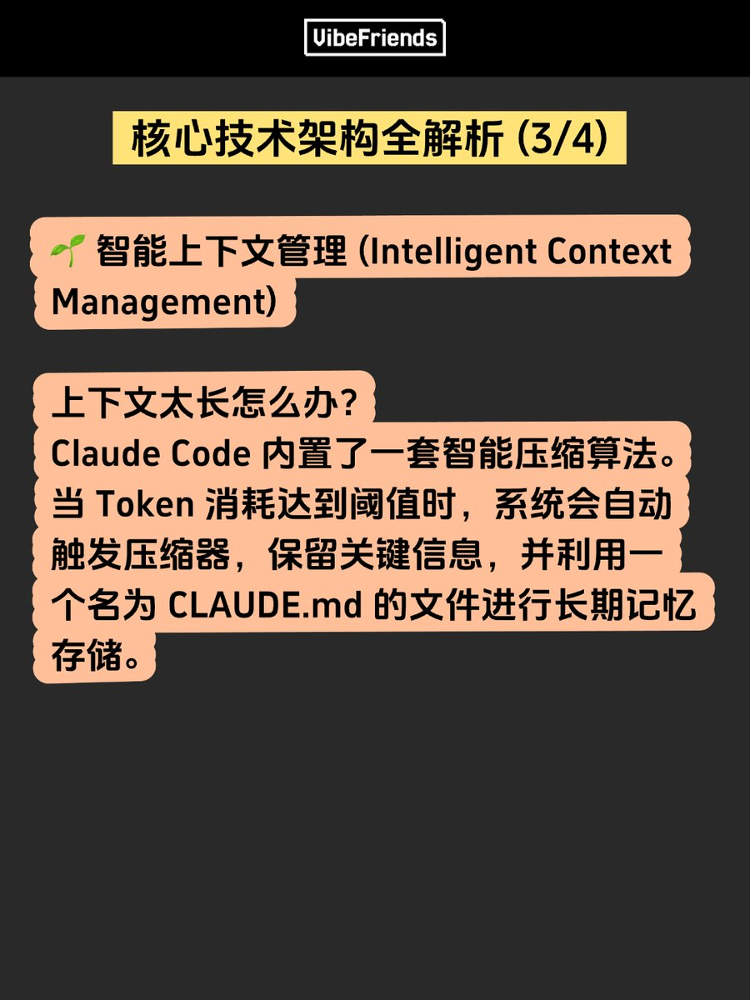

# Claude Code v1.0.33 逆向工程分析 - 多智能體架構與安全機制解密

> **來源**: [@glow1n](https://x.com/glow1n/status/1945795531802071160) | [原文連結](https://code.claude.com/docs)
>
> **日期**: 
>
> **標籤**: `Claude Code` `系統架構` `安全機制`

---






> **來源**: [@glow1n (Glowin)](https://twitter.com/glow1n)  
> **日期**: 2026-02-18  
> **標籤**: `Claude Code` `逆向工程` `多智能體架構` `AI開發工具` `安全機制`

---

## 事件概述

Anthropic 的 Claude Code v1.0.33 版本代碼遭安全研究人員逆向工程分析。shareAI-lab 團隊成功解析超過五萬行混淆源碼,完整揭露其技術架構與實現機制,並在 GitHub 上開源分析資料。

## 核心技術架構解析

### 分層多智能體架構 (Layered Multi-Agent Architecture)

Claude Code 採用複雜的多智能體系統設計:

- **主智能體 (Main Agent)**: 負責核心調度與協調
- **子智能體 (Sub-agent)**: 負責隔離執行任務
- **任務智能體 (Task-specific Agent)**: 處理並發請求

每個智能體擁有獨立的權限和資源,形成分工明確的高效協作機制。

### 實時轉向與響應機制 (Real-time Steering)

基於 h2A (雙緩衝異步消息隊列) 的實時轉向機制實現:

- 零延遲的消息傳遞
- 高吞吐量處理
- 非阻塞的實時流式響應
- 在處理複雜任務時保持流暢的用戶體驗

### 智能上下文管理 (Intelligent Context Management)

內置智能壓縮算法應對長上下文問題:

- Token 消耗達閾值時自動觸發壓縮
- 保留關鍵信息
- 利用 MEMORY.md 文件進行長期記憶存儲

### 安全保障機制 (Reinforced Security)

六層權限驗證系統從 UI 到工具執行全程保護:

- 工具執行沙盒環境隔離
- 多級過濾器防止惡意輸入
- 從界面到底層的完整安全鏈路

## Claude Code 功能特性

### 多環境支持

可在以下環境運行:
- Terminal CLI
- VS Code 擴充套件
- Desktop 應用程式
- Web 瀏覽器
- JetBrains IDE
- GitHub Actions / GitLab CI/CD
- Slack 整合

### 主要功能

**自動化開發任務**:
```bash
claude "write tests for the auth module, run them, and fix any failures"
```

**建構功能與修復錯誤**:
- 以自然語言描述需求
- Claude Code 規劃方案、編寫跨文件代碼、驗證運行

**Git 整合**:
```bash
claude "commit my changes with a descriptive message"
```
- 暫存變更、撰寫 commit 訊息
- 創建分支、開啟 Pull Request

**MCP (Model Context Protocol) 整合**:
- 連接外部數據源 (Google Drive、Jira、Slack)
- 使用自定義工具

**客製化功能**:
- `CLAUDE.md`: 定義編碼標準、架構決策、首選庫
- 自定義 slash 指令 (如 `/review-pr`)
- Hooks: 在 Claude Code 操作前後執行 shell 指令

**多智能體協作**:
- 派生多個智能體同時處理不同子任務
- 主智能體協調工作並合併結果
- Agent SDK 支持自定義智能體開發

**CLI 腳本化**:
```bash
# 監控日誌異常
tail -f app.log | claude -p "Slack me if you see any anomalies"

# CI 自動化翻譯
claude -p "translate new strings into French and raise a PR for review"

# 批量檔案操作
git diff main --name-only | claude -p "review these changed files for security issues"
```

### 跨平台會話轉移

會話不綁定單一環境:
- 在 Web/iOS 啟動長時任務,用 `/teleport` 拉到 Terminal
- 用 `/desktop` 將 Terminal 會話移至桌面應用進行視覺化 diff 檢視
- 在 Slack 提及 @Claude 提交 bug 報告,自動生成 Pull Request

## 安裝方式

### Terminal CLI

**macOS/Linux/WSL**:
```bash
curl -fsSL https://claude.ai/install.sh | bash
```

**Windows PowerShell**:
```powershell
irm https://claude.ai/install.ps1 | iex
```

**Homebrew**:
```bash
brew install --cask claude-code
```

**WinGet**:
```bash
winget install Anthropic.ClaudeCode
```

啟動:
```bash
cd your-project
claude
```

### VS Code / Cursor

在擴充套件市場搜尋 "Claude Code" 安裝,或使用快捷鍵 `Cmd+Shift+X` (Mac) / `Ctrl+Shift+X` (Windows/Linux) 開啟擴充套件檢視。

安裝後使用 `Cmd+Shift+P` / `Ctrl+Shift+P` 開啟指令面板,輸入 "Claude Code" 並選擇 "Open in New Tab"。

### Desktop App

下載對應平台安裝包:
- macOS (Intel 和 Apple Silicon)
- Windows (x64)
- Windows ARM64 (僅遠端會話)

安裝後啟動應用程式,登入後點擊 Code 標籤開始使用 (需付費訂閱)。

### Web 版本

直接訪問 [claude.ai/code](https://claude.ai/code) 在瀏覽器使用,支持桌面瀏覽器和 Claude iOS 應用。

### JetBrains IDE

從 JetBrains Marketplace 安裝 Claude Code 插件,重啟 IDE 後即可使用。

## 技術意義

此次逆向工程分析揭示了 Claude Code 並非簡單的 AI 套殼產品,而是具備精密系統設計的企業級開發工具。其多智能體架構、實時響應機制、智能上下文管理和多層安全防護展現了現代 AI 輔助編程工具的技術深度。
