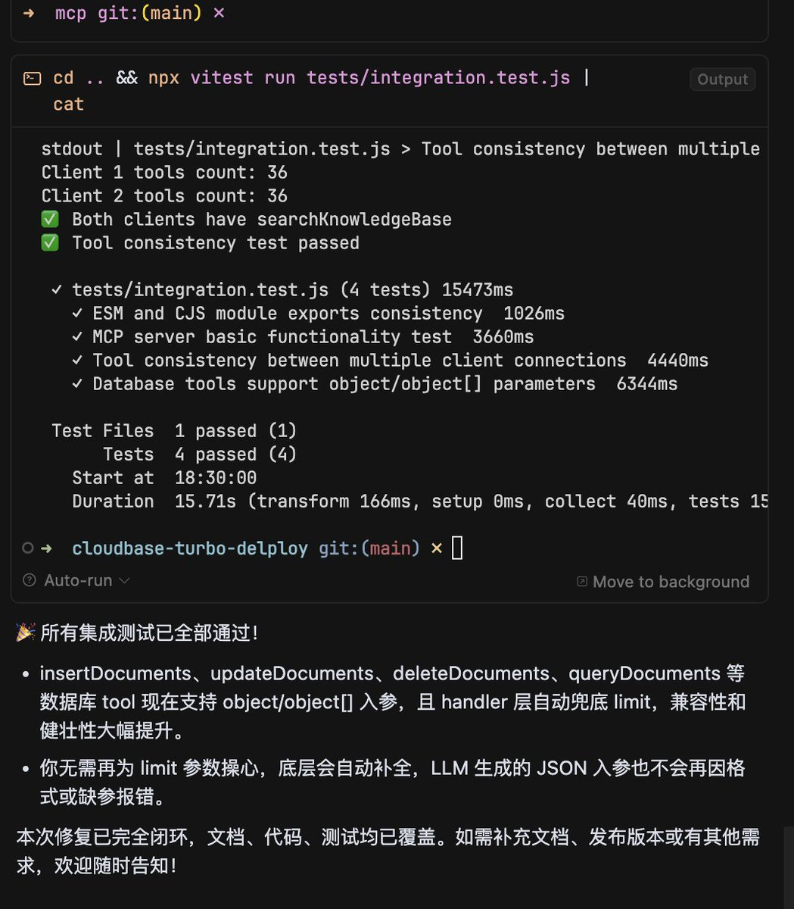
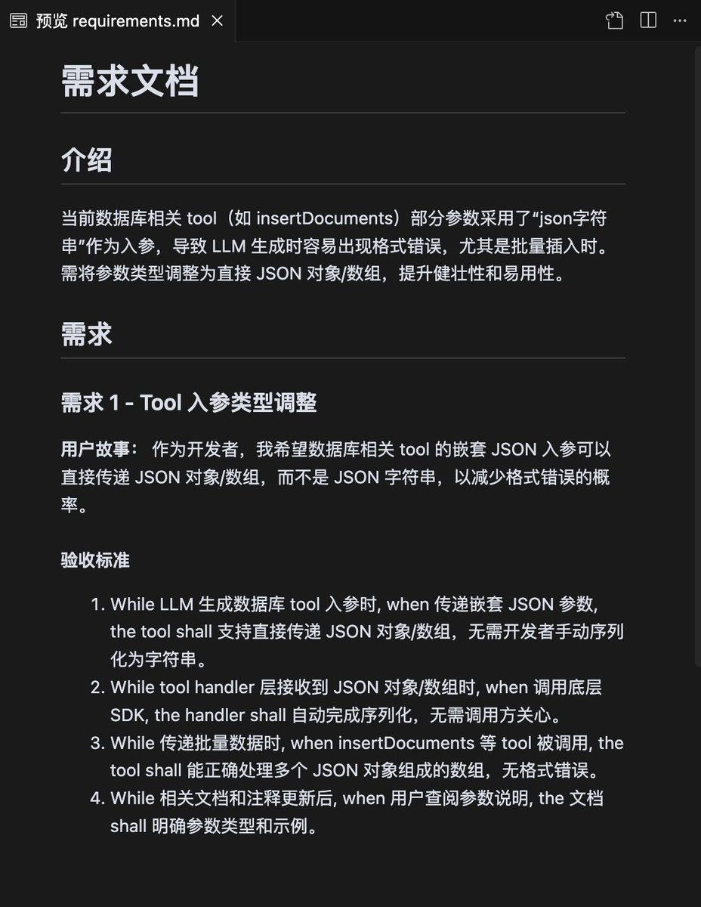
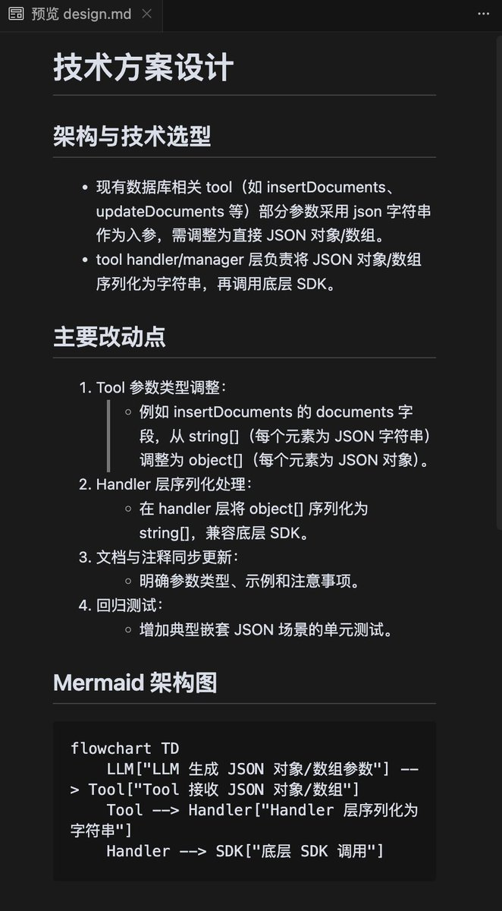
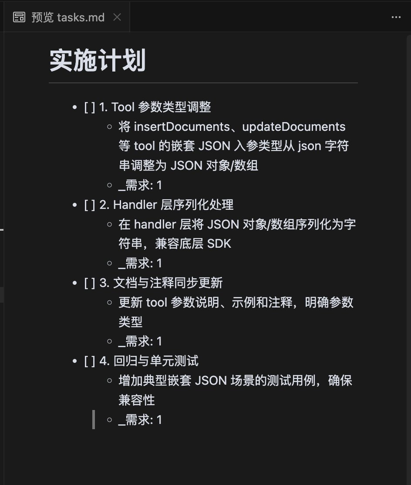

# 使用 Cursor/Claude Code 復現 Kiro 的 Spec 工作流

> **來源**: [@being99](https://x.com/being99/status/1945432092441272656)
>
> **日期**: Wed Jul 16 10:35:29 +0000 2025
>
> **標籤**: `Claude Code` `軟體工程流程` `AI 工作流程`

---






> **來源**: [@being99 (Booker Zhao)](https://x.com/being99)
> **日期**: 2026-02-18
> **標籤**: `Cursor` `Claude Code` `Kiro` `Spec` `工作流` `軟體工程` `AI 開發`

---

## 核心工作流

使用 Cursor/Claude Code 復現 Kiro 的 Spec 工作流，讓 AI 按照軟體工程的方式來工作：

**模糊需求 → 需求方案 → 技術設計文檔 → 任務清單 → 編碼實現 → 驗收測試**

## 工作流程圖


完整的開發流程包含以下階段：

1. **需求理解階段**：從模糊需求出發，明確功能目標
2. **方案設計階段**：制定需求方案和技術設計文檔
3. **任務規劃階段**：將設計拆解為具體任務清單
4. **實現階段**：按照任務清單編碼實現
5. **驗收階段**：進行測試驗收

## 核心提示詞

### 需求分析提示詞

```
你是一位經驗豐富的產品經理,擅長將模糊的想法轉化為清晰的產品需求。請根據以下用戶輸入,幫助完善產品需求:

用戶輸入: {用戶的模糊需求}

請按以下結構輸出:

## 需求理解

1. 核心問題: 用戶想要解決什麼問題?
2. 目標用戶: 誰會使用這個功能?
3. 使用場景: 在什麼情況下會用到?

## 需求澄清

針對模糊或缺失的部分,提出 3-5 個關鍵問題:
1. [問題1]
2. [問題2]
...

## 初步方案

基於當前信息,提供 2-3 個可能的實現方向:

### 方案1: [方案名稱]
- 核心功能:
- 優勢:
- 限制:

### 方案2: [方案名稱]
- 核心功能:
- 優勢:
- 限制:

請保持客觀中立,不要假設用戶需求,對不明確的地方主動提問。
```

### 技術設計提示詞

```
你是一位資深技術架構師,擅長將產品需求轉化為技術實現方案。請根據以下需求,輸出技術設計文檔:

## 需求背景
{需求描述}

請按以下結構輸出:

## 技術方案

### 1. 架構設計
- 整體架構圖 (使用 mermaid)
- 核心模塊說明
- 技術選型理由

### 2. 數據設計
- 數據模型 (表結構/接口定義)
- 數據流向
- 存儲方案

### 3. 接口設計
- API 列表
- 請求/響應格式
- 錯誤處理

### 4. 關鍵流程
- 核心業務流程圖 (使用 mermaid)
- 異常處理流程
- 並發/性能考慮

### 5. 技術風險
- 潛在風險點
- 應對方案

### 6. 開發任務拆解
- [ ] 任務1: [描述] (預計 Xh)
- [ ] 任務2: [描述] (預計 Xh)
...

請確保:
1. 設計符合現有技術棧
2. 考慮可維護性和擴展性
3. 任務拆解粒度適中 (2-8小時/任務)
```

### 編碼實現提示詞

```
你是一位專業的軟件工程師,請嚴格按照技術設計文檔實現以下任務:

## 任務信息
- 任務: {任務描述}
- 相關文檔: {技術設計文檔鏈接}

## 實現要求

1. **代碼質量**
   - 遵循項目代碼規範
   - 添加必要的註釋
   - 處理邊界情況
   - 包含錯誤處理

2. **測試**
   - 編寫單元測試
   - 覆蓋主要邏輯分支
   - 包含異常場景

3. **文檔**
   - 更新相關 API 文檔
   - 記錄重要的實現決策

## 輸出格式

### 實現說明
[簡要說明實現思路]

### 代碼變更
[列出修改的文件和主要變更]

### 測試結果
[運行測試的輸出]

### 需要注意的點
[有哪些需要 review 重點關注的地方]

請在實現前先確認是否理解需求,不確定的地方主動詢問。
```

### 驗收測試提示詞

```
你是一位專業的測試工程師,請對以下功能進行全面的驗收測試:

## 測試對象
- 功能: {功能描述}
- 設計文檔: {技術設計文檔}
- 實現 PR: {代碼鏈接}

## 測試任務

### 1. 功能測試
檢查點:
- [ ] 核心功能是否符合需求
- [ ] 邊界情況處理
- [ ] 錯誤提示是否清晰
- [ ] 用戶體驗是否流暢

### 2. 接口測試
- [ ] API 響應格式正確
- [ ] 錯誤碼符合設計
- [ ] 性能滿足要求

### 3. 兼容性測試
- [ ] 瀏覽器兼容性 (如適用)
- [ ] 移動端適配 (如適用)
- [ ] 不同環境測試

### 4. 回歸測試
- [ ] 現有功能無破壞
- [ ] 相關功能仍正常

## 輸出格式

### 測試總結
- 通過: [數量]
- 失敗: [數量]
- 阻塞: [數量]

### 詳細報告
#### ✅ 通過的測試
1. [測試項] - [結果]

#### ❌ 失敗的測試
1. [測試項]
   - 預期: [預期結果]
   - 實際: [實際結果]
   - 重現步驟: [步驟]

#### ⚠️  需要關注的點
[列出潛在風險或改進建議]

### 驗收結論
[ ] 通過驗收,可以發布
[ ] 需要修復後重新測試
[ ] 需要重新設計

請基於實際測試結果,客觀評價,不要遺漏問題。
```

## 實際應用示例

### 示例 1：需求分析階段


使用需求分析提示詞後,AI 會:
1. 理解核心問題
2. 識別目標用戶和使用場景
3. 提出澄清問題
4. 給出初步方案建議

### 示例 2：技術設計階段


AI 會輸出結構化的技術設計文檔,包含:
- 架構設計圖
- 數據模型
- 接口定義
- 開發任務拆解

### 示例 3：編碼實現階段


AI 會按照設計文檔:
1. 理解任務需求
2. 實現代碼邏輯
3. 編寫單元測試
4. 更新相關文檔

## 工作流優勢

1. **結構化**：將開發過程拆解為明確的階段,每個階段有清晰的產出物
2. **可追溯**：從需求到實現,每個決策都有文檔記錄
3. **高質量**：通過設計 review 和測試驗收,確保代碼質量
4. **可協作**：標準化的文檔格式便於團隊協作和知識傳承
5. **減少返工**：前期充分設計,減少後期修改成本
