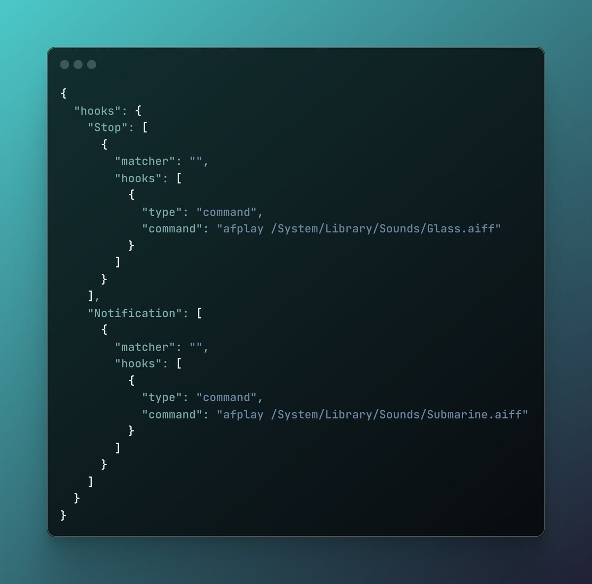

# Claude Code 任務完成通知提示設定

> **來源**: [@_kaichen](https://x.com/_kaichen/status/1944010478671606231) | [原文連結](https://twitter.com/_kaichen/status/1944010478671606231/photo/1)
>
> **日期**: Sat Jul 12 12:26:30 +0000 2025
>
> **標籤**: `Claude Code` `工作效率` `系統提示`

---



## 使用 Hooks 功能添加 Claude Code 完成提示音

如果你使用 Claude Code 時經常忘記回來按 Yes 或不知道任務是否完成，可以透過 Hooks 功能添加提示音🔔

## 設定方法

將以下 hooks 加入 `~/.claude/settings.json` 中：

```json
{
  "hooks": {
    "onTaskComplete": "afplay /System/Library/Sounds/Glass.aiff"
  }
}
```

## 自訂選項

- 可以將音訊檔案換成其他音效
- 也可以使用語音提示，例如：`say '老板搞定了'`

## 適用系統

此設定方法適用於 Mac 系統。
