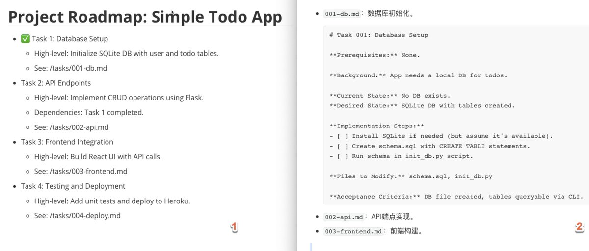

# Claude Code 高效編碼：從上到下工作流程

> **來源**: [@BadUncleX](https://x.com/BadUncleX/status/1943325112641687768)
>
> **日期**: 
>
> **標籤**: `Claude Code` `工作流程優化` `AI 開發效率`

---



## 使用 Claude Code 高效編碼：從上到下工作流程分享

從高層 ROADMAP 到原子化 Tasks，再到 One-Shotting 執行——AI 編碼效率提升 20-30% 的實用藍圖。

> **來源**: [@BadUncleX (BadUncle)](https://x.com/BadUncleX)  
> **日期**: 2026-02-18  
> **標籤**: `Claude Code` `AI 編碼` `工作流程` `專案管理` `開發效率`

---

## TLDR

採用「從上到下」思路，用 `ROADMAP.md` 概述專案全局，Tasks 資料夾原子化分解步驟，讓 Claude Code 透過 One-Shotting 一次性完成 5-8 步任務。

## 為什麼採用「從上到下」的思路？

傳統編碼往往是「邊做邊想」，但 AI 代理如 Claude Code 在長會話中容易丟失上下文（token 限制或非確定性導致）。

從上到下意味著先建構一個清晰的藍圖（roadmap 和 tasks），然後讓 AI 基於藍圖執行。這不只提高了效率，還讓人類開發者更容易介入審查和調整。

**洞察 1**：AI 擅長執行原子化任務，但需要人類提供結構化指導來避免偏題。

**洞察 2**：這個思路借鑑了軟體工程的「瀑布模型」變體，但更靈活——規劃不是一成不變的，而是迭代的。相比「敏捷」方法，它在 AI 場景下減少了反覆提示的開銷。

## 核心組件 1：ROADMAP.md —— 高層概括藍圖

`ROADMAP.md` 是整個專案的「鳥瞰圖」，放在倉庫的 docs 資料夾中。

它用 bullet points 概述開發過程、每個大任務的高層視圖，以及進度追蹤。

### 為什麼有用？

它讓 Claude Code 一啟動就能「看到」全局，避免從零開始規劃的低效。

### 可操作步驟

1. 建立 `docs/ROADMAP.md` 檔案
2. 用 Markdown 格式寫高層總結，包括任務列表、依賴關係和驗收標準
3. 透過 Claude 的 `@docs/ROADMAP.md` 語法匯入檔案到 AI 記憶體中
4. 已完成任務標記 ✅，並引用子任務檔案（如 `See: /tasks/001-db.md`）

### 示例

假設你開發一個簡單的 Web 應用，`ROADMAP.md` 可能這樣寫：

```markdown
# Project Roadmap

## Phase 1: Database Setup
- [ ] Task 001: Initialize database schema
- [ ] Task 002: Set up migrations
- See: /tasks/001-db.md

## Phase 2: API Development
- [ ] Task 003: Create REST endpoints
- [ ] Task 004: Add authentication
- See: /tasks/003-api.md

## Phase 3: Frontend
- [ ] Task 005: Build UI components
- [ ] Task 006: Connect to API
```

**借鑑點**：保持簡潔，每項不超過 3-5 行，避免細節淹沒高層視圖。

## 核心組件 2：Tasks 資料夾 —— 具體步驟分解

Tasks 是 ROADMAP 的「放大鏡」，每個大任務拆分成原子化的子任務檔案，放在 `/tasks` 資料夾中。

每個檔案聚焦一個具體問題，包括背景、步驟和驗收標準。這構成了 Claude Code 執行的「藍圖」——AI 會基於這些檔案一步步操作。

### 可操作步驟

1. 為每個任務建立單獨 Markdown 檔案，命名格式如 `001-db-setup.md`（數字便於排序）
2. 內容包括：先決條件、當前/期望狀態、實施步驟（用 checkboxes）、要修改的檔案、驗收標準
3. 讓 Claude 基於 ROADMAP 生成這些檔案，然後人類審查
4. 處理臨時小任務時，用 `docs/AD_HOC_TASKS.md` 記錄，避免打斷主流程

### 示例檔案名和內容

**檔案名**：`001-db-setup.md`

```markdown
# Task 001: Database Setup

## Prerequisites
- PostgreSQL installed
- Environment variables configured

## Current State
No database schema exists

## Expected State
Database initialized with user and posts tables

## Implementation Steps
- [ ] Create database connection
- [ ] Define user schema
- [ ] Define posts schema
- [ ] Run migrations
- [ ] Verify tables created

## Files to Modify
- `src/db/schema.sql`
- `src/db/connection.js`

## Acceptance Criteria
- Tables exist in database
- Can insert and query test data
```

這些示例具有可操作性：步驟用 checkboxes，便於 Claude 標記進度。

**洞察**：原子化確保每個任務 5-8 步，控制在 10-20 分鐘內完成，匹配 Claude 的會話限制。

## 整合執行：One-Shotting 原子化任務

ROADMAP 和 Tasks 藍圖完成後，進入執行階段：用「One-Shotting」讓 Claude 一次性完成單個任務。

意思是 AI 基於任務檔案，從頭到尾自治處理（利用內部 TODO 列表分解步驟），無需中途暫停審批。

### 可操作步驟

1. 選擇一個任務檔案（如 `001-db.md`）
2. 提示 Claude："Based on /tasks/001-db.md, complete the task in one shot."
3. 審查輸出程式碼，提交到倉庫
4. 如果任務複雜，預先用 planning mode 細化步驟
