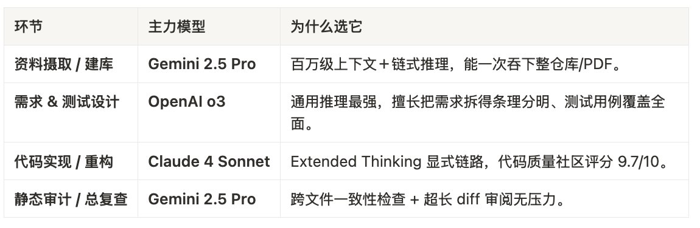
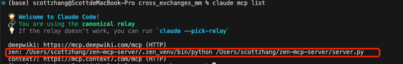
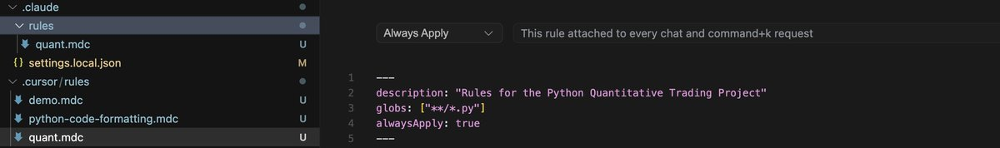
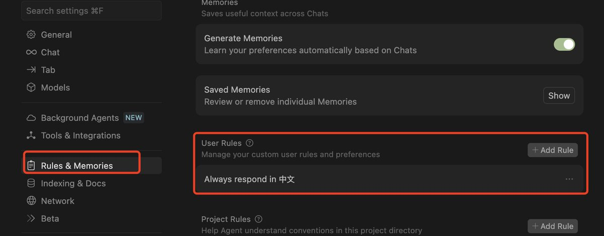

# ZEN MCP：多模型協作的 AI 編程流水線

> **來源**: [@0xScottBTC](https://x.com/0xScottBTC/status/1942969350719483921) | [原文連結](https://www.docker.com/products/docker-desktop/)
>
> **日期**: Wed Jul 09 15:29:26 +0000 2025
>
> **標籤**: `AI編程` `模型協作` `MCP`

---






> **來源**: [@0xScottBTC (AI索羅斯科特)](https://twitter.com/0xScottBTC)
> **日期**: 2026-02-18
> **標籤**: `AI編程` `MCP` `Claude` `Gemini` `多模型協作` `開發工具`

---

## 單模型 AI 編程的三大痛點

### 上下文天花板
再大的上下文窗口也擋不住持續膨脹的代碼庫、會議紀要、PRD。頻繁裁切與拼接讓開發者苦不堪言,錯誤和遺漏層出不窮。

### 能力偏科
沒有一款模型同時在「資料攝取、需求推理、代碼實現、測試設計」四個環節都拿滿分——單模型必然在某一環節拖後腿。

### AI 幻覺與代碼質量難雙保
LLM 生成代碼速度很快,但錯誤同樣迅速蔓延；如果缺少獨立的二次校驗,線上事故風險直線上升。

## ZEN MCP：多模型協作解決方案

### 核心概念
ZEN MCP 是一個 Model Context Protocol (MCP) 服務器,讓一個主模型(常用 Claude 或 Gemini CLI)在同一會話裡調用 Gemini、OpenAI、Claude、Grok、本地 Llama3 等任意模型,並且把上下文無損串聯。

### 三大特性

**AI-to-AI Orchestration**
自動分配子任務,模型間接力而不丟記憶。

**超長上下文橋**
當主模型 token 不夠時,把巨型文檔丟給 Gemini 2.5(百萬級),再用 MCP 把摘要返還。

**內置 16 個開發工具**
planner、codereview、testgen、debug、secaudit… 讓思考→編碼→測試→審計流程模板化。

### 最終效果
得到一條「想→拆→寫→測→查」全自動流水線,而不是一堆臨時 prompt。

## 三模型黃金分工流程

根據各個模型的特點和實戰總結,制定如下分工流程:

在 Claude Code 中使用以下 Prompt:

```
調用 ZEN MCP 進行此工程開發:
1. 讓 Gemini Pro 2.5 來讀取資料(@你具體資料的位置),建立知識庫
2. 讓 o3 根據知識庫制定開發需求文檔
3. 讓 Claude 4 根據需求文檔進行編程
4. 讓 o3 進行測試代碼編寫
5. 讓 Gemini 審查代碼
```

## 10 分鐘完成 ZEN MCP 配置

所有操作均在終端中運行:

### 1. 下載並安裝 Docker
訪問 Docker 官網下載安裝

### 2. 克隆 ZEN MCP 倉庫到本地
```bash
git clone [ZEN MCP 倉庫地址]
```

### 3. 進入倉庫目錄
```bash
cd zen-mcp-server
```

### 4. 配置 API
```bash
nano .env
```

### 5. 在 .env 文件中輸入 API KEY

### 6. 在 Docker 環境中運行 ZEN MCP
```bash
./setup-docker.sh
```

完成以上步驟後,就能在 Claude Code 或 Gemini CLI 中使用 ZEN MCP。

## 相關資源

作者之前分享過「設置好 rules,不再被你的 AI 碼農氣到腦殼疼」相關內容,包含:

- AI 編程的阵痛背景
- Agent Rules 的概念與作用
- 全局規則配置推薦
- 加密貨幣量化交易工程規則

這些規則體系配合 ZEN MCP 使用,可以建立「全局規範 + 工程流程 + 多模型協作」的完整開發體系。
