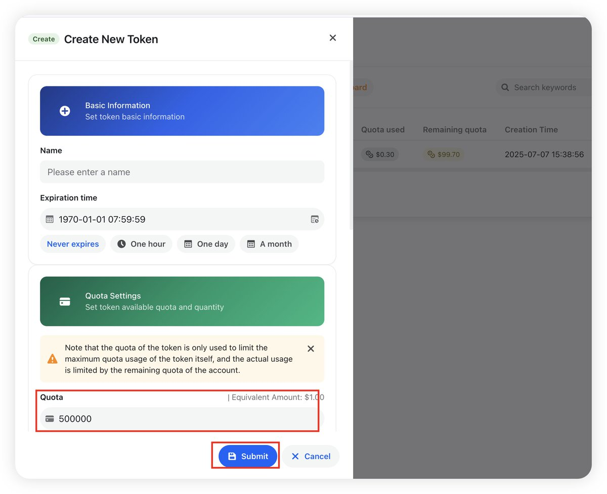
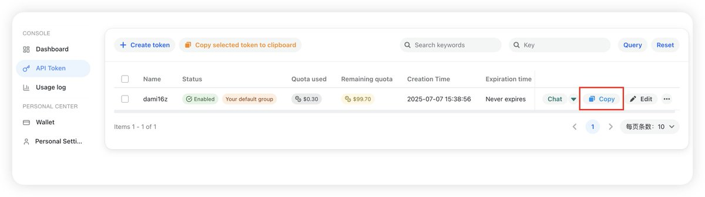

# Claude Code 免費額度設置教程

> **來源**: [@dami16z](https://x.com/dami16z/status/1942396085374443918) | [原文連結](https://anyrouter.top/register?aff=2fjZ)
>
> **日期**: 
>
> **標籤**: `Claude Code` `API設置` `編程工具`

---

> **來源**: [@dami16z (dami.eth)](https://twitter.com/dami16z)
> **日期**: 2026-02-18
> **標籤**: `Claude Code` `AI編程` `免費額度` `教程`

---

## 概述

本教程介紹如何免費獲得 $100 額度使用最新的 AI 編碼工具 Claude Code，特別針對幣圈小白不會編程的選手，實現嘴替自由。

## 註冊 AnyRouter 帳號

首先，需要註冊一個提供 $100 免費額度的 API 平台。

### 步驟 1：訪問註冊頁面

訪問 AnyRouter 平台（官方站轉發的站）：
https://t.co/RmIVEN30rQ

### 步驟 2：創建 API Token

1. 在 API Token 管理頁面，點擊「新建 Token」
2. 創建設置：
   - 額度設置：填寫 `$100`
   - 其他選項：保持默認設置
3. 點擊創建

### 步驟 3：複製 API Key

創建成功後：
1. 返回 Token 列表頁面
2. 點擊「Copy」按鈕
3. 複製生成的 API Key（後續配置 Claude Code 時會用到）

## 注意事項

- API Key 需要妥善保管，後續配置 Claude Code 時會使用
- $100 免費額度足夠進行充分的體驗和測試
