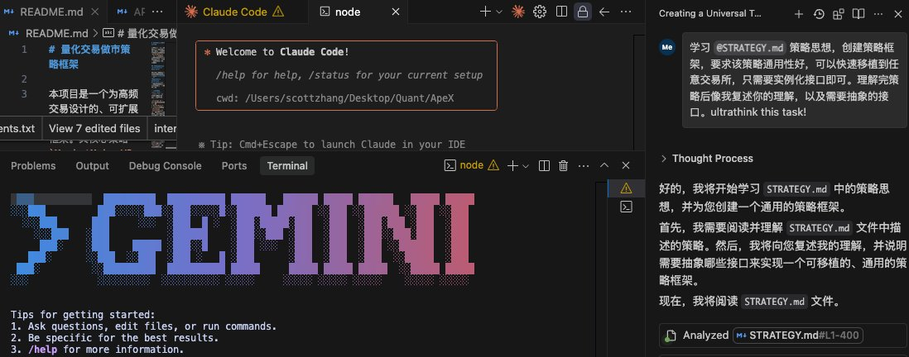

# AI 編程最優路徑：多模型編排工作流

> **來源**: [@0xScottBTC](https://x.com/0xScottBTC/status/1941707237199839601)
>
> **日期**: Sun Jul 06 03:54:15 +0000 2025
>
> **標籤**: `AI 編程` `多模型協作` `Claude Code`

---

> **來源**: [@0xScottBTC (AI索羅斯科特)](https://x.com/0xScottBTC)
> **日期**: 2026-02-18
> **標籤**: `AI編程` `多模型編排` `工作流程` `Cursor` `Claude Code` `Gemini` `ZEN MCP`

---

最近感覺 Cursor / Windsurf 沒那麼好用了,於是安裝了 Gemini CLI 和 Claude Code,找到了 AI 編程最優路徑:

## 工作流程

1. **用 ChatGPT 進行方案探討** - 得出可實施路徑,複製保存到產品需求文檔
2. **讓 Cursor/Windsurf 根據文檔搭建項目框架**
3. **用 Gemini 去讀項目使用到的開源代碼庫和官方文檔** - 重新評估並更新產品需求文檔
4. **用 Claude Code 來進行代碼編寫**
5. **用 Gemini 進行代碼審查**

## 協作方案

步驟 3、4、5 可以直接用 **ZEN MCP** 來實現多個大模型的上下文協作。

## 總結

- 用包月不限量使用的 chatbot 工具進行**創意和方案探討**(主要為了節省 API credit)
- 用 AI 代碼編輯器來**搭建項目框架**
- 用 Gemini 超長上下文的能力進行**長篇文檔和代碼庫的閱讀審計**
- 用 Claude Code 進行**編程**
