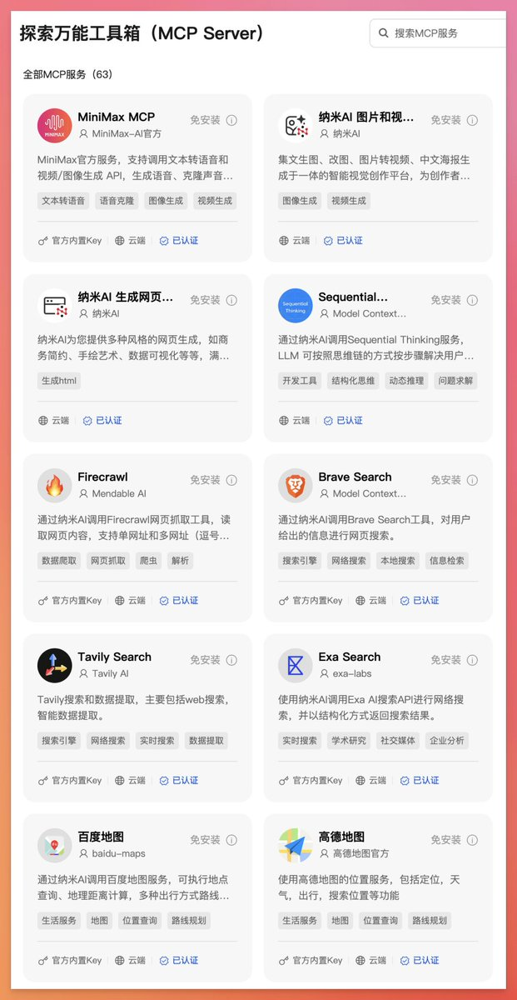

# MCP 萬能工具箱 — 納米AI 整合100+ MCP 服務

> **來源**: [@oran_ge](https://x.com/oran_ge/status/1915183713299943559)
>
> **日期**: Wed Apr 23 23:19:14 +0000 2025
>
> **標籤**: `MCP` `AI工具` `開發效率`

---

> **來源**: [@oran_ge (Orange AI)](https://twitter.com/oran_ge)
> **日期**: 2026-02-18
> **標籤**: `MCP` `AI工具` `納米AI` `整合服務`

---

## 核心功能

終於有公司在解決 MCP 配置難的問題了。納米 AI 推出了 MCP 萬能工具箱，整合了 100 多個 MCP 服務，全部預先配置完成，可以直接調用。

## 主要特點

- **預配置服務**：100+ MCP 服務已配置完成，開箱即用
- **內置 API Key**：常用的 18 個服務的 key 已內置，省去到各網站申請的麻煩
- **豐富功能**：整合高德地圖、MiniMax 生圖/生音/生視頻等服務，想要什麼就直接調用

## 使用成本

目前限時免費隨意調用，API 費用由納米官方承擔。預期後續會開始收費，否則成本難以持續。
