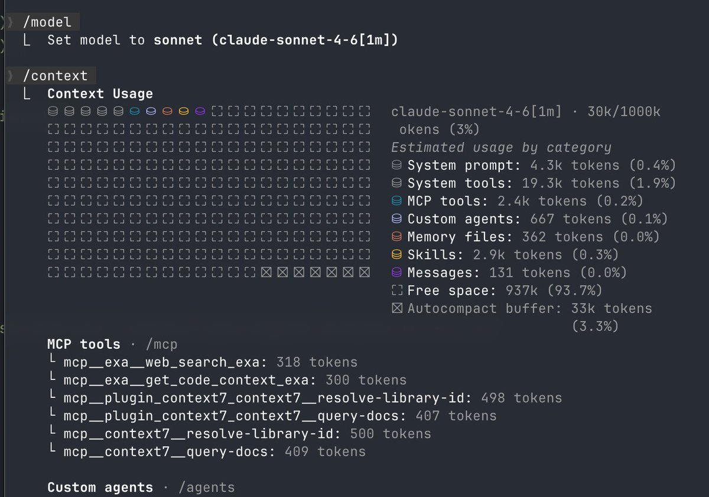

# Claude Sonnet 4.6 設定技巧：解鎖 1M Token 上下文窗口

> **來源**: [@melvynxdev](https://x.com/melvynxdev/status/2023917549134757914)
>
> **日期**: Wed Feb 18 00:28:40 +0000 2026
>
> **標籤**: `Claude Code` `模型配置` `開發工具`

---



## Claude Sonnet 4.6：1M Token 上下文窗口設定指南

### 快速設定步驟

如果你想在 Claude Code 中使用最新的 Claude Sonnet 4.6 模型並解鎖 1M token 上下文窗口，可以按照以下步驟操作：

1. **修改設定檔**
   - 打開 `.claude/settings.json` 檔案
   - 加入以下設定：
   ```json
   "env": {
       "ANTHROPIC_DEFAULT_HAIKU_MODEL": "claude-sonnet-4-6-1m",
       "ANTHROPIC_DEFAULT_SONNET_MODEL": "claude-sonnet-4-6-1m"
   }
   ```

2. **切換模型**
   - 使用 `/model` 指令切換到 Sonnet

### 主要優勢

完成設定後，你可以享受 1M token 上下文窗口的容量，這意味著你可以在不觸發自動壓縮（auto-compaction）的情況下開發整個 SaaS 應用程式。

### Claude Sonnet 4.6 重點特性

Claude Sonnet 4.6 是目前最強大的 Sonnet 模型，在以下領域都有全面升級：

- **程式開發（Coding）**
- **電腦操作（Computer Use）**
- **長上下文推理（Long-context Reasoning）**
- **Agent 規劃（Agent Planning）**
- **知識工作（Knowledge Work）**
- **設計（Design）**

此外，該模型還提供測試版的 1M token 上下文窗口功能。

---

> **來源**: [@melvynxdev (Melvyn • Builder)](https://twitter.com/melvynxdev) 與 [@claudeai](https://twitter.com/claudeai)  
> **相關連結**: [Claude Sonnet 4.6 公告](https://t.co/TDId3XUSRs)
