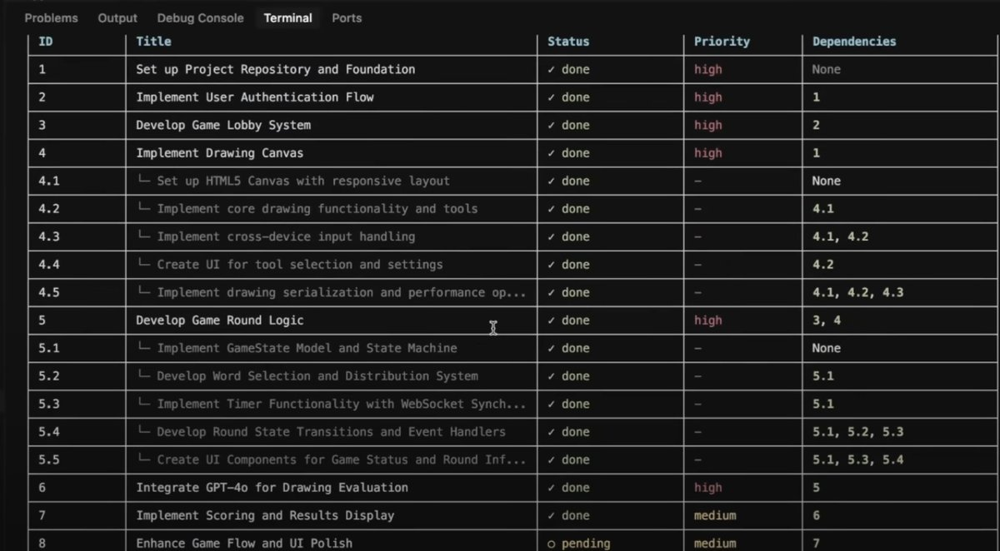

# Agent 任務拆解框架：將工程思想應用於 AI 代理設計

> **來源**: [@Yangyixxxx](https://x.com/Yangyixxxx/status/1914687827117518991) | [原文連結](https://twitter.com/Yangyixxxx/status/1914687827117518991/photo/1)
>
> **日期**: 
>
> **標籤**: `Agent設計` `任務管理` `工程方法論`

---

> **來源**: [@Yangyixxxx (Yangyi)](https://twitter.com/Yangyixxxx)
> **日期**: 2026-02-18
> **標籤**: `AI Agent` `任務拆解` `軟體工程` `PRD` `專案管理`

---

## 核心觀點

我只能稱之為神仙專案。但凡是做 AI Coding 的，在工程上絕對會想辦法按照這個思路做封裝的。

## 任務執行的演進

以前任務做不好，大多數是 PRD（Product Requirements Document，產品需求文件）寫不好。

PRD 寫好之後，還需要的是把任務拆解好。就像人在執行工作時，也會有依賴項，也會有 epic 和 story。

## 設計原則

**所有 Agent 都應該和人一樣設計就對了！**

這個專案就是用來做這個的：https://t.co/SLTOSJGhgL

---

## 延伸思考

這個框架的核心思想是將軟體工程中的專案管理方法論（epic、story、依賴項管理）應用到 AI Agent 的任務設計上，讓 AI Agent 能像人類工程師一樣有結構地執行複雜任務。
