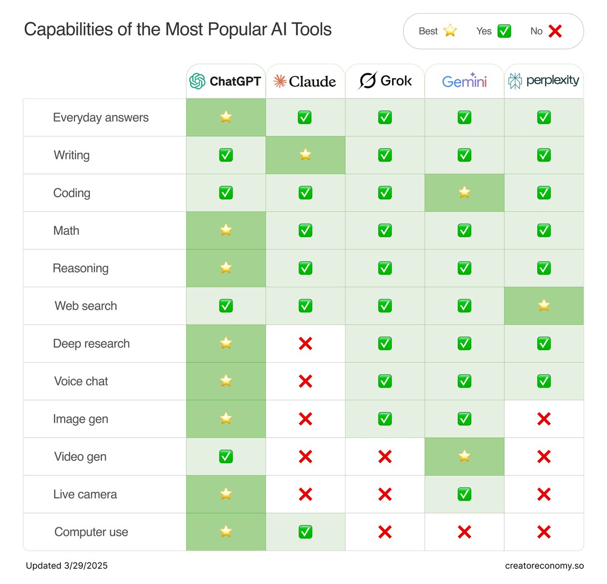

# AI 模型能力對比表（2025 年 3 月）

> **來源**: [@petergyang](https://x.com/petergyang/status/1906007718961492391) | [原文連結](https://twitter.com/petergyang/status/1906007718961492391/photo/1)
>
> **日期**: Sat Mar 29 15:37:06 +0000 2025
>
> **標籤**: `模型比較` `程式碼生成` `影像生成`

---

> **來源**: [@petergyang (Peter Yang)](https://twitter.com/petergyang)
> **日期**: 2025-03
> **標籤**: `AI-模型` `能力對比` `Gemini` `ChatGPT`

---

## 模型能力更新

作者更新了 AI 模型能力對比表，關鍵發現：

- **Gemini 2.5** 現在是程式碼開發能力最強的模型
- **ChatGPT** 在圖像生成方面遙遙領先其他模型

這個領域的變化速度非常快。

---

**附註**：原推文包含一張能力對比表圖片 (https://t.co/I4GxYUVBCi)，建議搭配圖片查看完整的模型能力比較資訊。
