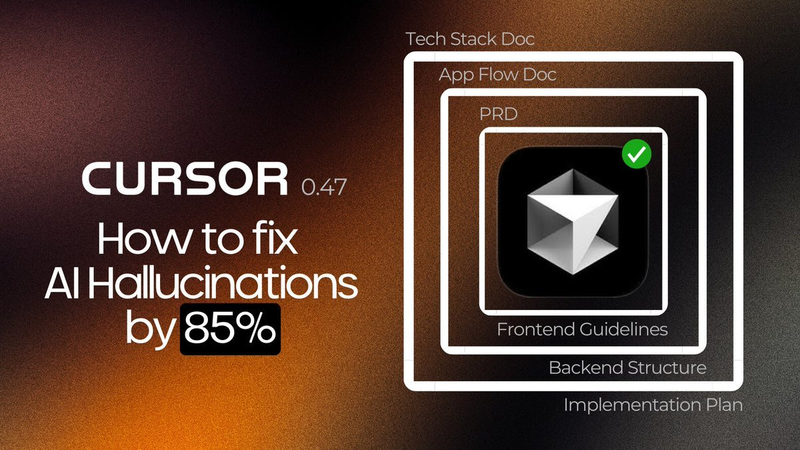

# Cursor 知識庫技術：降低 AI 幻覺 85%

> **來源**: [@Yangyixxxx](https://x.com/Yangyixxxx/status/1904511350719824378) | [原文連結](https://twitter.com/Yangyixxxx/status/1904511350719824378/photo/1)
>
> **日期**: 
>
> **標籤**: `Cursor` `AI幻覺` `提示工程`

---

> **來源**: [@Yangyixxxx (Yangyi)](https://twitter.com/Yangyixxxx)
> **日期**: 2026-02-18
> **標籤**: `Cursor` `AI` `幻覺問題` `知識庫` `開發技術`

---

## 核心概念

開發者 Yangyi 提出了一種適用於 Cursor 的新方法，稱為「知識庫」技術。通過這種方法，成功地將 AI 產生的幻覺和猜測降低了 85%。

## 技術特點

- **名稱**：知識庫技術
- **效果**：降低 AI 幻覺和猜測達 85%
- **適用範圍**：Cursor 開發環境

## 參考資料

詳細運作方式請參考原始推文附帶的說明。
