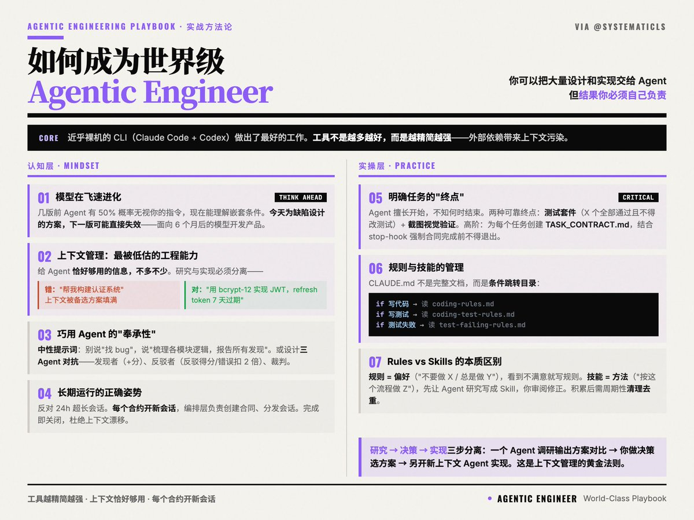

# 世界級 Agentic Engineer 的工程實踐

> **來源**: [@shao__meng](https://x.com/shao__meng/status/2028833958230933729)
>
> **日期**: 
>
> **標籤**: `Claude Agent` `上下文管理` `Prompt 工程`

---

> **來源**: [@shao__meng (meng shao)](https://twitter.com/shao__meng)
> **標籤**: `AI開發` `Agent工程` `最佳實踐`

---

## 核心理念

你可以把大量的設計和實現交給 Agent，但結果你必須自己負責。

## 工具不是越多越好，而是越精簡越強

大多數人陷入了「工具崇拜」的誤區：以為安裝越多的插件、harness、記憶系統，就能讓 Agent 更強。實際上，這些外部依賴帶來的是上下文污染，Agent 表現反而下降。

@systematicls 現在用的是近乎裸機的 CLI（Claude Code + Codex），並且做出了迄今為止最好的工作。

## 理解「模型在飛速進化」這件事

- 幾個版本前，在 CLAUDE.md 裡寫「先讀這個檔案」，Agent 有 50% 機率會無視你
- 現在，它能理解嵌套的條件指令（「如果 C，則讀 D」）

今天為某個缺陷設計的複雜解決方案，可能在下一個模型版本中直接失效，或直接被模型實現。這和 @bcherny 面向 6 個月後模型開發產品有異曲同工之妙。

## 上下文管理：最被低估的工程能力

> 「你只需要給 Agent 完成任務所需的確切資訊，不多也不少。」

### 研究與實現必須分離

- **錯誤做法**：「去幫我構建一個認證系統。」— Agent 會去查所有方案，上下文被各種備選實現細節填滿，實現時容易混亂或幻覺。
- **正確做法**：「用 bcrypt-12 實現 JWT 認證，refresh token 7 天過期……」— 上下文直接聚焦在實現細節上。

### 不確定實現方案時的流程

1. 開一個 Agent 做調研，輸出方案對比
2. 你或 Agent 決策選哪個
3. 另開一個全新上下文的 Agent 來實現

## 巧用 Agent 的「奉承性」

Agent 被設計為「取悅使用者」——你讓它找 bug，它會找到 bug，哪怕需要編造一個。這不是 Agent 的錯，這是你的提示詞問題。

### 解決方案一：中性提示詞

別說「找 bug」，而說「梳理各模組的邏輯，報告所有發現」。

中性提示不預設結論，Agent 會如實彙報，有 bug 說 bug，沒有就說沒有。

### 解決方案二：利用奉承性設計多 Agent 對抗系統

作者設計了一個三 Agent 的 bug 驗證機制：

- **Bug 發現者**：低/中/高影響 bug 分別得 +1/+5/+10 分
- **對抗者**：成功反駁得對應分，反駁錯誤扣 2 倍
- **裁判**：告知有真實答案參照，對錯各 ±1

## 明確任務的「終點」

Agent 很擅長開始任務，卻不知道何時結束——這是當前模型的固有限制。

### 兩種可靠的終點定義方式

- **測試套件**：明確告知 Agent「X 個測試全部通過才算完成，且不得修改測試檔案」。測試是確定性的，Agent 無法糊弄。
- **截圖 + 視覺驗證**：實現功能後讓 Agent 截圖，並驗證設計或行為是否符合預期。Agent 可以根據截圖反覆迭代，直到視覺結果滿足要求。

### 更高階的做法

為每個任務創建 `{TASK}_CONTRACT.md`，其中列出所有驗收條件（測試、截圖驗證等），結合 stop-hook 機制，強制 Agent 在合同完成前不得退出。

## 長期運行 Agent 的正確姿勢

作者明確反對「24 小時連續運行的超長會話」，原因正是上下文污染——多個不相關合同的上下文混在一起，會導致漂移。

### 推薦方案

- 每個合約開一個新會話
- 用一個編排層負責創建合同、分發新會話
- 會話完成即關閉，下個任務開新會話

## 規則與技能的管理

### CLAUDE.md 的定位

不是一份完整文檔，而是一個條件跳轉目錄。它只告訴 Agent「在什麼場景下，去讀哪個檔案」。

**格式示例**：
- 如果你在寫程式碼，先讀 `coding-rules.md`
- 如果你在寫測試，先讀 `coding-test-rules.md`
- 如果測試失敗，先讀 `coding-test-failing-rules.md`

### 規則（Rules）與技能（Skills）

- **規則（Rules）**：編碼偏好——「不要做 X」、「總是做 Y」。看到 Agent 做了你不滿意的事，就寫成規則。
- **技能（Skills）**：編碼方法——「按照這個流程做 Z」。如果你想讓某件事的做法確定可控，先讓 Agent 研究如何做，把方案寫成 Skill 檔案，然後你審閱修正——這樣在真實場景出現前，你就已經掌握了 Agent 的解法。

### 維護原則

規則和技能累積到一定程度會出現矛盾和冗餘，導致性能再次下降。此時需要定期「清理」——讓 Agent 整合並去重，向你確認最新偏好。這是一個需要週期性執行的維護動作。

---

引用來源：[@systematicls](https://t.co/wBaKpAI5Vl)
