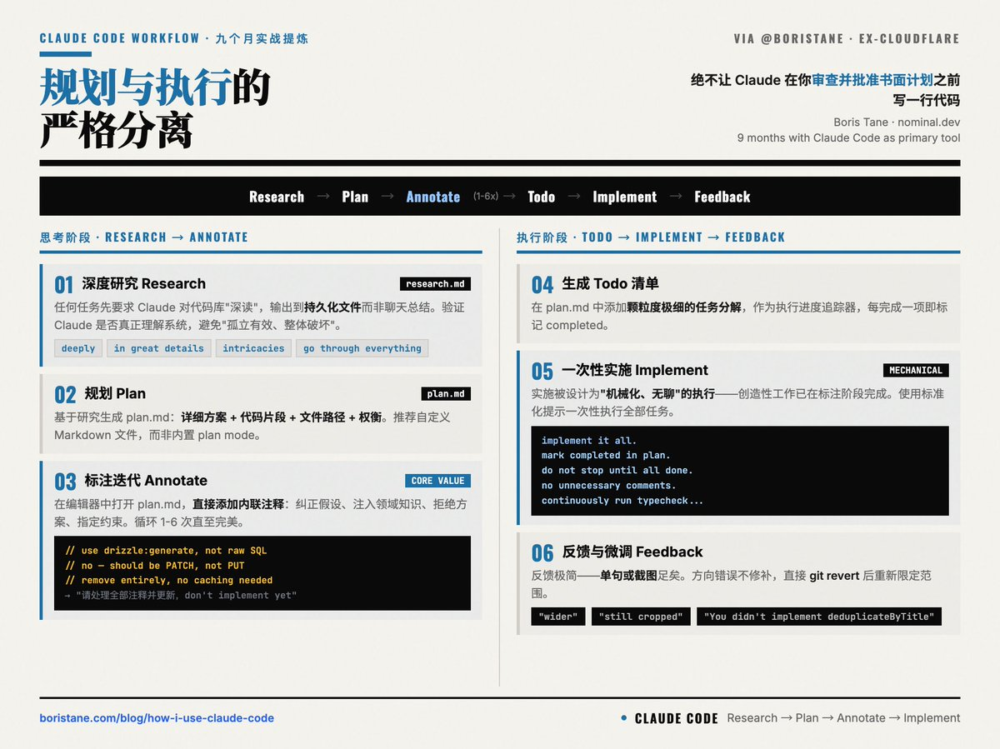

# Claude Code 工作流：規劃優先的開發完全指南

> **來源**: [@shao__meng](https://x.com/shao__meng/status/2028998826699415561) | [原文連結](https://research.md/)
>
> **日期**: Wed Mar 04 00:59:51 +0000 2026
>
> **標籤**: `Claude Code` `工作流程` `規劃驗證`

---



九個月使用 Claude Code 作為主力開發工具後，Boris Tane（前 Cloudflare 工程師，現在做 nominal.dev，要把所有 on-call 的工程師都解放出來）分享了他提煉出來的完整工作流。

## 核心觀點

**規劃與執行的嚴格分離**，絕不讓 Claude 在你審查並批准書面計劃之前寫一行程式碼。

## 整體工作流程

Research → Plan → Annotate（反覆） → Todo List → Implement → Feedback & Iterate

## 1. 深度研究（Research）

任何任務先要求 Claude 對程式碼庫相關部分進行「深讀」。必須輸出到持久文件 `research.md`，而非聊天總結。

**關鍵提示詞**：deeply、in great details、intricacies、go through everything。

**目的**：驗證 Claude 是否真正理解系統，避免後續「孤立有效、整體破壞」的最昂貴失敗模式（如忽略快取層、違反 ORM 約定、重複已有邏輯）。

## 2. 規劃（Plan）

基於研究結果，讓 Claude 生成 `task_plan.md`，包含詳細方案、程式碼片段建議、檔案路徑、權衡考量。

Boris 強烈推薦自訂 Markdown 檔案，而非 Claude 內建的 plan mode。

## 3. 標註迭代（Annotation Cycle）——最核心的價值注入環節

在本地編輯器中開啟 `task_plan.md`，直接新增行內註解：糾正假設、注入領域知識、拒絕方案、指定約束等。

**示例註解**：
- "use drizzle:generate for migrations, not raw SQL"
- "no — this should be a PATCH, not a PUT"
- "remove this section entirely, we don't need caching here"

然後發給 Claude：「我新增了註解，請全部處理並更新文件，don't implement yet。」循環 1-6 次，直至計劃完美適配專案情境。此階段才是真正的「思考」與「判斷」。

## 4. 生成 Todo 清單

要求 Claude 在 `task_plan.md` 中新增顆粒度極細的任務分解，作為執行進度追蹤器。

## 5. 一次性實施（Implement）

使用標準化提示：

```
implement it all. when you're done with a task or phase, mark it as completed in the plan document. do not stop until all tasks and phases are completed. do not add unnecessary comments or jsdocs, do not use any or unknown types. continuously run typecheck...
```

實施被設計為「機械化、無聊」的執行過程——創造性工作已在標註階段完成。

## 6. 反饋與微調

實施中反饋極簡（單句或截圖）："wider"、"still cropped"、"You didn't implement the deduplicateByTitle function."

若方向錯誤，直接 Git revert 後重新限定範圍，而非修補。

## 延伸資源

- Boris Tane 的部落格文章（連結已失效）
- nominal.dev 專案
