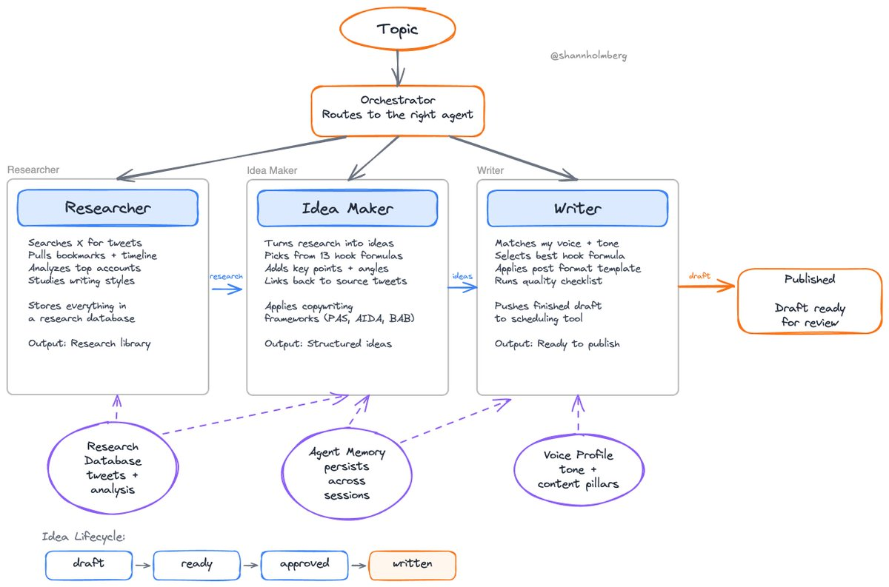

# 四代理內容寫作系統：用 Claude Code 自動化 X 貼文

> **來源**: [@shannholmberg](https://x.com/shannholmberg/status/2028417727661318425)
>
> **日期**: Mon Mar 02 10:30:47 +0000 2026
>
> **標籤**: `Claude Code` `代理工程` `內容自動化`

---

## 系統概述

作者建立了一個 4-agent 系統來撰寫 X 內容。只需給定主題，系統就會搜尋 X 上的相關推文、儲存研究資料、從不同的 hook 角度生成想法、以作者的語調撰寫草稿，並將其推送到 Typefully。

## 系統架構

整個 pipeline 包含四個主要 agent：

**Research（研究）**  
提取推文並將其儲存在資料庫中。

**Ideate（構思）**  
使用 hook 公式和關鍵要點生成結構化的想法。

**Write（寫作）**  
應用語調指南和文案寫作框架，匹配作者的語氣。

**Orchestrate（協調）**  
將請求路由到各個階段。

## 記憶系統

每個 agent 都擁有跨 session 持久化的記憶：

- Writer 會記住過去草稿收到的反饋
- Researcher 會記住喜歡研究的帳號

## 技術實作

整個系統使用 Claude Code 建構，技術棧非常簡單：

- Markdown prompts
- 資料庫
- CLI 工具
