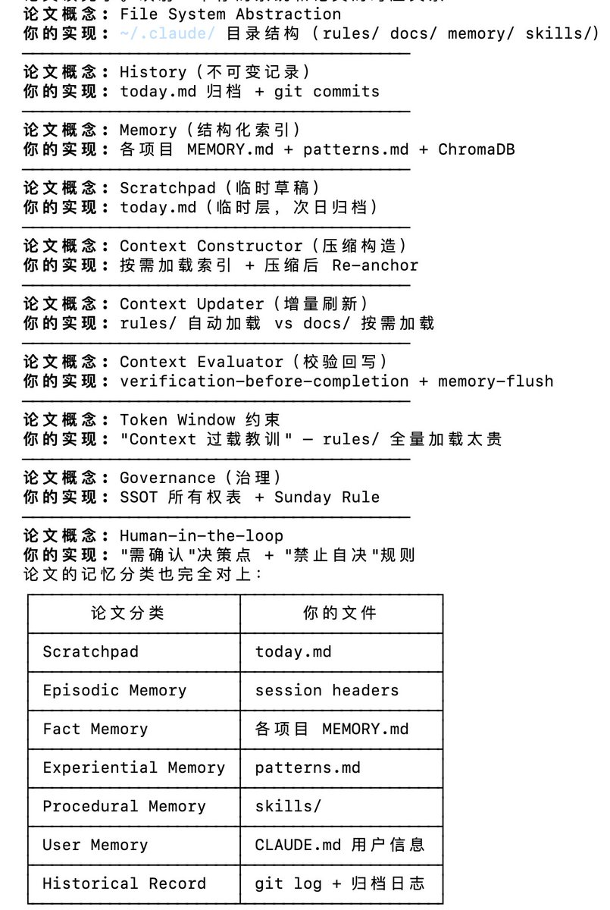

# Claude Code 上下文記憶架構：Scratchpad 與 Bounded Reasoning

> **來源**: [@runes_leo](https://x.com/runes_leo/status/2028990557331112363) | [原文連結](https://today.md/)
>
> **日期**: Wed Mar 04 00:27:00 +0000 2026
>
> **標籤**: `Claude Code` `上下文管理` `Token 優化`

---

> **來源**: [@runes_leo (Leo)](https://twitter.com/runes_leo)
> **標籤**: `Claude Code` `Context Window` `Memory Architecture` `AI 工具`

---

用 Claude Code 三個月，目錄越建越多，rules/ docs/ memory/ skills/ 各種分層，但一直說不清自己在搭什麼。

直到看到這篇論文「Everything is Context」，把我的資料夾結構翻譯成了學術語言：

## 目錄結構對應的學術概念

- **today.md** → 論文叫 Scratchpad（臨時工作區）
- **rules/** → Fact Memory（專案級事實記憶）
- **memory/** → Experiential Memory（跨專案經驗）
- **rules/ 自動載入 vs docs/ 按需載入** → Context Constructor（在 token 預算內選擇性載入）

## Token Window 約束的實踐

最有共鳴的是 token window 約束那段。我之前 rules/ 全量載入，context 直接爆炸。後來拆成兩層才穩住。論文管這個叫「bounded reasoning capacity」——原來我解決的是這個問題。

## 反思

實踐在前，命名在後。先踩坑，再讀論文，發現踩的坑都有名字。

---

**論文連結**: [Everything is Context](https://arxiv.org/abs/...)（原推文提供的連結無效，需要從論文標題搜尋）
