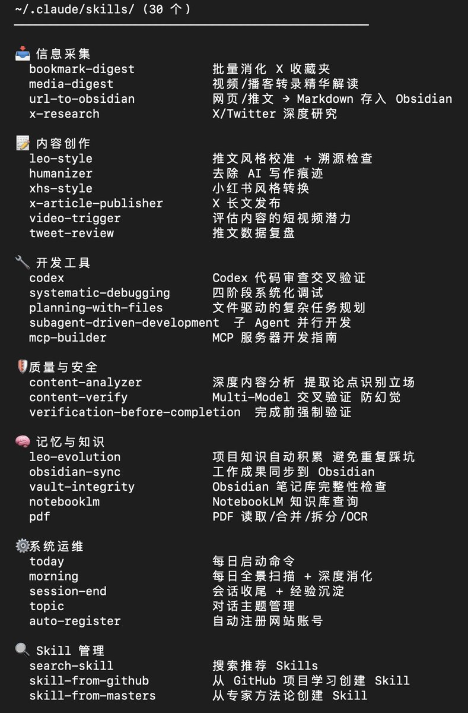
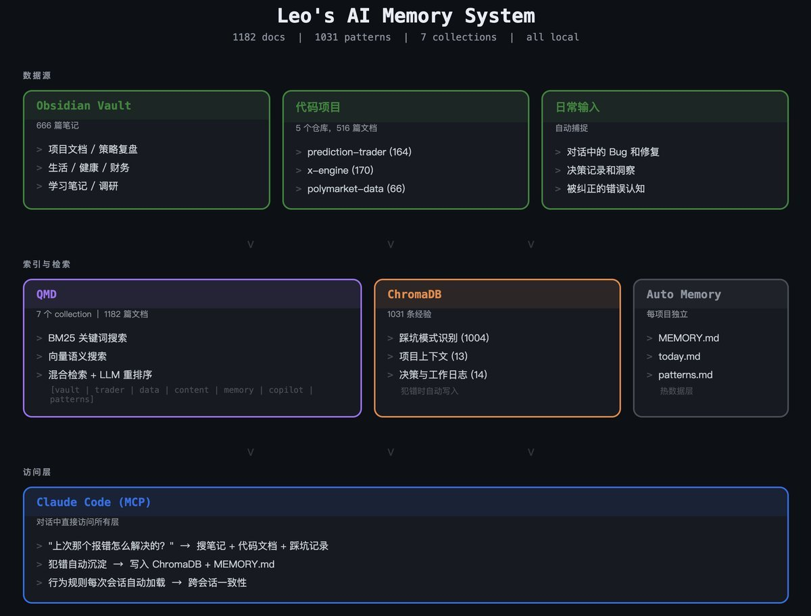

# Claude Code Skills 生態：質量優於數量

> **來源**: [@runes_leo](https://x.com/runes_leo/status/2028253450631331958) | [原文連結](https://code.claude.com/docs)
>
> **日期**: Sun Mar 01 23:38:00 +0000 2026
>
> **標籤**: `Claude Code` `Skills 系統` `知識管理`

---




## Claude Code Skills 生態現狀

上條聊了 CLAUDE.md 怎麼從配置文件變成記憶系統，這條接著說能力層——Skills。

Claude Code 的 Skills 生態正在經歷一輪爆發。聚合市場從幾萬漲到近 30 萬條，官方 repo、Vercel 的包管理器、第三方市場三條線同時跑。看起來很像早期的 App Store。

我自己連下載帶自己寫一共有了 30 個 skill，覆蓋推文風格校準、四階段調試流程、數據採集、Obsidian 同步、PDF 處理、代碼審查交叉驗證。兩個月用下來，最大的體感是：

**數量沒意義。**

## 質量問題

市場上 30 萬個 skill，大部分是一段 prompt 套個 markdown 模板。裝上就能用，但用兩次就知道不對——沒有觸發條件，不知道什麼時候該跑；沒有錯誤處理，一出問題整個流程斷掉；沒有輸入輸出契約，每次結果格式不一樣。

有人分析了 3 萬多個 skill，發現 **26.1% 存在安全風險**。提示注入、未經驗證的外部調用、權限過寬——這些不是理論風險，是你把別人的 skill 裝進自己的 agent 就真實存在的攻擊面。

## 好的 Skill 長什麼樣

好的 skill 不是一段 prompt，是一套完整的調度邏輯。拿我用得最多的 `leo-style` 舉例：

- 有範文庫做風格校準
- 有 7 條禁止規則做質量兜底
- 有溯源檢查防止 AI 替你吹牛
- 還有迭代日誌——每次我手動改了推文，規則自動更新

這不是「安裝一個插件」，更像是給 agent 做崗前培訓。

## 生態對比

現在的 Skills 生態像 2009 年的 App Store——量在爆發，質量沒跟上。聰明的做法不是裝 50 個熱門 skill，是花時間把 3-5 個核心 skill 打磨到真正好用。

你自己寫的，永遠比別人寫的更合手。

## Claude Code 核心能力

### 自動化繁瑣任務

Claude Code 處理那些吃掉你一整天的重複工作：為未測試的代碼撰寫測試、修復整個專案的 lint 錯誤、解決合併衝突、更新依賴、撰寫發布說明。

```bash
claude "write tests for the auth module, run them, and fix any failures"
```

### 建構功能與修復 Bug

用自然語言描述你想要的東西。Claude Code 會規劃方法、跨多個文件撰寫代碼，並驗證它能運作。對於 bug，貼上錯誤訊息或描述症狀，Claude Code 會追蹤你的代碼庫找出問題根源，並實作修復。

### 創建 Commit 與 Pull Request

Claude Code 直接與 git 協作。它會暫存變更、撰寫 commit 訊息、創建分支，並開啟 pull request。

```bash
claude "commit my changes with a descriptive message"
```

在 CI 中，你可以透過 GitHub Actions 或 GitLab CI/CD 自動化代碼審查和 issue 分類。

### 透過 MCP 連接你的工具

Model Context Protocol (MCP) 是連接 AI 工具與外部數據源的開放標準。有了 MCP，Claude Code 可以讀取 Google Drive 中的設計文件、更新 Jira 的工單、從 Slack 拉取數據，或使用你自己的自訂工具。

### 自訂指令、Skills 與 Hooks

**CLAUDE.md** 是你加到專案根目錄的 markdown 文件，Claude Code 在每次 session 開始時都會讀取它。用它來設定編碼標準、架構決策、偏好的函式庫和審查檢查清單。

Claude 也會在工作時建立 **auto memory**，儲存像建置指令和除錯見解這類的學習內容，跨 session 保存，你不需要寫任何東西。

創建**自訂指令**來打包可重複的工作流程，讓你的團隊可以分享，像是 `/review-pr` 或 `/deploy-staging`。

**Hooks** 讓你在 Claude Code 動作之前或之後執行 shell 指令，像是每次編輯文件後自動格式化，或在 commit 前執行 lint。

### Agent 團隊與自訂 Agent

生成多個 Claude Code agent，同時處理任務的不同部分。一個主 agent 協調工作、分配子任務並合併結果。

對於完全自訂的工作流程，Agent SDK 讓你建立自己的 agent，由 Claude Code 的工具和能力驅動，完全控制編排、工具存取和權限。

### 用 CLI 進行管道、腳本與自動化

Claude Code 可組合且遵循 Unix 哲學。將日誌導入它、在 CI 中執行它，或與其他工具串接：

```bash
# 監控日誌並獲得警報
tail -f app.log | claude -p "Slack me if you see any anomalies"

# 在 CI 中自動化翻譯
claude -p "translate new strings into French and raise a PR for review"

# 跨文件批次操作
git diff main --name-only | claude -p "review these changed files for security issues"
```

### 隨處工作

Session 不限於單一環境。隨著你的情境改變在不同環境間移動工作：

- 離開辦公桌後用手機或任何瀏覽器透過 **Remote Control** 繼續工作
- 在 web 或 iOS app 上啟動長時間執行的任務，然後用 `/teleport` 拉到你的終端機
- 用 `/desktop` 將終端機 session 交給 Desktop app 進行視覺化 diff 審查
- 從團隊聊天路由任務：在 Slack 中 mention @Claude 並附上 bug 報告，然後得到一個 pull request
